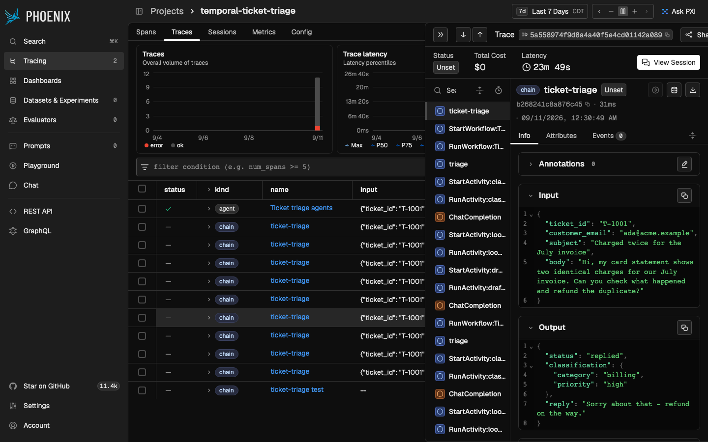
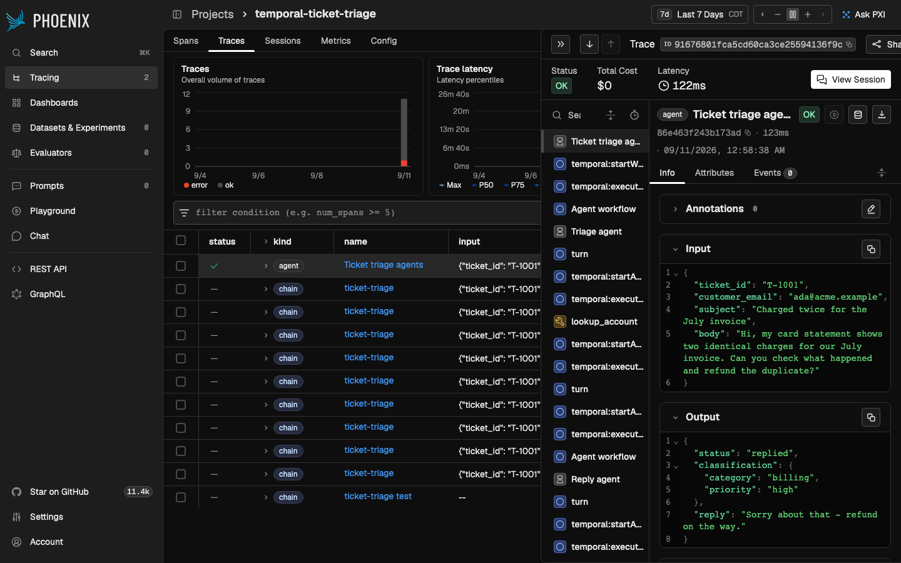
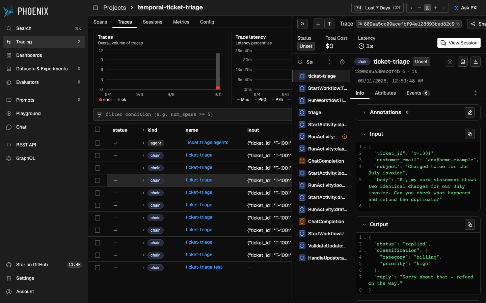

# Arize Tracing

This sample shows the recommended way to get Temporal workflow traces into
[Arize](https://arize.com/) — the open-source [Arize Phoenix](https://arize.com/docs/phoenix)
or the [Arize AX](https://arize.com/docs/ax) platform — using Temporal's
[`OpenTelemetryPlugin`](https://python.temporal.io/temporalio.contrib.opentelemetry.OpenTelemetryPlugin.html)
plus a standard OTLP/HTTP exporter and the
[OpenInference](https://github.com/Arize-ai/openinference) semantic conventions
that Arize reads. No Arize SDK or Arize-specific plugin is involved, workflow
code stays deterministic and sandboxed, and traces are correctly nested,
correctly typed, and duplicate-free across replay and worker restarts.

Contents:

- **[ticket_triage/](ticket_triage/)** — the framework-agnostic pattern: an LLM
  ticket-triage workflow (two LLM activities, one plain activity, one human
  approval delivered as a workflow update). LLM calls run in activities and are
  captured by the OpenInference OpenAI instrumentation.
- **[ticket_triage_agents/](ticket_triage_agents/)** — the same workflow built
  with the [OpenAI Agents SDK](https://openai.github.io/openai-agents-python/)
  through Temporal's `OpenAIAgentsPlugin(use_otel_instrumentation=True)`, so
  Arize shows native AGENT, LLM, and TOOL spans.
- **[verify_trace.py](verify_trace.py)** — checks a trace through the Phoenix
  REST API: whole-tree equality with span kinds, enrichment attributes, LLM
  token usage, activity attempts, and no duplicates.
- **[phoenix/docker-compose.yml](phoenix/docker-compose.yml)** — pinned
  self-hosted Phoenix, one container.
- **[telemetry.py](telemetry.py)** — the OpenTelemetry wiring: replay-safe
  tracer provider, Phoenix/Arize AX exporter, the OpenInference enrichment
  processor, and LLM instrumentation.

## Prerequisites

- Docker (for Phoenix) or `uvx`, a local Temporal server
  (`temporal server start-dev`), and `uv`.
- An OpenAI-compatible LLM endpoint: either a real `OPENAI_API_KEY`, or any
  OpenAI-compatible gateway via `OPENAI_BASE_URL`.

## Run it

```bash
# 1. Start Phoenix (UI, REST API, and OTLP collector on port 6006)
docker compose -f arize_tracing/phoenix/docker-compose.yml up -d
curl -sf http://localhost:6006/healthz && echo ok
#    ...or without Docker: uvx --from "arize-phoenix==20.9.0" phoenix serve

# 2. Install dependencies and set environment (repo root)
uv sync --group arize-tracing
cp arize_tracing/.env.example arize_tracing/.env   # edit the LLM settings
set -a; source arize_tracing/.env; set +a

# 3. Run the sample (two terminals, same environment)
uv run python -m arize_tracing.ticket_triage.worker
uv run python -m arize_tracing.ticket_triage.starter

# 4. Verify the trace through the Phoenix API (uses the printed trace ID)
uv run python -m arize_tracing.verify_trace --trace-id <printed trace id>
```

The starter prints a direct link to the trace in Phoenix (project
`temporal-ticket-triage`). You should see one trace shaped like this, with the
OpenInference kinds Arize renders:

```
ticket-triage                                    CHAIN  (root; session = workflow id, user, input, output, tags)
├─ StartWorkflow:TicketTriageWorkflow            CHAIN
│  └─ RunWorkflow:TicketTriageWorkflow           CHAIN
│     ├─ triage                                  CHAIN  (custom span from workflow code)
│     │  ├─ StartActivity:classify_ticket → RunActivity:classify_ticket   CHAIN, attempt 1
│     │  │  └─ ChatCompletion                    LLM    (model, tokens, messages)
│     │  └─ StartActivity:lookup_account  → RunActivity:lookup_account
│     └─ StartActivity:draft_reply → RunActivity:draft_reply
│        └─ ChatCompletion                       LLM
└─ StartWorkflowUpdate:approve                   CHAIN
   ├─ ValidateUpdate:approve                     CHAIN
   └─ HandleUpdate:approve                       CHAIN
```



The Sessions tab groups traces by Temporal workflow ID (`session.id`), so all
interactions with one workflow execution appear as one session. Start the
starter with `--workflow-id <id>` more than once to see several traces in a
session.

### With the OpenAI Agents SDK

```bash
uv run python -m arize_tracing.ticket_triage_agents.worker
uv run python -m arize_tracing.ticket_triage_agents.starter
uv run python -m arize_tracing.verify_trace --trace-id <printed trace id> --scenario agents
```

Here the Agents SDK trace itself becomes the root, and the plugin's
OpenTelemetry bridge produces the OpenInference kinds directly:

```
Ticket triage agents                             AGENT  (root; session, user, input, output)
└─ temporal:startWorkflow:TicketTriageAgentsWorkflow   CHAIN
   └─ temporal:executeWorkflow                   CHAIN
      ├─ Agent workflow → Triage agent           AGENT
      │  ├─ turn → temporal:startActivity → temporal:executeActivity → response   LLM
      │  ├─ lookup_account                       TOOL   (a Temporal activity as an agent tool)
      │  │  └─ temporal:startActivity → temporal:executeActivity
      │  └─ turn → temporal:startActivity → temporal:executeActivity → response   LLM
      └─ Agent workflow → Reply agent            AGENT
         └─ turn → temporal:startActivity → temporal:executeActivity → response   LLM
└─ temporal:updateWorkflow                       CHAIN
```



## How replay, retries, and restarts show up

Durable execution means workflow code re-executes (replays) on worker
restarts and cache evictions, and activities retry. The rule this sample
demonstrates: **replay produces no spans, real re-executions do**, which is
exactly what the Temporal Web UI shows too (Event History records nothing for a
replay, but it does record every activity attempt).

| What happened | Temporal Web UI | Arize |
|---|---|---|
| Workflow replayed (worker restart, cache eviction, `--replay-stress`) | Nothing: Event History is unchanged | Nothing: spans re-created during replay have the same deterministic IDs and are never exported again |
| Activity retried | Pending Activities shows attempt N and the last failure | One `RunActivity` span per attempt under one `StartActivity`, failed attempts with error status, `temporal.activity.attempt` = 1, 2, ... |
| Worker died while the workflow waited | Workers tab / Workflow Task timeouts | The `RunWorkflow` span exports once, when the workflow finishes on another worker; its duration covers the outage |
| Worker died mid-activity | The attempt is not recorded; the next attempt is | The attempt's span was never ended, so it does not appear; the next attempt does |
| Workflow Task failed (bug, non-determinism) | `WorkflowTaskFailed` events | Spans that ended inside the failed task are exported again with the same span ID; Phoenix keeps one copy |
| Reset or retried workflow (new run) | New run under the same Workflow Id | Another `RunWorkflow` span with its own `temporalRunID`, same trace; the session (workflow ID) groups them |
| Continue-As-New | New run under the same Workflow Id | The new run's `RunWorkflow` span nests under the previous run's, same trace |

Reproduce each case with the flags below; every run must still verify cleanly:

```bash
# Replay stress: disable the workflow cache so EVERY workflow task replays
# the workflow from the start of history. The trace must be identical.
uv run python -m arize_tracing.ticket_triage.worker --replay-stress
uv run python -m arize_tracing.ticket_triage.starter
uv run python -m arize_tracing.verify_trace --trace-id <printed trace id>

# Worker restart mid-workflow: the starter waits 20s before sending the
# approval. Give the triage activities a few seconds to finish, then kill the
# worker while the workflow durably awaits approval; start a new worker and
# watch the workflow (and its trace) complete cleanly.
uv run python -m arize_tracing.ticket_triage.starter --pause-before-approval 20
#   ... after ~5s, ctrl+c the worker, then start it again in another terminal
uv run python -m arize_tracing.verify_trace --trace-id <printed trace id>

# Activity retry: classify_ticket fails on its first attempt. Arize shows two
# RunActivity:classify_ticket spans, the first with an error status.
uv run python -m arize_tracing.ticket_triage.worker --fail-first-attempt
uv run python -m arize_tracing.ticket_triage.starter
uv run python -m arize_tracing.verify_trace --trace-id <id> --expect-attempts classify_ticket=2

# Worker crash mid-activity: classify_ticket heartbeats for 30s first. Kill
# the worker hard (kill -9) during that time and start a new one. The first
# attempt's span was never ended, so it is absent; the retry appears with
# attempt 2 after the heartbeat timeout.
uv run python -m arize_tracing.ticket_triage.worker --slow-classify 30
uv run python -m arize_tracing.ticket_triage.starter
uv run python -m arize_tracing.verify_trace --trace-id <id> --expect-attempt classify_ticket=2

# Reset: rerun a finished workflow from its first workflow task. The reset
# reapplies the original approval update, and the new run shares the trace as
# a second RunWorkflow span with its own run ID.
temporal workflow reset --workflow-id <workflow id> --type FirstWorkflowTask --reason demo
uv run python -m arize_tracing.verify_trace --workflow-id <workflow id> --expect-runs 2
```



## Where spans come from

| Span | Emitted by | Where it runs |
|---|---|---|
| `ticket-triage` (root) + OpenInference session/user/input/output | starter code | starter |
| `StartWorkflow:*`, `StartWorkflowUpdate:*` | `OpenTelemetryPlugin` | starter (client side) |
| `RunWorkflow:*`, `StartActivity:*`, `ValidateUpdate:*`, `HandleUpdate:*` | `OpenTelemetryPlugin` | worker (workflow) |
| `triage` | plain OpenTelemetry API in workflow code | worker (workflow) |
| `RunActivity:*` | `OpenTelemetryPlugin` | worker (activity) |
| `ChatCompletion` LLM spans | `openinference-instrumentation-openai` | worker (activity) |
| `openinference.span.kind`, `session.id`, `metadata`, `temporal.activity.attempt` on Temporal spans | `OpenInferenceEnrichmentProcessor` in `telemetry.py` | every process |

The enrichment processor is optional but recommended: without it Phoenix and
Arize AX show Temporal's spans as UNKNOWN, do not group them into sessions,
and cannot tell activity attempts apart.

## Where tracing works

| Location | Works? | Notes |
|---|---|---|
| Activity bodies | ✅ | Plain OpenTelemetry + any OpenInference instrumentation, no restrictions. This is where LLM calls belong. |
| Workflow bodies | ✅ | Plain OpenTelemetry APIs are replay-safe under the plugin: deterministic span IDs, no re-export on replay. Spans export when they end; the `RunWorkflow` span exports when the run completes. |
| Signal/query/update handlers | ✅ | Handled by the plugin automatically (`HandleUpdate:*` etc.). |
| Client / starter code | ✅ | Standard OpenTelemetry; put the OpenInference trace-level attributes on your root span. |

## Sending to Arize AX instead of Phoenix

Set `ARIZE_SPACE_ID` and `ARIZE_API_KEY` (and `ARIZE_OTLP_ENDPOINT` for the EU
region) and `telemetry.py` exports to `https://otlp.arize.com/v1/traces` with
the same spans and attributes; `ARIZE_PROJECT_NAME` selects the project.
`verify_trace.py` reads Phoenix's REST API and does not apply to Arize AX; use
the AX UI or the `ax` CLI there.

## Operational notes

- Phoenix and Arize AX both accept OTLP/HTTP; this sample uses
  `opentelemetry-exporter-otlp-proto-http`.
- Short-lived processes must flush: the starters and workers call
  `force_flush()` on exit (see `telemetry.py`).
- The workflow ID doubles as the Arize session ID. A fresh ID per run is the
  default; reuse one to group runs.
- `OTEL_SDK_DISABLED=true` turns off export without code changes.
- Ingestion is asynchronous; `verify_trace.py` polls until the trace is stable.
- The OpenAI Agents SDK bridge (`use_otel_instrumentation=True`) is Public
  Preview in the Temporal SDK. Run the starter and the worker as separate
  processes, as the sample does, and see `quiet_otel_context_detach_errors()`
  in `telemetry.py` for a known log-noise issue.

## Tests

`tests/arize_tracing/` runs without Arize, Docker, or an LLM: mocked activities
(and the SDK's `TestModel` for the agents scenario), an in-memory span
exporter, a worker with the workflow cache disabled, whole-tree span
assertions, enrichment and retry-attempt assertions, and a `Replayer` pass
asserting that replaying the finished workflow's history emits zero new spans.

```bash
uv run --group arize-tracing pytest tests/arize_tracing -v
```

## Using this outside samples-python

The sample is self-contained: copy the `arize_tracing/` directory, change the
absolute imports (`arize_tracing.ticket_triage.activities` →
`ticket_triage.activities` or similar), and install the dependencies listed
under `arize-tracing` in this repo's `pyproject.toml`.
