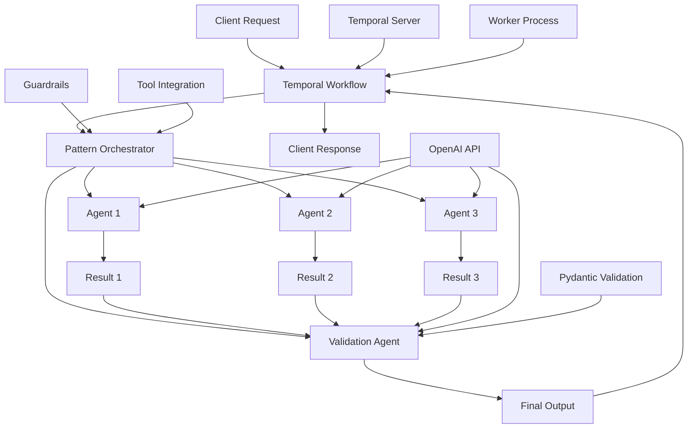
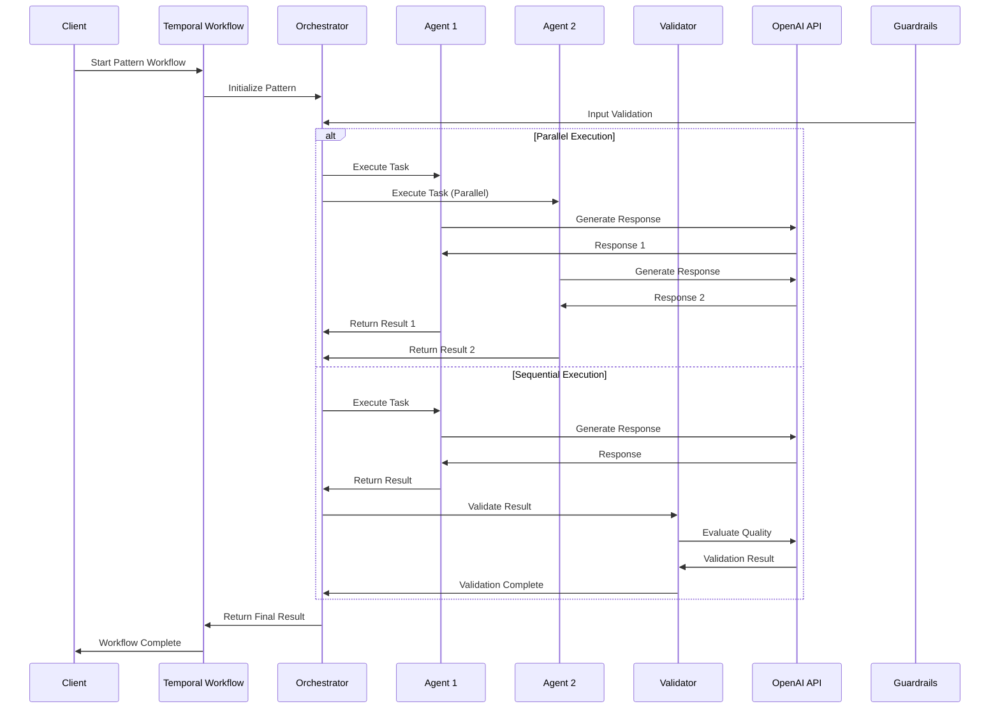

# Agent Patterns

## 📑 Table of Contents

- [Introduction](#introduction)
- [Philosophy & Challenges](#philosophy--challenges)
- [System Constraints & Features](#system-constraints--features)
- [System Overview](#system-overview)
- [System Flow](#system-flow)
- [Core Architecture](#core-architecture)
- [Interaction Flow](#interaction-flow)
- [Development Guidelines](#development-guidelines)
- [Code Examples & Best Practices](#code-examples--best-practices)

## 🎯 Introduction

The Agent Patterns service demonstrates advanced agentic patterns extended with Temporal's durable execution capabilities. This service showcases sophisticated patterns like deterministic flows, parallelization, LLM-as-a-judge, agents-as-tools, and guardrails, all implemented within Temporal's reliable workflow framework.

The system is designed for developers and engineering teams who want to:
- Learn advanced agent orchestration patterns with Temporal
- Implement complex multi-agent workflows with validation gates
- Build parallel execution systems for improved quality and efficiency
- Create safety mechanisms through input and output guardrails
- Compose agents as tools within other agents for specialized task delegation

## 🧠 Philosophy & Challenges

### What We're Solving
- **Complex Task Decomposition**: Breaking down complex tasks into manageable, validated steps
- **Quality Improvement**: Using feedback loops and multiple agents to enhance output quality
- **Parallel Processing**: Running multiple agents concurrently for efficiency and redundancy
- **Safety and Validation**: Implementing guardrails for input validation and output safety
- **Agent Composition**: Building complex systems from simpler, specialized agents
- **Non-Streaming Adaptation**: Adapting streaming patterns to Temporal's non-streaming workflow model

### Our Approach
- **Pattern-Based Design**: Establish reusable patterns for common agent interactions
- **Validation Gates**: Use agents to validate and improve outputs from other agents
- **Parallel Execution**: Leverage Temporal's capabilities for concurrent agent execution
- **Safety First**: Implement comprehensive guardrails for production safety
- **Composability**: Enable agents to work as tools within other agents
- **Temporal Integration**: Leverage workflow durability and state management

## ⚡ System Constraints & Features

### Key Features
- **Deterministic Flows**: Sequential agent execution with validation gates and Pydantic models
- **Parallelization**: Multiple agents running concurrently with result selection
- **LLM-as-a-Judge**: Iterative improvement using feedback loops with structured evaluation
- **Agents as Tools**: Use agents as callable tools within other agents via `as_tool()`
- **Agent Routing**: Route requests to specialized agents based on content analysis
- **Input Guardrails**: Pre-execution validation using `@input_guardrail` decorator
- **Output Guardrails**: Post-execution validation using `@output_guardrail` decorator
- **Forcing Tool Use**: Control tool execution strategies with `ModelSettings(tool_choice="required")`

### System Constraints
- **No Streaming**: Temporal workflows don't support streaming responses
- **Deterministic Execution**: All workflow code must be deterministic
- **Activity-Based I/O**: External calls must be wrapped in activities
- **State Persistence**: Automatic state management through Temporal
- **Task Queue**: Uses `"openai-agents-patterns-task-queue"` for all workflows
- **Pydantic Models**: Output validation requires structured Pydantic models

## 🏗️ System Overview



## 🔄 System Flow



## 🏛️ Core Architecture

### Component Layers
1. **Workflow Layer**: Temporal workflows for pattern orchestration with `@workflow.defn`
2. **Pattern Layer**: Specific pattern implementations (deterministic, parallel, etc.)
3. **Agent Layer**: Specialized agents with Pydantic output types and guardrails
4. **Validation Layer**: Quality assurance using structured evaluation and feedback
5. **Tool Layer**: Function tools and agent-as-tool integration via `as_tool()`

### Key Components
- **Pattern Workflows**: Implement specific agent patterns with Temporal integration
- **Agent Orchestrator**: Coordinates multiple agents and their interactions
- **Validation Agents**: Ensure quality and safety using structured feedback
- **Tool Integration**: Function tools and agent tools via `as_tool()` method
- **Result Selector**: Choose best results from parallel execution
- **Guardrail System**: Input and output validation with tripwire mechanisms

## 🔗 Interaction Flow

### Internal Communication
- Workflows orchestrate pattern execution using `Runner.run()` with `RunConfig`
- Agents communicate through structured data exchange with Pydantic models
- Validation agents provide feedback using structured evaluation classes
- Results are synthesized through `ItemHelpers.text_message_outputs()`
- Guardrails intercept execution using `@input_guardrail` and `@output_guardrail`

### External Dependencies
- **OpenAI API**: For agent responses and validation via `OpenAIAgentsPlugin`
- **Temporal Server**: For workflow orchestration and state management
- **Pydantic**: For output validation and structured data models
- **Function Tools**: Custom tools defined with `@function_tool` decorator

## 💻 Development Guidelines

### Code Organization
- **Pattern Workflows**: One file per pattern type in `workflows/` directory
- **Agent Definitions**: Specialized agents with specific instructions and output types
- **Runner Scripts**: Individual execution scripts for each pattern in root directory
- **Worker**: Central worker supporting all patterns in `run_worker.py`

### Design Patterns
- **Deterministic Pattern**: Sequential execution with validation gates using Pydantic models
- **Parallel Pattern**: Concurrent execution using `asyncio.gather()` with result selection
- **Feedback Pattern**: Iterative improvement using structured evaluation classes
- **Composition Pattern**: Agents working as tools via `as_tool()` method
- **Guardrail Pattern**: Input and output validation with tripwire mechanisms

### Error Handling
- **Validation Failures**: Handle cases where agents don't meet quality standards
- **Parallel Failures**: Continue execution when some agents fail
- **Guardrail Triggers**: Handle safety violations via `GuardrailTripwireTriggered` exceptions
- **Workflow Retries**: Automatic retry with exponential backoff via Temporal
- **Pydantic Validation**: Structured output validation with clear error messages

## 📝 Code Examples & Best Practices

### Deterministic Flow Pattern
**File**: `openai_agents/agent_patterns/workflows/deterministic_workflow.py`

This pattern demonstrates sequential agent execution with validation gates. Each step must pass validation before proceeding to the next, ensuring quality and consistency.

```python
from agents import Agent, RunConfig, Runner, trace
from pydantic import BaseModel
from temporalio import workflow

# Define structured output for validation - this ensures type safety and clear validation logic
class OutlineCheckerOutput(BaseModel):
    good_quality: bool      # Quality gate: must be True to proceed
    is_scifi: bool         # Genre gate: must be True for this example

# Agent 1: Generates the initial story outline
def story_outline_agent() -> Agent:
    return Agent(
        name="story_outline_agent",
        instructions="Generate a very short story outline based on the user's input.",
    )

# Agent 2: Validates the outline quality and genre - this is the validation gate
def outline_checker_agent() -> Agent:
    return Agent(
        name="outline_checker_agent",
        instructions="Read the given story outline, and judge the quality. Also, determine if it is a scifi story.",
        output_type=OutlineCheckerOutput,  # Enforces structured output for validation
    )

# Agent 3: Writes the final story (only called if validation passes)
def story_agent() -> Agent:
    return Agent(
        name="story_agent",
        instructions="Write a short story based on the given outline.",
        output_type=str,
    )

@workflow.defn
class DeterministicWorkflow:
    @workflow.run
    async def run(self, input_prompt: str) -> str:
        # RunConfig ensures consistent execution settings across all agent calls
        config = RunConfig()

        # Use trace() for observability - this creates a single trace span for the entire workflow
        with trace("Deterministic story flow"):
            # Step 1: Generate an outline using the first agent
            outline_result = await Runner.run(
                story_outline_agent(),
                input_prompt,
                run_config=config,
            )
            workflow.logger.info("Outline generated")

            # Step 2: Validate the outline using the second agent with structured output
            outline_checker_result = await Runner.run(
                outline_checker_agent(),
                outline_result.final_output,
                run_config=config,
            )

            # Step 3: Validation gate using Pydantic model - this is where we enforce quality
            assert isinstance(outline_checker_result.final_output, OutlineCheckerOutput)
            
            # Quality gate: stop if outline quality is insufficient
            if not outline_checker_result.final_output.good_quality:
                return "Story generation stopped: Outline quality insufficient."

            # Genre gate: stop if not science fiction (business rule enforcement)
            if not outline_checker_result.final_output.is_scifi:
                return "Story generation stopped: Outline is not science fiction."

            # Step 4: Continue only if validation passes - this ensures quality output
            workflow.logger.info("Outline validation passed, generating story")
            story_result = await Runner.run(
                story_agent(),
                outline_result.final_output,
                run_config=config,
            )

            return f"Final story: {story_result.final_output}"
```

**Key Benefits**: 
- **Quality Assurance**: Multiple validation gates ensure output quality
- **Business Rule Enforcement**: Genre and quality requirements are enforced programmatically
- **Observability**: Single trace span makes debugging easier
- **Type Safety**: Pydantic models prevent runtime errors

### Parallelization Pattern
**File**: `openai_agents/agent_patterns/workflows/parallelization_workflow.py`

This pattern runs multiple agents concurrently and selects the best result, improving both quality and efficiency through redundancy.

```python
import asyncio
from agents import Agent, ItemHelpers, RunConfig, Runner, trace
from temporalio import workflow

# Agent that performs the actual work (translation in this case)
def spanish_agent() -> Agent:
    return Agent(
        name="spanish_agent",
        instructions="You translate the user's message to Spanish",
    )

# Judge agent that selects the best result from multiple candidates
def translation_picker() -> Agent:
    return Agent(
        name="translation_picker",
        instructions="You pick the best Spanish translation from the given options.",
    )

@workflow.defn
class ParallelizationWorkflow:
    @workflow.run
    async def run(self, msg: str) -> str:
        config = RunConfig()

        with trace("Parallel translation"):
            # Run three translation agents in parallel using asyncio.gather()
            # This improves efficiency and provides redundancy for better quality
            res_1, res_2, res_3 = await asyncio.gather(
                Runner.run(spanish_agent(), msg, run_config=config),
                Runner.run(spanish_agent(), msg, run_config=config),
                Runner.run(spanish_agent(), msg, run_config=config),
            )

            # Extract text outputs using ItemHelpers - this handles the message structure properly
            # ItemHelpers.text_message_outputs() extracts all text content from the agent's response
            outputs = [
                ItemHelpers.text_message_outputs(res_1.new_items),
                ItemHelpers.text_message_outputs(res_2.new_items),
                ItemHelpers.text_message_outputs(res_3.new_items),
            ]

            # Combine all translations for the judge agent to evaluate
            translations = "\n\n".join(outputs)
            workflow.logger.info(f"Generated translations:\n{translations}")

            # Use a judge agent to select the best result from multiple candidates
            # This provides quality improvement through competition
            best_translation = await Runner.run(
                translation_picker(),
                f"Input: {msg}\n\nTranslations:\n{translations}",
                run_config=config,
            )

            return f"Best translation: {best_translation.final_output}"
```

**Key Benefits**:
- **Efficiency**: Parallel execution reduces total latency
- **Quality Improvement**: Multiple candidates allow selection of the best result
- **Redundancy**: If one agent fails, others can still succeed
- **Competition**: Agents compete to produce better results

### LLM-as-a-Judge Pattern
**File**: `openai_agents/agent_patterns/workflows/llm_as_a_judge_workflow.py`

This pattern implements iterative improvement using feedback loops, where one agent generates content and another evaluates and provides feedback for improvement.

```python
from dataclasses import dataclass
from typing import Literal
from agents import Agent, ItemHelpers, RunConfig, Runner, TResponseInputItem, trace
from temporalio import workflow

# Structured feedback for evaluation - ensures consistent evaluation criteria
@dataclass
class EvaluationFeedback:
    feedback: str                                    # Specific improvement suggestions
    score: Literal["pass", "needs_improvement", "fail"]  # Clear evaluation outcome

# Agent that generates content and incorporates feedback for improvement
def story_outline_generator() -> Agent:
    return Agent(
        name="story_outline_generator",
        instructions=(
            "You generate a very short story outline based on the user's input."
            "If there is any feedback provided, use it to improve the outline."
        ),
    )

# Judge agent that evaluates quality and provides structured feedback
def evaluator() -> Agent:
    return Agent(
        name="evaluator",
        instructions=(
            "You evaluate a story outline and decide if it's good enough."
            "If it's not good enough, you provide feedback on what needs to be improved."
            "Never give it a pass on the first try. After 5 attempts, you can give it a pass if story outline is good enough - do not go for perfection"
        ),
        output_type=EvaluationFeedback,  # Enforces structured feedback
    )

@workflow.defn
class LLMAsAJudgeWorkflow:
    @workflow.run
    async def run(self, msg: str) -> str:
        config = RunConfig()
        
        # Initialize conversation context with the user's message
        input_items: list[TResponseInputItem] = [{"content": msg, "role": "user"}]
        latest_outline: str | None = None

        with trace("LLM as a judge"):
            while True:  # Iterative improvement loop
                # Generate or improve the story outline
                story_outline_result = await Runner.run(
                    story_outline_generator(),
                    input_items,  # Pass conversation history for context
                    run_config=config,
                )

                # Update conversation context with the new outline
                input_items = story_outline_result.to_input_list()
                latest_outline = ItemHelpers.text_message_outputs(
                    story_outline_result.new_items
                )
                workflow.logger.info("Story outline generated")

                # Evaluate the outline quality using the judge agent
                evaluator_result = await Runner.run(
                    evaluator(),
                    input_items,
                    run_config=config,
                )
                result: EvaluationFeedback = evaluator_result.final_output

                # Check if quality threshold is met
                if result.score == "pass":
                    workflow.logger.info("Story outline is good enough, exiting.")
                    break

                # Add feedback to conversation context for the next iteration
                # This creates a continuous improvement loop
                input_items.append(
                    {"content": f"Feedback: {result.feedback}", "role": "user"}
                )

        return f"Final story outline: {latest_outline}"
```

**Key Benefits**:
- **Continuous Improvement**: Feedback loops lead to better quality output
- **Structured Evaluation**: Clear pass/fail criteria with specific feedback
- **Context Preservation**: Conversation history maintains improvement context
- **Quality Control**: Prevents poor quality output from being accepted

### Agents as Tools Pattern
**File**: `openai_agents/agent_patterns/workflows/agents_as_tools_workflow.py`

This pattern allows agents to use other agents as callable tools, enabling composition and specialized task delegation within a single workflow.

```python
from agents import Agent, ItemHelpers, MessageOutputItem, RunConfig, Runner, trace
from temporalio import workflow

def orchestrator_agent() -> Agent:
    # Create specialized translation agents with clear handoff descriptions
    spanish_agent = Agent(
        name="spanish_agent",
        instructions="You translate the user's message to Spanish",
        handoff_description="An english to spanish translator",  # Helps with agent selection
    )

    french_agent = Agent(
        name="french_agent",
        instructions="You translate the user's message to French",
        handoff_description="An english to french translator",
    )

    # Main orchestrator agent that coordinates other agents as tools
    orchestrator_agent = Agent(
        name="orchestrator_agent",
        instructions=(
            "You are a translation agent. You use the tools given to you to translate."
            "If asked for multiple translations, you call the relevant tools in order."
            "You never translate on your own, you always use the provided tools."
        ),
        tools=[
            # Convert agents to tools using as_tool() - this enables composition
            spanish_agent.as_tool(
                tool_name="translate_to_spanish",
                tool_description="Translate the user's message to Spanish",
            ),
            french_agent.as_tool(
                tool_name="translate_to_french",
                tool_description="Translate the user's message to French",
            ),
        ],
    )
    return orchestrator_agent

# Agent that synthesizes and validates the final output
def synthesizer_agent() -> Agent:
    return Agent(
        name="synthesizer_agent",
        instructions="You inspect translations, correct them if needed, and produce a final concatenated response.",
    )

@workflow.defn
class AgentsAsToolsWorkflow:
    @workflow.run
    async def run(self, msg: str) -> str:
        config = RunConfig()

        with trace("Orchestrator evaluator"):
            orchestrator = orchestrator_agent()
            synthesizer = synthesizer_agent()

            # The orchestrator agent uses other agents as tools to perform translations
            orchestrator_result = await Runner.run(orchestrator, msg, run_config=config)

            # Log each translation step for observability and debugging
            for item in orchestrator_result.new_items:
                if isinstance(item, MessageOutputItem):
                    text = ItemHelpers.text_message_output(item)
                    if text:
                        workflow.logger.info(f"  - Translation step: {text}")

            # Use a synthesizer agent to combine and validate the final output
            # This ensures quality and consistency of the final result
            synthesizer_result = await Runner.run(
                synthesizer, orchestrator_result.to_input_list(), run_config=config
            )

        return synthesizer_result.final_output
```

**Key Benefits**:
- **Agent Composition**: Build complex systems from simpler, specialized agents
- **Tool Reusability**: Agents can be used as tools in multiple contexts
- **Specialized Delegation**: Each agent focuses on its specific expertise
- **Coordination**: Orchestrator agent manages the overall workflow

### Agent Routing Pattern
**File**: `openai_agents/agent_patterns/workflows/routing_workflow.py`

This pattern demonstrates intelligent routing based on content analysis, where a triage agent determines which specialized agent should handle the request.

```python
from agents import Agent, RunConfig, Runner, TResponseInputItem, trace
from temporalio import workflow

# Specialized agents for different languages - each has a specific domain expertise
def french_agent() -> Agent:
    return Agent(
        name="french_agent",
        instructions="You only speak French",  # Clear specialization
    )

def spanish_agent() -> Agent:
    return Agent(
        name="spanish_agent",
        instructions="You only speak Spanish",  # Clear specialization
    )

def english_agent() -> Agent:
    return Agent(
        name="english_agent",
        instructions="You only speak English",  # Clear specialization
    )

# Triage agent that analyzes the request and routes to appropriate specialized agent
def triage_agent() -> Agent:
    return Agent(
        name="triage_agent",
        instructions="Handoff to the appropriate agent based on the language of the request.",
        handoffs=[french_agent(), spanish_agent(), english_agent()],  # Available routing options
    )

@workflow.defn
class RoutingWorkflow:
    @workflow.run
    async def run(self, msg: str) -> str:
        config = RunConfig()

        with trace("Routing example"):
            # Initialize conversation context with the user's message
            inputs: list[TResponseInputItem] = [{"content": msg, "role": "user"}]

            # Run the triage agent to determine which language agent to handoff to
            # The triage agent analyzes the message content and selects the appropriate specialist
            result = await Runner.run(
                triage_agent(),
                input=inputs,
                run_config=config,
            )

            # Log successful handoff for observability
            workflow.logger.info("Handoff completed")

            # Convert result to proper input format for the next agent
            # This maintains conversation context across the handoff
            inputs = result.to_input_list()

            # Return the result from the handoff (either the handoff agent's response or triage response)
            return f"Response: {result.final_output}"
```

**Key Benefits**:
- **Intelligent Routing**: Automatic selection of the most appropriate agent
- **Specialization**: Each agent focuses on its specific domain
- **Scalability**: Easy to add new specialized agents
- **Context Preservation**: Conversation context maintained across handoffs

### Input Guardrails Pattern
**File**: `openai_agents/agent_patterns/workflows/input_guardrails_workflow.py`

This pattern implements pre-execution validation to prevent unwanted or unsafe requests from being processed by the main agent.

```python
from agents import (
    Agent, GuardrailFunctionOutput, InputGuardrailTripwireTriggered,
    RunConfig, RunContextWrapper, Runner, TResponseInputItem, input_guardrail
)
from pydantic import BaseModel
from temporalio import workflow

# Structured output for guardrail validation - ensures clear decision criteria
class MathHomeworkOutput(BaseModel):
    reasoning: str           # Explanation of why the input was flagged
    is_math_homework: bool  # Boolean flag for tripwire decision

# Dedicated agent for input validation - specialized for safety checks
guardrail_agent = Agent(
    name="Guardrail check",
    instructions="Check if the user is asking you to do their math homework.",
    output_type=MathHomeworkOutput,  # Enforces structured validation output
)

# Input guardrail decorator - this intercepts all input before it reaches the main agent
@input_guardrail
async def math_guardrail(
    context: RunContextWrapper[None],  # Runtime context for the guardrail
    agent: Agent,                      # The agent being protected
    input: str | list[TResponseInputItem],  # The input to validate
) -> GuardrailFunctionOutput:
    """Input guardrail function that calls an agent to check if input is math homework."""
    
    # Use a specialized agent to perform the validation check
    result = await Runner.run(guardrail_agent, input, context=context.context)
    final_output = result.final_output_as(MathHomeworkOutput)

    # Return guardrail result with tripwire decision
    return GuardrailFunctionOutput(
        output_info=final_output,                    # Detailed validation information
        tripwire_triggered=final_output.is_math_homework,  # Decision to block execution
    )

@workflow.defn
class InputGuardrailsWorkflow:
    @workflow.run
    async def run(self, user_input: str) -> str:
        config = RunConfig()
        
        # Main agent with input guardrails attached
        agent = Agent(
            name="Customer support agent",
            instructions="You are a customer support agent. You help customers with their questions.",
            input_guardrails=[math_guardrail],  # Attach the guardrail for protection
        )

        # Format input for the agent
        input_data: list[TResponseInputItem] = [
            {"role": "user", "content": user_input}
        ]

        try:
            # Attempt to run the agent - guardrail will intercept if needed
            result = await Runner.run(agent, input_data, run_config=config)
            return str(result.final_output)
        except InputGuardrailTripwireTriggered:
            # Handle guardrail tripwire - provide safe fallback response
            workflow.logger.info(
                "Input guardrail triggered - refusing to help with math homework"
            )
            return "Sorry, I can't help you with your math homework."
```

**Key Benefits**:
- **Pre-Execution Safety**: Blocks unsafe requests before processing
- **Specialized Validation**: Dedicated agents for specific safety checks
- **Graceful Degradation**: Provides safe fallback responses
- **Audit Trail**: Logs all guardrail activations for compliance

### Output Guardrails Pattern
**File**: `openai_agents/agent_patterns/workflows/output_guardrails_workflow.py`

This pattern implements post-execution validation to detect sensitive or inappropriate content in agent responses before they are returned to users.

```python
from agents import (
    Agent, GuardrailFunctionOutput, OutputGuardrailTripwireTriggered,
    RunConfig, RunContextWrapper, Runner, output_guardrail
)
from pydantic import BaseModel, Field
from temporalio import workflow

# Structured output for the main agent - includes reasoning for transparency
class MessageOutput(BaseModel):
    reasoning: str = Field(description="Thoughts on how to respond to the user's message")
    response: str = Field(description="The response to the user's message")
    user_name: str | None = Field(description="The name of the user who sent the message, if known")

# Output guardrail decorator - this intercepts all output before it's returned
@output_guardrail
async def sensitive_data_check(
    context: RunContextWrapper,  # Runtime context for the guardrail
    agent: Agent,                # The agent being monitored
    output: MessageOutput        # The output to validate
) -> GuardrailFunctionOutput:
    """Output guardrail that checks for sensitive data like phone numbers."""
    
    # Check for sensitive data in both reasoning and response
    phone_number_in_response = "650" in output.response
    phone_number_in_reasoning = "650" in output.reasoning

    # Return guardrail result with detailed information about what was detected
    return GuardrailFunctionOutput(
        output_info={
            "phone_number_in_response": phone_number_in_response,
            "phone_number_in_reasoning": phone_number_in_reasoning,
        },
        tripwire_triggered=phone_number_in_response or phone_number_in_reasoning,
    )

@workflow.defn
class OutputGuardrailsWorkflow:
    @workflow.run
    async def run(self, user_input: str) -> str:
        config = RunConfig()
        
        # Main agent with output guardrails attached
        agent = Agent(
            name="Assistant",
            instructions="You are a helpful assistant.",
            output_type=MessageOutput,           # Enforces structured output
            output_guardrails=[sensitive_data_check],  # Attach output validation
        )

        try:
            # Attempt to get response from agent
            result = await Runner.run(agent, user_input, run_config=config)
            output = result.final_output_as(MessageOutput)
            return f"Response: {output.response}"
        except OutputGuardrailTripwireTriggered as e:
            # Handle output guardrail tripwire - provide safe response with detection info
            workflow.logger.info(
                f"Output guardrail triggered. Info: {e.guardrail_result.output.output_info}"
            )
            return f"Output guardrail triggered due to sensitive data detection. Info: {e.guardrail_result.output.output_info}"
```

**Key Benefits**:
- **Post-Execution Safety**: Catches sensitive content after generation
- **Structured Validation**: Clear criteria for what constitutes sensitive data
- **Transparency**: Provides detailed information about what was detected
- **Compliance**: Ensures responses meet safety and privacy requirements

### Forcing Tool Use Pattern
**File**: `openai_agents/agent_patterns/workflows/forcing_tool_use_workflow.py`

This pattern demonstrates different strategies for controlling how agents use tools, from optional usage to forced tool execution with custom behavior.

```python
from typing import Any, Literal
from agents import (
    Agent, FunctionToolResult, ModelSettings, RunConfig, RunContextWrapper,
    Runner, ToolsToFinalOutputFunction, function_tool
)
from pydantic import BaseModel
from temporalio import workflow

# Pydantic model for tool output - ensures structured data
class Weather(BaseModel):
    city: str
    temperature_range: str
    conditions: str

# Function tool that provides weather information
@function_tool
def get_weather(city: str) -> Weather:
    workflow.logger.info("[debug] get_weather called")
    return Weather(city=city, temperature_range="14-20C", conditions="Sunny with wind")

# Custom tool use behavior function - provides fine-grained control over tool execution
async def custom_tool_use_behavior(
    context: RunContextWrapper[Any],           # Runtime context
    results: list[FunctionToolResult]          # Results from all tool executions
) -> ToolsToFinalOutputResult:
    """Custom behavior that processes tool results and generates final output."""
    
    # Extract weather data from the first tool result
    weather: Weather = results[0].output
    
    # Generate custom formatted output
    return ToolsToFinalOutputResult(
        is_final_output=True,  # Mark this as the final output
        final_output=f"{weather.city} is {weather.conditions}."
    )

@workflow.defn
class ForcingToolUseWorkflow:
    @workflow.run
    async def run(self, tool_use_behavior: str = "default") -> str:
        config = RunConfig()

        # Configure different tool use behaviors based on the parameter
        if tool_use_behavior == "default":
            # Default behavior: send tool output back to LLM for final processing
            behavior: Literal["run_llm_again", "stop_on_first_tool"] | ToolsToFinalOutputFunction = "run_llm_again"
        elif tool_use_behavior == "first_tool":
            # First tool behavior: use first tool result as final output
            behavior = "stop_on_first_tool"
        elif tool_use_behavior == "custom":
            # Custom behavior: use custom function to process tool results
            behavior = custom_tool_use_behavior

        # Create agent with configured tool use behavior
        agent = Agent(
            name="Weather agent",
            instructions="You are a helpful agent.",
            tools=[get_weather],                    # Available tools
            tool_use_behavior=behavior,            # How to handle tool usage
            model_settings=ModelSettings(
                # Force tool usage when not using default behavior
                tool_choice="required" if tool_use_behavior != "default" else None
            ),
        )

        # Execute the agent with a weather-related query
        result = await Runner.run(
            agent, input="What's the weather in Tokyo?", run_config=config
        )
        return str(result.final_output)
```

**Key Benefits**:
- **Flexible Tool Control**: Different strategies for different use cases
- **Custom Processing**: Fine-grained control over how tool results are handled
- **Forced Execution**: Ensures tools are used when required
- **Behavior Customization**: Easy to implement custom tool handling logic

### Worker Configuration
**File**: `openai_agents/agent_patterns/run_worker.py`

This is the central worker that supports all agent pattern workflows, providing a single execution environment for the entire system.

```python
from __future__ import annotations

import asyncio
from datetime import timedelta

from temporalio.client import Client
from temporalio.contrib.openai_agents import ModelActivityParameters, OpenAIAgentsPlugin
from temporalio.worker import Worker

# Import all workflow classes for registration
from openai_agents.agent_patterns.workflows.agents_as_tools_workflow import (
    AgentsAsToolsWorkflow,
)
from openai_agents.agent_patterns.workflows.deterministic_workflow import (
    DeterministicWorkflow,
)
from openai_agents.agent_patterns.workflows.forcing_tool_use_workflow import (
    ForcingToolUseWorkflow,
)
from openai_agents.agent_patterns.workflows.input_guardrails_workflow import (
    InputGuardrailsWorkflow,
)
from openai_agents.agent_patterns.workflows.llm_as_a_judge_workflow import (
    LLMAsAJudgeWorkflow,
)
from openai_agents.agent_patterns.workflows.output_guardrails_workflow import (
    OutputGuardrailsWorkflow,
)
from openai_agents.agent_patterns.workflows.parallelization_workflow import (
    ParallelizationWorkflow,
)
from openai_agents.agent_patterns.workflows.routing_workflow import RoutingWorkflow

async def main():
    # Create client connected to Temporal server
    client = await Client.connect(
        "localhost:7233",
        plugins=[
            OpenAIAgentsPlugin(
                model_params=ModelActivityParameters(
                    start_to_close_timeout=timedelta(seconds=30)  # Timeout for OpenAI API calls
                )
            ),
        ],
    )

    # Create worker that supports all agent pattern workflows
    worker = Worker(
        client,
        task_queue="openai-agents-patterns-task-queue",  # Single task queue for all patterns
        workflows=[
            # Register all workflow classes for execution
            AgentsAsToolsWorkflow,
            DeterministicWorkflow,
            ParallelizationWorkflow,
            LLMAsAJudgeWorkflow,
            ForcingToolUseWorkflow,
            InputGuardrailsWorkflow,
            OutputGuardrailsWorkflow,
            RoutingWorkflow,
        ],
    )
    await worker.run()

if __name__ == "__main__":
    asyncio.run(main())
```

**Key Benefits**:
- **Centralized Execution**: Single worker for all patterns
- **Consistent Configuration**: Unified settings for all workflows
- **Easy Deployment**: Single process to manage and monitor
- **Resource Efficiency**: Shared resources across all patterns

### Runner Script Pattern
**File**: `openai_agents/agent_patterns/run_deterministic_workflow.py` (example)

Runner scripts provide individual execution of specific patterns for testing and demonstration purposes.

```python
import asyncio
from temporalio.client import Client
from temporalio.contrib.openai_agents import OpenAIAgentsPlugin

async def main():
    # Create client connected to Temporal server
    client = await Client.connect(
        "localhost:7233",
        plugins=[OpenAIAgentsPlugin()],
    )

    # Execute specific workflow with test input
    result = await client.execute_workflow(
        DeterministicWorkflow.run,                    # Workflow to execute
        "Write a science fiction story about time travel",  # Test input
        id="deterministic-workflow-example",          # Unique workflow ID
        task_queue="openai-agents-patterns-task-queue",    # Task queue for execution
    )
    print(f"Result: {result}")

if __name__ == "__main__":
    asyncio.run(main())
```

**Key Benefits**:
- **Individual Testing**: Test specific patterns in isolation
- **Easy Demonstration**: Simple execution for demos and presentations
- **Development Workflow**: Quick iteration during development
- **Clear Examples**: Shows exactly how to execute each pattern

### Testing Approach
This section shows how to test agent pattern workflows using mocking and assertions.

```python
async def test_agent_patterns():
    """Test agent pattern workflows."""
    with mock.patch('agents.Runner.run') as mock_run:
        # Mock deterministic flow with realistic responses
        mock_run.side_effect = [
            MockResult("Detailed outline here"),
            MockResult(OutlineCheckerOutput(good_quality=True, is_scifi=True)),
            MockResult("Final content based on outline")
        ]
        
        # Execute workflow with mocked dependencies
        result = await client.execute_workflow(
            DeterministicWorkflow.run,
            "Write a story about AI",
            id="test-deterministic",
            task_queue="openai-agents-patterns-task-queue"
        )
        
        # Assert expected behavior
        assert "Final content" in result
```

**Key Benefits**:
- **Isolated Testing**: Test workflows without external dependencies
- **Predictable Results**: Mocked responses ensure consistent test behavior
- **Fast Execution**: No actual API calls during testing
- **Clear Assertions**: Verify expected workflow behavior

## 🎯 Key Benefits of This Structure

1. **Advanced Patterns**: Demonstrates sophisticated agent interaction patterns with Temporal
2. **Production Ready**: Shows how to build reliable, scalable agent systems
3. **Quality Assurance**: Implements validation and improvement mechanisms using Pydantic
4. **Safety First**: Comprehensive guardrails for production use with tripwire mechanisms
5. **Composability**: Enables building complex systems from simple components via `as_tool()`
6. **Structured Validation**: Pydantic models ensure type safety and validation
7. **Parallel Execution**: Leverages Temporal's capabilities for concurrent processing
8. **Iterative Improvement**: Feedback loops for continuous quality enhancement

## ⚠️ Important Implementation Notes

### Task Queue Configuration
- **Worker**: Uses task queue `"openai-agents-patterns-task-queue"`
- **All Runner Scripts**: Use the same task queue for consistency
- **Note**: Unlike the basic examples, all patterns use the same task queue

### Specific Examples Implemented
- **Deterministic Flow**: Science fiction story generation with outline validation
- **Parallelization**: Spanish translation with multiple agents and quality selection
- **LLM-as-a-Judge**: Story outline improvement with structured feedback
- **Agents as Tools**: Translation orchestration using agents as callable tools
- **Routing**: Language-based agent handoffs for specialized responses
- **Input Guardrails**: Math homework detection with tripwire mechanism
- **Output Guardrails**: Phone number detection in responses
- **Forcing Tool Use**: Weather tool usage with different behavior strategies

### Architecture Patterns
- **Pydantic-First Design**: All outputs use structured Pydantic models for validation
- **Trace-Based Monitoring**: Comprehensive tracing using `trace()` context managers
- **ItemHelpers Integration**: Proper handling of message items and outputs
- **Guardrail System**: Input and output validation with configurable tripwires
- **Tool Integration**: Both function tools and agent tools via `as_tool()`

### File Organization
```
openai_agents/agent_patterns/
├── workflows/                           # Core pattern implementations
│   ├── deterministic_workflow.py       # Sequential execution with validation
│   ├── parallelization_workflow.py     # Concurrent execution with selection
│   ├── llm_as_a_judge_workflow.py     # Iterative improvement with feedback
│   ├── agents_as_tools_workflow.py    # Agent composition via tools
│   ├── routing_workflow.py            # Intelligent agent routing
│   ├── input_guardrails_workflow.py   # Pre-execution validation
│   ├── output_guardrails_workflow.py  # Post-execution validation
│   └── forcing_tool_use_workflow.py   # Tool usage control strategies
├── run_worker.py                       # Central worker for all patterns
├── run_*.py                           # Individual pattern runners
└── README.md                          # Pattern overview and usage
```

### Common Development Patterns
- **Always use `RunConfig()`** for consistent execution settings
- **Wrap workflows in `trace()`** for observability and debugging
- **Use Pydantic models** for structured output validation
- **Implement proper error handling** for guardrail tripwires
- **Log key workflow steps** for monitoring and debugging
- **Use `ItemHelpers`** for proper message handling

### Troubleshooting Common Issues
- **Guardrail Tripwires**: Always handle `GuardrailTripwireTriggered` exceptions gracefully
- **Pydantic Validation**: Ensure all agent outputs use proper `output_type` for validation
- **Message Handling**: Use `ItemHelpers.text_message_outputs()` for extracting text content
- **Context Preservation**: Use `result.to_input_list()` to maintain conversation context across handoffs
- **Tool Integration**: Remember to use `as_tool()` for agent composition, not direct calls
- **Parallel Execution**: Use `asyncio.gather()` for concurrent agent execution, not sequential loops

This structure ensures developers can understand:
- **Advanced agent orchestration** patterns with Temporal integration
- **Quality improvement** through structured feedback and validation
- **Parallel execution** strategies using `asyncio.gather()`
- **Safety and validation** mechanisms with guardrails and tripwires
- **Agent composition** techniques via `as_tool()` method
- **Structured data handling** with Pydantic models and ItemHelpers

The patterns serve as building blocks for production-ready AI agent systems while maintaining the reliability, observability, and type safety that Temporal and Pydantic provide.
