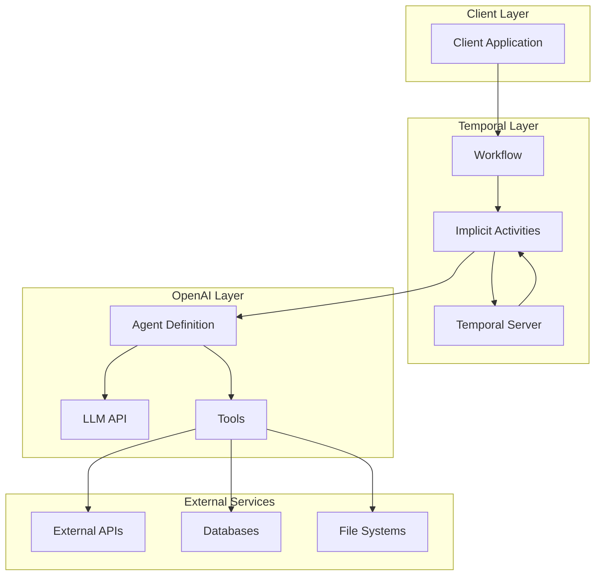
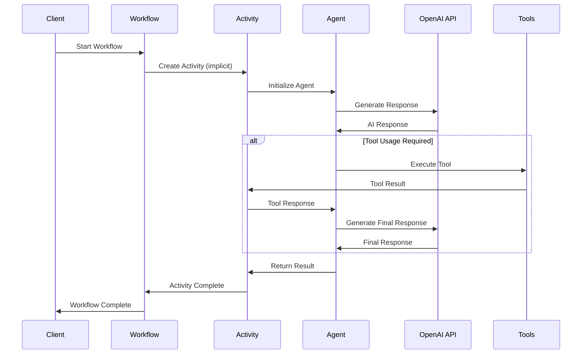
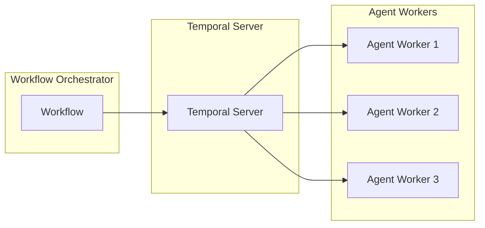

# OpenAI Agents SDK + Temporal Architecture Deep Dive

## 🏗️ **Integration Architecture**

This document provides a technical deep dive into how the OpenAI Agents SDK integrates with Temporal's durable execution engine, focusing on the architectural patterns and implementation details.

## 🔄 **Core Integration Mechanism**

### **Implicit Activity Creation**
The integration's key innovation is automatic Temporal Activity creation for every agent invocation:

```python
# What you write
result = await Runner.run(agent, input="Hello")

# What happens under the hood
# 1. Temporal creates an Activity for this agent execution
# 2. The Activity handles the OpenAI API call
# 3. Results are automatically persisted
# 4. Workflow state is checkpointed
```

### **Runner Abstraction**
The `Runner` class serves as the bridge between OpenAI Agents SDK and Temporal:

```python
from agents import Runner

# Standard usage (creates implicit activities)
result = await Runner.run(agent, input="...")

# With custom configuration
result = await Runner.run(
    agent, 
    input="...",
    run_config=RunConfig(
        max_steps=100,
        timeout=300
    )
)
```

## 🏛️ **System Architecture**



## 🔄 **Execution Flow**



## 🧩 **Component Architecture**

### **Workflow Layer**
```python
@workflow.defn
class AgentWorkflow:
    @workflow.run
    async def run(self, input: str) -> str:
        # Workflow orchestrates agent execution
        # State is automatically persisted
        # Failures trigger automatic retries
        pass
```

### **Activity Layer (Implicit)**
```python
# Activities are created automatically by the integration
# Each Runner.run() call becomes a Temporal Activity
# Benefits:
# - Automatic retries
# - Timeout handling
# - Error isolation
# - Resource management
```

### **Agent Layer**
```python
from agents import Agent

agent = Agent(
    name="MyAgent",
    instructions="...",
    model="gpt-4o",
    tools=[...],
    handoffs=[...]
)
```

## 🔧 **Configuration Patterns**

### **Worker Configuration**
```python
from temporalio.worker import Worker
from temporalio.contrib.openai_agents import OpenAIAgentsPlugin, ModelActivityParameters

worker = Worker(
    client,
    task_queue="openai-agents-task-queue",
    workflows=[...],
    plugins=[
        OpenAIAgentsPlugin(
            model_params=ModelActivityParameters(
                start_to_close_timeout=timedelta(seconds=120),
                retry_policy=RetryPolicy(
                    initial_interval=timedelta(seconds=1),
                    maximum_interval=timedelta(seconds=10),
                    maximum_attempts=3
                )
            )
        )
    ]
)
```

### **Agent Configuration**
```python
from agents import Agent, ModelSettings

agent = Agent(
    name="ResearchAgent",
    instructions="...",
    model="gpt-4o",
    model_settings=ModelSettings(
        temperature=0.7,
        max_tokens=1000,
        tool_choice="auto"
    ),
    tools=[WebSearchTool(), CodeInterpreterTool()]
)
```

## 📊 **Scaling Architecture**

### **Horizontal Scaling**


### **Independent Scaling**
- **Planner Agents**: Scale based on planning workload
- **Search Agents**: Scale based on search volume
- **Writer Agents**: Scale based on report generation needs
- **Tool Agents**: Scale based on external API usage

## 🔍 **Observability Architecture**

### **Integrated Tracing**
```python
from temporalio import workflow
from agents import trace, custom_span

@workflow.defn
class ObservableWorkflow:
    @workflow.run
    async def run(self, input: str) -> str:
        with trace("Agent Workflow"):
            with custom_span("Agent Execution"):
                agent = Agent(...)
                result = await Runner.run(agent, input)
            return result.final_output
```

### **Dual Dashboard Access**
- **Temporal Dashboard**: Workflow execution, activity history, retries
- **OpenAI Dashboard**: Agent interactions, tool usage, token consumption

## 🚨 **Error Handling Architecture**

### **Automatic Retries**
```python
# Temporal automatically retries failed agent invocations
# Configurable retry policies per activity type
# Exponential backoff with jitter
# Maximum retry attempts per activity
```

### **Failure Isolation**
```python
# Agent failures don't crash the entire workflow
# Partial results can be salvaged
# Compensation logic for failed steps
# Graceful degradation strategies
```

### **Error Recovery Patterns**
```python
@workflow.defn
class ResilientWorkflow:
    @workflow.run
    async def run(self, input: str) -> str:
        try:
            result = await Runner.run(agent, input)
            return result.final_output
        except Exception as e:
            # Fallback logic
            return await self.fallback_agent(input)
```

## 🔐 **Security Architecture**

### **API Key Management**
```python
# OpenAI API keys managed through environment variables
# Temporal server authentication and authorization
# Secure communication between components
# Audit logging for all agent interactions
```

### **Tool Access Control**
```python
# Tools can be restricted based on agent permissions
# External API access controlled through activities
# Input validation and sanitization
# Output filtering and validation
```

## 📈 **Performance Architecture**

### **Optimization Strategies**
1. **Parallel Agent Execution**: Use `asyncio.gather()` for concurrent agents
2. **Connection Pooling**: Reuse OpenAI API connections
3. **Caching**: Cache agent responses and tool results
4. **Batch Processing**: Group similar agent operations

### **Resource Management**
```python
# Automatic cleanup of agent resources
# Memory management for large conversations
# Timeout handling for long-running operations
# Resource limits per workflow execution
```

## 🔄 **State Management Architecture**

### **Workflow State**
```python
@workflow.defn
class StatefulWorkflow:
    def __init__(self):
        self.conversation_history = []
        self.agent_context = {}
    
    @workflow.run
    async def run(self, input: str) -> str:
        # State automatically persisted between steps
        self.conversation_history.append(input)
        # ... agent execution
        return result
```

### **Persistence Patterns**
- **Conversation History**: Maintain context across agent interactions
- **Agent State**: Preserve agent-specific information
- **Tool Results**: Cache and reuse tool outputs
- **Execution Metadata**: Track performance and usage metrics

---

*This architecture document provides the technical foundation for understanding the integration. For implementation examples and specific use cases, refer to the individual service documentation.*
