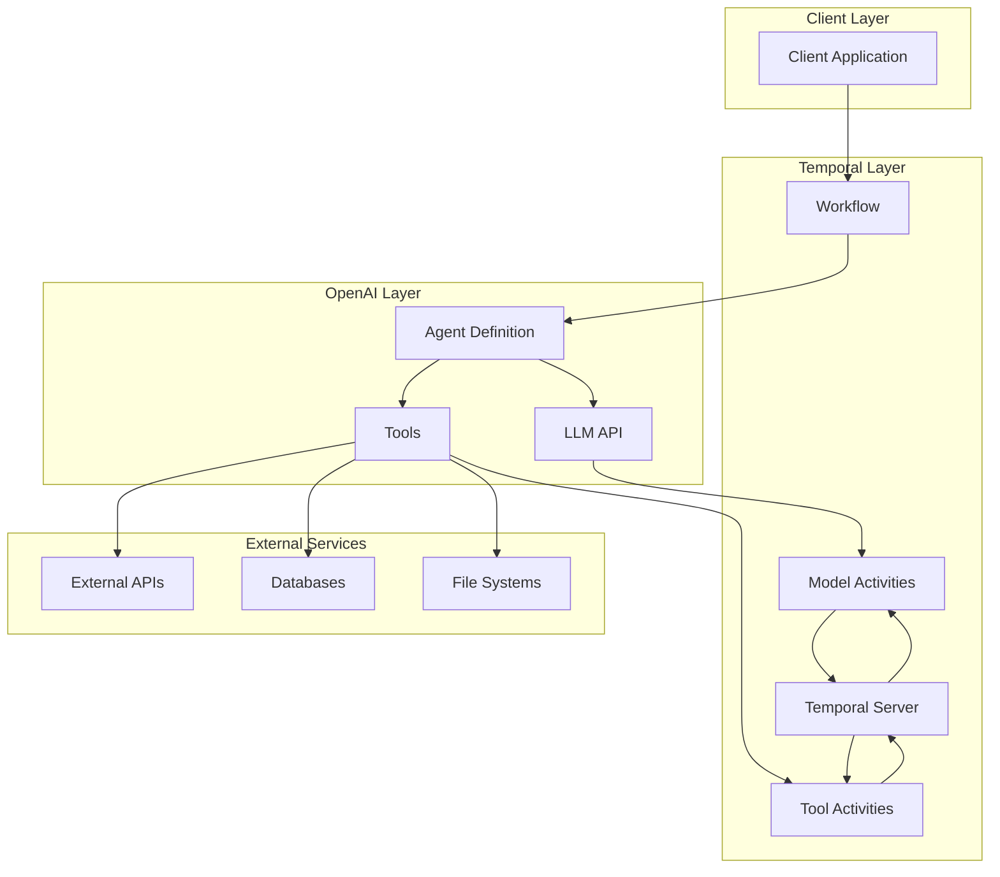
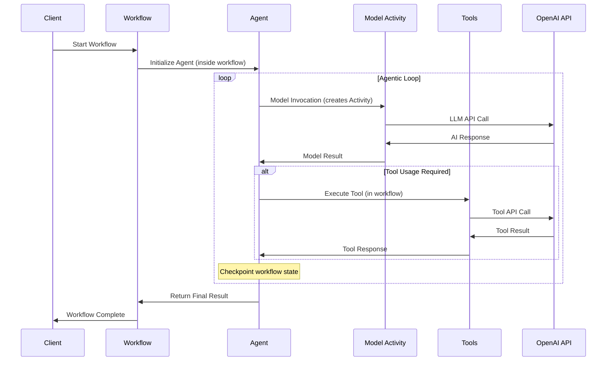
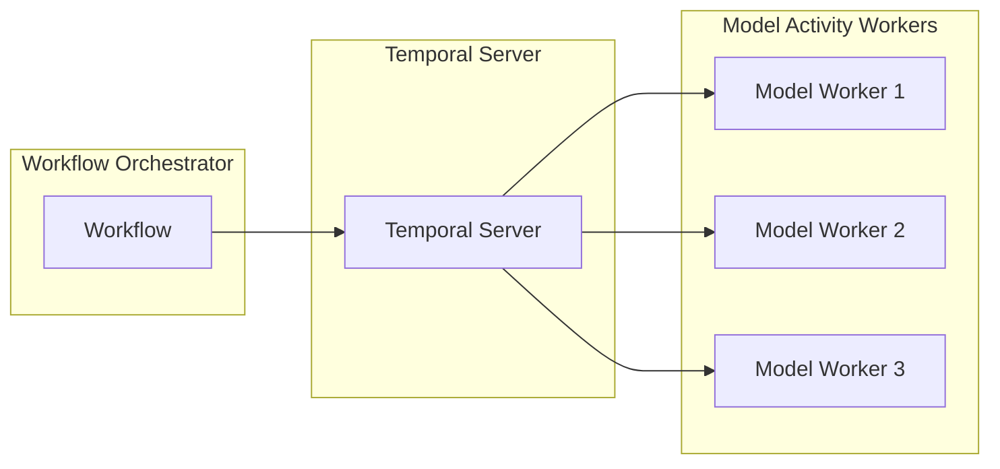

# OpenAI Agents SDK + Temporal Architecture Deep Dive

## 🏗️ **Integration Architecture**

This document provides a technical deep dive into how the OpenAI Agents SDK integrates with Temporal's durable execution engine, focusing on the architectural patterns and implementation details.

## 🔄 **Core Integration Mechanism**

### **Implicit Activity Creation for Model Invocations**
The integration's key innovation is automatic Temporal Activity creation for each **model invocation** within the agentic loop:

```python
# What you write
result = await Runner.run(agent, input="Hello")

# What happens under the hood
# 1. Runner.run() executes inside the Temporal workflow
# 2. During the agentic loop, each model invocation becomes a separate Activity
# 3. Each Activity is stored in Temporal history
# 4. The agentic loop can be resumed from any point
# 5. Workflow state is automatically checkpointed between model invocations
```

### **Runner Abstraction**
The `Runner.run()` method executes **inside** the Temporal workflow, not as an Activity itself:

```python
from agents import Runner

# Standard usage (executes inside workflow, creates implicit activities for model calls)
result = await Runner.run(agent, input="...")

# With custom configuration
result = await Runner.run(
    agent, 
    input="...",
    run_config=RunConfig(
        max_steps=100,
        timeout=300
    )
)
```

### **Key Architectural Insight**
- **`Runner.run()`**: Executes inside the workflow, orchestrating the agentic loop
- **Model Invocations**: Each LLM call automatically becomes a Temporal Activity
- **Tool Executions**: Run in the workflow, with optional `activity_as_tool` helper
- **Resumability**: The agentic loop can resume from any model invocation point

## 🏛️ **System Architecture**



## 🔄 **Execution Flow**



## 🧩 **Component Architecture**

### **Workflow Layer**
```python
@workflow.defn
class AgentWorkflow:
    @workflow.run
    async def run(self, input: str) -> str:
        # Workflow orchestrates the entire agentic loop
        # Runner.run() executes inside this workflow
        # State is automatically persisted between model invocations
        # Failures can resume from any model invocation point
        pass
```

### **Activity Layer (Implicit for Models)**
```python
# Model invocations automatically create Temporal Activities
# Each LLM call becomes a separate Activity stored in history
# Benefits:
# - Automatic retries for failed model calls
# - Timeout handling per model invocation
# - Error isolation between model calls
# - Resumability from any point in the agentic loop
```

### **Agent Layer**
```python
from agents import Agent

agent = Agent(
    name="MyAgent",
    instructions="...",
    model="gpt-4o",
    tools=[...],
    handoffs=[...]
)
```

## 🔧 **Configuration Patterns**

### **Worker Configuration**
```python
from temporalio.worker import Worker
from temporalio.contrib.openai_agents import OpenAIAgentsPlugin, ModelActivityParameters

worker = Worker(
    client,
    task_queue="openai-agents-task-queue",
    workflows=[...],
    plugins=[
        OpenAIAgentsPlugin(
            model_params=ModelActivityParameters(
                start_to_close_timeout=timedelta(seconds=120),
                retry_policy=RetryPolicy(
                    initial_interval=timedelta(seconds=1),
                    maximum_interval=timedelta(seconds=10),
                    maximum_attempts=3
                )
            )
        )
    ]
)
```

### **Agent Configuration**
```python
from agents import Agent, ModelSettings

agent = Agent(
    name="ResearchAgent",
    instructions="...",
    model="gpt-4o",
    model_settings=ModelSettings(
        temperature=0.7,
        max_tokens=1000,
        tool_choice="auto"
    ),
    tools=[WebSearchTool(), CodeInterpreterTool()]
)
```

## 📊 **Scaling Architecture**

### **Horizontal Scaling**


### **Independent Scaling**
- **Model Workers**: Scale based on LLM API call volume
- **Tool Workers**: Scale based on external API usage
- **Workflow Workers**: Scale based on orchestration needs

## 🔍 **Observability Architecture**

### **Integrated Tracing**
```python
from temporalio import workflow
from agents import trace, custom_span

@workflow.defn
class ObservableWorkflow:
    @workflow.run
    async def run(self, input: str) -> str:
        with trace("Agent Workflow"):
            with custom_span("Agent Execution"):
                agent = Agent(...)
                result = await Runner.run(agent, input)
            return result.final_output
```

### **Dual Dashboard Access**
- **Temporal Dashboard**: Workflow execution, model activity history, retries
- **OpenAI Dashboard**: Agent interactions, tool usage, token consumption

## 🚨 **Error Handling Architecture**

### **Automatic Retries for Model Calls**
```python
# Temporal automatically retries failed model invocations
# Each model call is a separate Activity with its own retry policy
# Exponential backoff with jitter per model invocation
# Maximum retry attempts per model call
```

### **Failure Isolation and Resumability**
```python
# Model failures don't crash the entire agentic loop
# The workflow can resume from any successful model invocation
# Partial results are preserved in workflow state
# Compensation logic can be implemented for failed model calls
```

### **Error Recovery Patterns**
```python
@workflow.defn
class ResilientWorkflow:
    @workflow.run
    async def run(self, input: str) -> str:
        try:
            result = await Runner.run(agent, input)
            return result.final_output
        except Exception as e:
            # The workflow can resume from the last successful model invocation
            # or implement fallback logic
            return await self.fallback_agent(input)
```

## 🔐 **Security Architecture**

### **API Key Management**
```python
# OpenAI API keys managed through environment variables
# Temporal server authentication and authorization
# Secure communication between components
# Audit logging for all model invocations and tool executions
```

### **Tool Access Control**
```python
# Tools can be restricted based on agent permissions
# External API access controlled through activities
# Input validation and sanitization
# Output filtering and validation
```

## 📈 **Performance Architecture**

### **Optimization Strategies**
1. **Parallel Model Invocations**: Use `asyncio.gather()` for concurrent model calls
2. **Connection Pooling**: Reuse OpenAI API connections across model activities
3. **Caching**: Cache model responses and tool results
4. **Batch Processing**: Group similar model operations

### **Resource Management**
```python
# Automatic cleanup of model resources
# Memory management for large conversations
# Timeout handling for long-running model calls
# Resource limits per workflow execution
```

## 🔄 **State Management Architecture**

### **Workflow State**
```python
@workflow.defn
class StatefulWorkflow:
    def __init__(self):
        self.conversation_history = []
        self.agent_context = {}
    
    @workflow.run
    async def run(self, input: str) -> str:
        # State automatically persisted between model invocations
        self.conversation_history.append(input)
        # ... agent execution with automatic checkpointing
        return result
```

### **Persistence Patterns**
- **Conversation History**: Maintain context across model invocations
- **Agent State**: Preserve agent-specific information between model calls
- **Tool Results**: Cache and reuse tool outputs
- **Execution Metadata**: Track performance and usage metrics per model invocation

## 🎯 **Key Benefits of This Architecture**

### **Resumability**
- Agentic loops can resume from any model invocation point
- No need to restart the entire agent execution
- Partial progress is preserved in workflow state

### **Granular Durability**
- Each model call is a separate, durable Activity
- Fine-grained retry policies per model invocation
- Better error isolation and recovery

### **Scalability**
- Model workers can scale independently
- Different types of model calls can use different worker pools
- Better resource utilization

---

*This architecture document provides the technical foundation for understanding the integration. The key insight is that `Runner.run()` executes inside the workflow, while model invocations automatically create Activities, enabling resumable agentic loops.*
