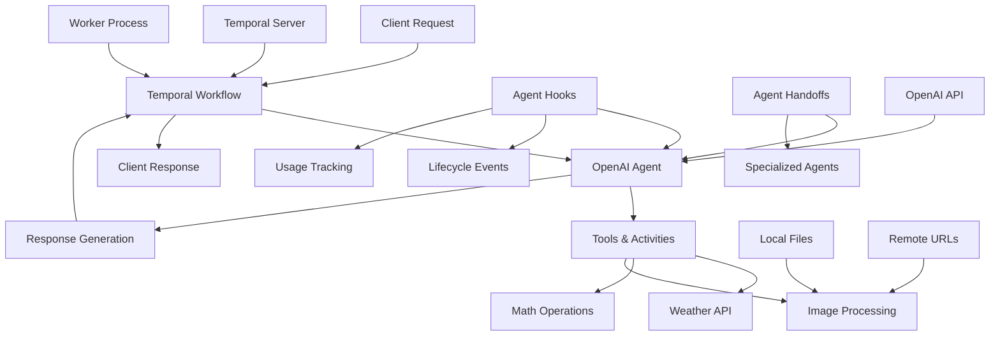
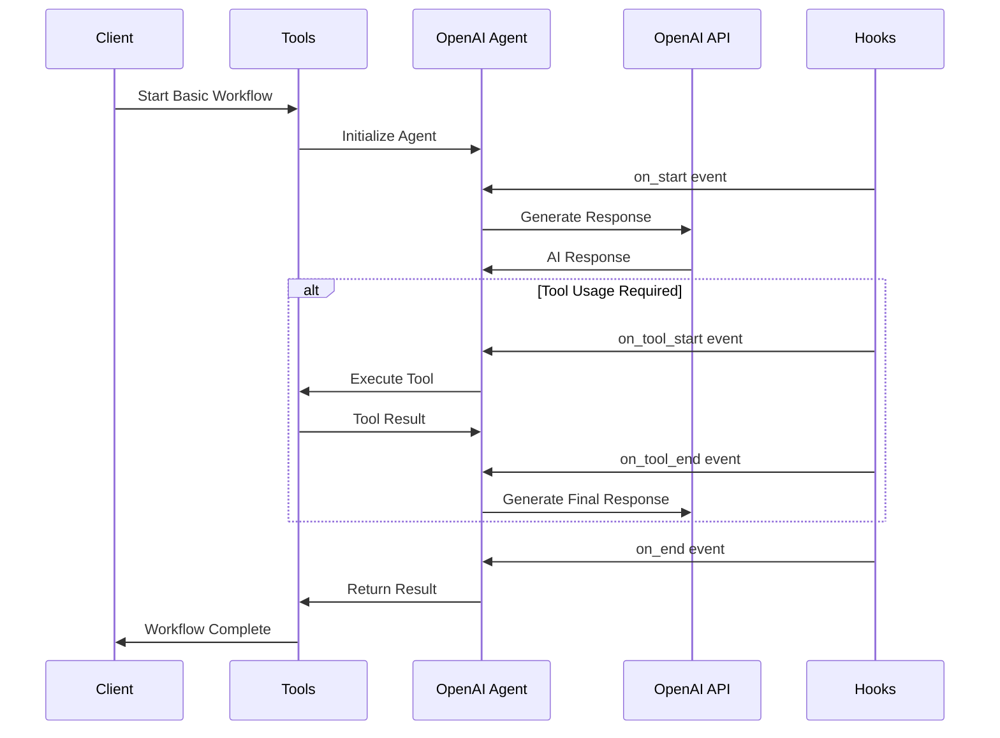

# Basic Agent Examples

## 📑 Table of Contents

- [Introduction](#introduction)
- [Philosophy & Challenges](#philosophy--challenges)
- [System Constraints & Features](#system-constraints--features)
- [System Overview](#system-overview)
- [System Flow](#system-flow)
- [Core Architecture](#core-architecture)
- [Interaction Flow](#interaction-flow)
- [Development Guidelines](#development-guidelines)
- [Code Examples & Best Practices](#code-examples--best-practices)

## 🎯 Introduction

The Basic Agent Examples service provides foundational examples for getting started with OpenAI Agents SDK integrated with Temporal workflows. This service demonstrates core agent capabilities including simple responses, tool usage, lifecycle management, dynamic prompts, image processing, and conversation continuity, all wrapped in Temporal's durable execution framework.

## 🧠 Philosophy & Challenges

### What We're Solving
- **Learning Curve**: Developers need simple examples to understand the integration
- **Foundation Building**: Establish basic patterns for more complex agent workflows
- **Tool Integration**: Demonstrate how agents can use external tools and APIs
- **State Management**: Show how Temporal maintains agent state across executions
- **Agent Lifecycle**: Understand agent events, hooks, and handoffs
- **Dynamic Behavior**: Implement context-aware agent instructions
- **Image Processing**: Handle both local and remote image analysis
- **Output Validation**: Manage different output schema requirements

### Our Approach
- **Progressive Complexity**: Start with simple agents, build up to complex workflows
- **Real-World Tools**: Use practical examples like weather APIs and image processing
- **Durability First**: Ensure all examples work reliably with Temporal's execution model
- **Pattern Consistency**: Establish consistent patterns across all basic examples
- **Event-Driven Design**: Use hooks and events for observability and control
- **Modular Architecture**: Separate activities, workflows, and execution logic

## ⚡ System Constraints & Features

### Key Features
- **Hello World Agent**: Simple agent that responds in haikus
- **Tools Integration**: Weather API, math operations, and image processing
- **Lifecycle Management**: Agent lifecycle events and handoffs with custom hooks
- **Dynamic Prompts**: Context-aware instruction generation (haiku/pirate/robot)
- **Image Processing**: Local file and remote URL analysis
- **Conversation Continuity**: Response ID tracking for context
- **Usage Tracking**: Detailed monitoring of requests, tokens, and API usage
- **Agent Handoffs**: Seamless transition between specialized agents
- **Output Schema Management**: Strict and non-strict JSON validation

### System Constraints
- **No Streaming**: Temporal workflows don't support streaming responses
- **Activity-Based I/O**: All external calls must be wrapped in activities
- **Deterministic Execution**: Workflow code must be deterministic
- **State Persistence**: Automatic state management through Temporal
- **Task Queue Mismatch**: Worker uses different queue than runner scripts

## 🏗️ System Overview



## 🔄 System Flow



## 🏛️ Core Architecture

### Component Layers
1. **Activity Layer**: Temporal activities wrapping external API calls and file operations
2. **Workflow Layer**: Temporal workflows for agent orchestration and state management
3. **Agent Layer**: OpenAI agents with specific instructions, tools, and hooks
4. **Hook Layer**: Custom event handlers for lifecycle monitoring and usage tracking
5. **Execution Layer**: Runner scripts and worker processes for deployment

### Key Components
- **Temporal Activities**: Weather, math, and image processing functions
- **Agent Workflows**: Simple to complex orchestration patterns
- **Custom Hooks**: Event handlers for agent lifecycle monitoring
- **Function Tools**: Workflow-level tools for agent usage
- **Worker Process**: Central execution engine for all workflows
- **Runner Scripts**: Individual execution scripts for testing

## 🔗 Interaction Flow

### Internal Communication
- Activities handle external I/O operations (file reading, API calls)
- Workflows orchestrate agent execution and state transitions
- Agents communicate through tool calls and response generation
- Hooks monitor and log agent lifecycle events
- State is maintained across workflow executions

### External Dependencies
- **OpenAI API**: For agent responses and reasoning
- **Temporal Server**: For workflow orchestration and state management
- **Local File System**: For image processing and data access
- **Remote URLs**: For remote image analysis
- **Random Number Generation**: For workflow-level tools

## 💻 Development Guidelines

### Code Organization
- **Activities**: Grouped by functionality (weather, math, images) in `activities/` directory
- **Workflows**: One file per workflow type in `workflows/` directory
- **Runner Scripts**: Individual execution scripts in root directory
- **Worker**: Central worker supporting all examples in `run_worker.py`
- **Hooks**: Custom event handlers embedded in workflow files

### Design Patterns
- **Activity Pattern**: Wrap external operations in Temporal activities
- **Hook Pattern**: Use event handlers for monitoring and control
- **Tool Pattern**: Provide agents with function-based tools
- **Handoff Pattern**: Seamless agent transitions with context preservation
- **Context Pattern**: Dynamic instruction generation based on runtime context
- **Schema Pattern**: Flexible output validation with strict/non-strict options

### Error Handling
- **Activity Timeouts**: Configurable timeouts for external operations
- **Schema Validation**: Handle output type mismatches gracefully
- **Workflow Retries**: Automatic retry with exponential backoff
- **Graceful Degradation**: Continue operation when possible
- **Hook Error Handling**: Graceful handling of hook failures

## 📝 Code Examples & Best Practices

### Activity Definition Pattern
**File**: `openai_agents/basic/activities/get_weather_activity.py`

This pattern demonstrates how to wrap external API calls in Temporal activities for reliable execution.

```python
from dataclasses import dataclass
from temporalio import activity

@dataclass
class Weather:
    city: str
    temperature_range: str
    conditions: str

@activity.defn
async def get_weather(city: str) -> Weather:
    """Get the weather for a given city."""
    return Weather(
        city=city, 
        temperature_range="14-20C", 
        conditions="Sunny with wind."
    )
```

**Key Benefits**:
- **Reliable Execution**: Activities provide automatic retries and error handling
- **External I/O Wrapping**: Safely handle API calls and file operations
- **Type Safety**: Use Pydantic models for structured data validation
- **Temporal Integration**: Seamlessly integrate with workflow orchestration
- **Timeout Control**: Configurable timeouts for external operations

### Basic Agent Workflow
**File**: `openai_agents/basic/workflows/hello_world_workflow.py`

This pattern demonstrates the simplest form of agent creation and execution within a Temporal workflow.

```python
from temporalio import workflow
from agents import Agent, Runner

@workflow.defn
class HelloWorldAgent:
    @workflow.run
    async def run(self, prompt: str) -> str:
        agent = Agent(
            name="Assistant",
            instructions="You only respond in haikus.",
        )

        result = await Runner.run(agent, input=prompt)
        return result.final_output
```

**Key Benefits**:
- **Simple Agent Creation**: Minimal configuration for basic agent functionality
- **Workflow Integration**: Seamless integration with Temporal's execution model
- **Clear Instructions**: Simple, focused agent instructions for specific tasks
- **Easy Testing**: Straightforward workflow for development and testing
- **Foundation Pattern**: Base pattern for more complex agent workflows

### Agent with Lifecycle Hooks
**File**: `openai_agents/basic/workflows/agent_lifecycle_workflow.py`

This pattern demonstrates comprehensive agent lifecycle monitoring using custom hooks for observability and control.

```python
class CustomAgentHooks(AgentHooks):
    def __init__(self, display_name: str):
        self.event_counter = 0
        self.display_name = display_name

    async def on_start(self, context: RunContextWrapper, agent: Agent) -> None:
        self.event_counter += 1
        print(f"### ({self.display_name}) {self.event_counter}: Agent {agent.name} started")

    async def on_end(self, context: RunContextWrapper, agent: Agent, output: Any) -> None:
        self.event_counter += 1
        print(f"### ({self.display_name}) {self.event_counter}: Agent {agent.name} ended with output {output}")

    async def on_handoff(self, context: RunContextWrapper, agent: Agent, source: Agent) -> None:
        self.event_counter += 1
        print(f"### ({self.display_name}) {self.event_counter}: Agent {source.name} handed off to {agent.name}")

    async def on_tool_start(self, context: RunContextWrapper, agent: Agent, tool) -> None:
        self.event_counter += 1
        print(f"### ({self.display_name}) {self.event_counter}: Agent {agent.name} started tool {tool.name}")

    async def on_tool_end(self, context: RunContextWrapper, agent: Agent, tool, result: str) -> None:
        self.event_counter += 1
        print(f"### ({self.display_name}) {self.event_counter}: Agent {agent.name} ended tool {tool.name} with result {result}")
```

**Key Benefits**:
- **Complete Observability**: Monitor every stage of agent execution
- **Event Tracking**: Sequential event counting for debugging and monitoring
- **Custom Naming**: Clear identification of different agent instances
- **Lifecycle Control**: Intercept and control agent behavior at key points
- **Debugging Support**: Detailed logging for troubleshooting agent issues

### Agent with Handoffs
**File**: `openai_agents/basic/workflows/agent_lifecycle_workflow.py`

This pattern demonstrates seamless agent transitions with context preservation and specialized agent delegation.

```python
@workflow.defn
class AgentLifecycleWorkflow:
    @workflow.run
    async def run(self, max_number: int) -> FinalResult:
        multiply_agent = Agent(
            name="Multiply Agent",
            instructions="Multiply the number by 2 and then return the final result.",
            tools=[multiply_by_two_tool],
            output_type=FinalResult,
            hooks=CustomAgentHooks(display_name="Multiply Agent"),
        )

        start_agent = Agent(
            name="Start Agent",
            instructions="Generate a random number. If it's even, stop. If it's odd, hand off to the multiply agent.",
            tools=[random_number_tool],
            output_type=FinalResult,
            handoffs=[multiply_agent],
            hooks=CustomAgentHooks(display_name="Start Agent"),
        )

        result = await Runner.run(
            start_agent,
            input=f"Generate a random number between 0 and {max_number}.",
        )

        return result.final_output
```

**Key Benefits**:
- **Agent Specialization**: Each agent has focused responsibilities and tools
- **Seamless Transitions**: Automatic handoffs based on business logic
- **Context Preservation**: Maintain conversation context across agent boundaries
- **Tool Distribution**: Distribute tools across specialized agents
- **Workflow Orchestration**: Complex logic through simple agent coordination

### Dynamic System Prompts
**File**: `openai_agents/basic/workflows/dynamic_system_prompt_workflow.py`

This pattern demonstrates context-aware instruction generation that adapts agent behavior based on runtime conditions.

```python
class CustomContext:
    def __init__(self, style: Literal["haiku", "pirate", "robot"]):
        self.style = style

def custom_instructions(
    run_context: RunContextWrapper[CustomContext], agent: Agent[CustomContext]
) -> str:
    context = run_context.context
    if context.style == "haiku":
        return "Only respond in haikus."
    elif context.style == "pirate":
        return "Respond as a pirate."
    else:
        return "Respond as a robot and say 'beep boop' a lot."

@workflow.defn
class DynamicSystemPromptWorkflow:
    @workflow.run
    async def run(self, user_message: str, style: Optional[str] = None) -> str:
        if style is None:
            selected_style: Literal["haiku", "pirate", "robot"] = workflow.random().choice(["haiku", "pirate", "robot"])
        else:
            if style not in ["haiku", "pirate", "robot"]:
                raise ValueError(f"Invalid style: {style}. Must be one of: haiku, pirate, robot")
            selected_style = style

        context = CustomContext(style=selected_style)
        agent = Agent(
            name="Chat agent",
            instructions=custom_instructions,
        )

        result = await Runner.run(agent, user_message, context=context)
        return f"Style: {selected_style}\nResponse: {result.final_output}"
```

**Key Benefits**:
- **Runtime Adaptation**: Agent behavior changes based on context
- **Random Selection**: Automatic style selection when none specified
- **Type Safety**: Literal types ensure valid style values
- **Context Injection**: Runtime context passed to instruction functions
- **Flexible Behavior**: Single agent with multiple personality modes

### Usage Tracking with RunHooks
**File**: `openai_agents/basic/workflows/agent_lifecycle_workflow.py`

This pattern demonstrates comprehensive usage monitoring for API consumption, token tracking, and cost optimization.

```python
class ExampleHooks(RunHooks):
    def __init__(self):
        self.event_counter = 0

    def _usage_to_str(self, usage: Usage) -> str:
        return f"{usage.requests} requests, {usage.input_tokens} input tokens, {usage.output_tokens} output tokens, {usage.total_tokens} total tokens"

    async def on_agent_start(self, context: RunContextWrapper, agent: Agent) -> None:
        self.event_counter += 1
        print(f"### {self.event_counter}: Agent {agent.name} started. Usage: {self._usage_to_str(context.usage)}")

    async def on_agent_end(self, context: RunContextWrapper, agent: Agent, output: Any) -> None:
        self.event_counter += 1
        print(f"### {self.event_counter}: Agent {agent.name} ended with output {output}. Usage: {self._usage_to_str(context.usage)}")

    async def on_tool_start(self, context: RunContextWrapper, agent: Agent, tool: Tool) -> None:
        self.event_counter += 1
        print(f"### {self.event_counter}: Tool {tool.name} started. Usage: {self._usage_to_str(context.usage)}")

    async def on_tool_end(self, context: RunContextWrapper, agent: Agent, tool: Tool, result: str) -> None:
        self.event_counter += 1
        print(f"### {self.event_counter}: Tool {tool.name} ended with result {result}. Usage: {self._usage_to_str(context.usage)}")

    async def on_handoff(self, context: RunContextWrapper, from_agent: Agent, to_agent: Agent) -> None:
        self.event_counter += 1
        print(f"### {self.event_counter}: Handoff from {from_agent.name} to {to_agent.name}. Usage: {self._usage_to_str(context.usage)}")
```

**Key Benefits**:
- **Cost Monitoring**: Track token usage and API requests for budgeting
- **Performance Analysis**: Monitor execution time and resource consumption
- **Event Sequencing**: Sequential event tracking for debugging workflows
- **Usage Optimization**: Identify expensive operations for optimization
- **Comprehensive Coverage**: Monitor all agent lifecycle events and tool usage

### Function Tools in Workflows
**File**: `openai_agents/basic/workflows/agent_lifecycle_workflow.py`

This pattern demonstrates how to create simple, workflow-level tools that agents can use for basic operations.

```python
@function_tool
def random_number_tool(max: int) -> int:
    """Generate a random number up to the provided maximum."""
    return workflow.random().randint(0, max)

@function_tool
def multiply_by_two_tool(x: int) -> int:
    """Simple multiplication by two."""
    return x * 2
```

**Key Benefits**:
- **Workflow Integration**: Tools directly available within workflow context
- **Deterministic Execution**: Use Temporal's random number generation
- **Simple Operations**: Lightweight tools for basic computational tasks
- **Agent Access**: Agents can use these tools without external dependencies
- **Easy Testing**: Simple tools that are easy to test and validate

### Image Processing Workflow
**File**: `openai_agents/basic/workflows/local_image_workflow.py`

This pattern demonstrates how to process local images by converting them to base64 and analyzing them with AI agents.

```python
@workflow.defn
class LocalImageWorkflow:
    @workflow.run
    async def run(self, image_path: str, question: str = "What do you see in this image?") -> str:
        # Convert image to base64 using activity
        b64_image = await workflow.execute_activity(
            read_image_as_base64,
            image_path,
            start_to_close_timeout=workflow.timedelta(seconds=30),
        )

        agent = Agent(
            name="Assistant",
            instructions="You are a helpful assistant.",
        )

        result = await Runner.run(
            agent,
            [
                {
                    "role": "user",
                    "content": [
                        {
                            "type": "input_image",
                            "detail": "auto",
                            "image_url": f"data:image/jpeg;base64,{b64_image}",
                        }
                    ],
                },
                {
                    "role": "user",
                    "content": question,
                },
            ],
        )
        return result.final_output
```

**Key Benefits**:
- **Local File Processing**: Handle images stored on the local filesystem
- **Base64 Conversion**: Convert images to format suitable for AI analysis
- **Activity Integration**: Use Temporal activities for file I/O operations
- **Flexible Questions**: Customizable questions for image analysis
- **Timeout Control**: Configurable timeouts for image processing operations

### Non-Strict Output Schema
**File**: `openai_agents/basic/workflows/non_strict_output_workflow.py`

This pattern demonstrates flexible output validation with both strict and non-strict schema enforcement options.

```python
@dataclass
class OutputType:
    jokes: dict[int, str]
    """A list of jokes, indexed by joke number."""

@workflow.defn
class NonStrictOutputWorkflow:
    @workflow.run
    async def run(self, input_text: str) -> dict[str, Any]:
        results = {}

        agent = Agent(
            name="Assistant",
            instructions="You are a helpful assistant.",
            output_type=OutputType,
        )

        # Try with strict output type (this should fail)
        try:
            result = await Runner.run(agent, input_text)
            results["strict_result"] = "Unexpected success"
        except Exception as e:
            results["strict_error"] = str(e)

        # Try with non-strict output type
        try:
            agent.output_type = AgentOutputSchema(OutputType, strict_json_schema=False)
            result = await Runner.run(agent, input_text)
            results["non_strict_result"] = result.final_output
        except Exception as e:
            results["non_strict_error"] = str(e)

        return results
```

**Key Benefits**:
- **Schema Flexibility**: Choose between strict and relaxed validation
- **Error Handling**: Gracefully handle validation failures
- **Testing Support**: Compare strict vs. non-strict behavior
- **Production Safety**: Use strict validation in production, relaxed in development
- **Schema Evolution**: Adapt to changing output requirements

### Conversation Continuity
**File**: `openai_agents/basic/workflows/previous_response_id_workflow.py`

This pattern demonstrates how to maintain conversation context across multiple agent interactions using response IDs.

```python
@workflow.defn
class PreviousResponseIdWorkflow:
    @workflow.run
    async def run(self, first_question: str, follow_up_question: str) -> Tuple[str, str]:
        agent = Agent(
            name="Assistant",
            instructions="You are a helpful assistant. be VERY concise.",
        )

        # First question
        result1 = await Runner.run(agent, first_question)
        first_response = result1.final_output

        # Follow-up question using previous response ID
        result2 = await Runner.run(
            agent,
            follow_up_question,
            previous_response_id=result1.last_response_id,
        )
        second_response = result2.final_output

        return first_response, second_response
```

**Key Benefits**:
- **Context Preservation**: Maintain conversation history across interactions
- **Follow-up Support**: Enable natural conversation flow with context
- **Memory Management**: Use OpenAI's built-in conversation memory
- **Stateful Interactions**: Build multi-turn conversations with agents
- **Concise Instructions**: Control response length for better user experience

### Tools Integration with Activities
**File**: `openai_agents/basic/workflows/tools_workflow.py`

This pattern demonstrates how to integrate Temporal activities as tools for agents, enabling external I/O operations.

```python
@workflow.defn
class ToolsWorkflow:
    @workflow.run
    async def run(self, question: str) -> str:
        agent = Agent(
            name="Hello world",
            instructions="You are a helpful agent.",
            tools=[
                temporal_agents.workflow.activity_as_tool(
                    get_weather, start_to_close_timeout=timedelta(seconds=10)
                )
            ],
        )

        result = await Runner.run(agent, input=question)
        return result.final_output
```

**Key Benefits**:
- **Activity Integration**: Convert Temporal activities into agent tools
- **External I/O**: Enable agents to access external APIs and services
- **Timeout Control**: Configurable timeouts for tool execution
- **Error Handling**: Leverage Temporal's built-in error handling
- **Reliable Execution**: Activities provide automatic retries and durability

### Worker Configuration
**File**: `openai_agents/basic/run_worker.py`

This is the central worker that supports all basic agent workflows, providing a single execution environment.

```python
async def main():
    client = await Client.connect(
        "localhost:7233",
        plugins=[
            OpenAIAgentsPlugin(
                model_params=ModelActivityParameters(
                    start_to_close_timeout=timedelta(seconds=30)
                )
            ),
        ],
    )

    worker = Worker(
        client,
        task_queue="openai-agents-task-queue",
        workflows=[
            HelloWorldAgent,
            ToolsWorkflow,
            AgentLifecycleWorkflow,
            DynamicSystemPromptWorkflow,
            NonStrictOutputWorkflow,
            LocalImageWorkflow,
            RemoteImageWorkflow,
            LifecycleWorkflow,
            PreviousResponseIdWorkflow,
        ],
        activities=[
            get_weather,
            multiply_by_two,
            random_number,
            read_image_as_base64,
        ],
    )
    await worker.run()
```

**Key Benefits**:
- **Centralized Execution**: Single worker for all basic agent workflows
- **Workflow Registration**: Register all workflow classes in one place
- **Activity Registration**: Register all activities for tool integration
- **Plugin Configuration**: Configure OpenAI integration with proper timeouts
- **Easy Deployment**: Single process to manage and monitor all workflows

### Testing Approach
**File**: `tests/hello/` (example test structure)

This pattern demonstrates how to test agent workflows using mocking and validation techniques.

```python
async def test_basic_agent():
    """Test basic agent workflows."""
    with mock.patch('agents.Runner.run') as mock_run:
        mock_run.return_value.final_output = "Expected haiku response"
        
        result = await client.execute_workflow(
            HelloWorldAgent.run,
            "Tell me about the weather",
            id="test-hello-world",
            task_queue="test-queue"
        )
        
        assert "Expected haiku response" in result

async def test_agent_lifecycle():
    """Test agent lifecycle with hooks."""
    with mock.patch('agents.Runner.run') as mock_run:
        mock_run.return_value.final_output = FinalResult(number=42)
        
        result = await client.execute_workflow(
            AgentLifecycleWorkflow.run,
            100,
            id="test-lifecycle",
            task_queue="test-queue"
        )
        
        assert result.number == 42
```

**Key Benefits**:
- **Mocked Dependencies**: Test workflows without external API calls
- **Isolated Testing**: Test individual workflow components
- **Validation**: Ensure workflows produce expected outputs
- **Development Workflow**: Quick iteration during development
- **Quality Assurance**: Catch issues before production deployment

## 🎯 Key Benefits of This Structure

1. **Learning Foundation**: Provides essential patterns for new developers
2. **Progressive Complexity**: Builds from simple to advanced concepts
3. **Real-World Examples**: Uses practical tools and APIs
4. **Pattern Consistency**: Establishes reusable patterns across examples
5. **Easy Onboarding**: Simple examples that demonstrate core concepts
6. **Lifecycle Management**: Comprehensive event handling and monitoring
7. **Dynamic Behavior**: Context-aware agent instructions
8. **Usage Tracking**: Detailed monitoring of API consumption
9. **Image Processing**: Both local and remote image analysis
10. **Output Validation**: Flexible schema handling for different requirements

## ⚠️ Important Implementation Notes

### Task Queue Configuration
- **Worker**: Uses task queue `"openai-agents-task-queue"`
- **Runner Scripts**: Use task queue `"openai-agents-basic-task-queue"`
- **Note**: This mismatch means runner scripts won't connect to the worker unless the worker is started with the correct task queue

### Specific Examples Implemented
- **Hello World**: Asks about recursion in programming
- **Dynamic Prompts**: Tests with "Tell me a joke" and specific "pirate" style
- **Image Processing**: 
  - Local: Uses `media/image_bison.jpg` with "What do you see in this image?"
  - Remote: Uses Golden Gate Bridge URL with same question
- **Non-Strict Output**: Asks for "3 short jokes"
- **Previous Response ID**: Uses South America geography questions
- **Tools**: Asks about weather in "Tokio" (note: typo in original code)

### Architecture Patterns
- **Activity-First Design**: All external operations wrapped in Temporal activities
- **Hook-Based Monitoring**: Comprehensive event tracking for observability
- **Tool Integration**: Both function tools and activity-based tools
- **Context-Aware Instructions**: Dynamic prompt generation based on runtime state
- **Schema Flexibility**: Support for strict and non-strict output validation

This structure ensures developers can quickly understand:
- **Basic agent creation** and configuration
- **Tool integration** patterns with activities
- **Workflow orchestration** with Temporal
- **Activity wrapping** for external calls
- **State management** and durability
- **Agent lifecycle** events and hooks
- **Dynamic prompt** generation
- **Usage monitoring** and optimization
- **Image processing** workflows
- **Output validation** strategies

The examples serve as building blocks for more complex agent workflows while maintaining the reliability and observability that Temporal provides. The comprehensive coverage of activities, workflows, hooks, and execution patterns demonstrates how to build production-ready agent systems with proper monitoring, error handling, and state management.
