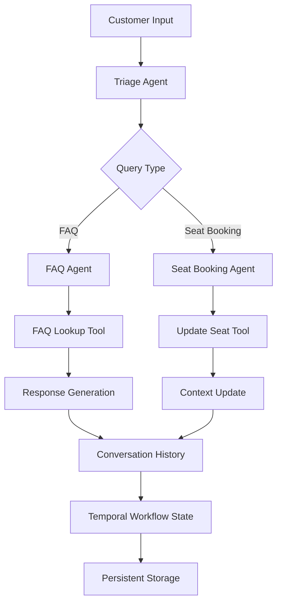
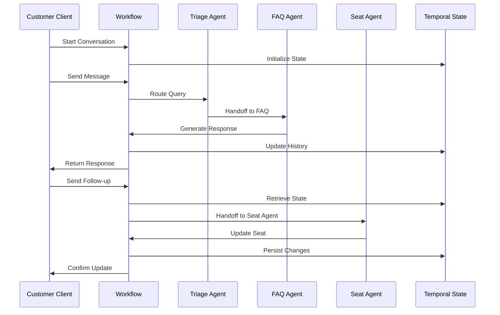

# Customer Service

## 📑 Table of Contents
- [Introduction](#introduction)
- [Philosophy & Challenges](#philosophy--challenges)
- [System Constraints & Features](#system-constraints--features)
- [System Overview](#system-overview)
- [System Flow](#system-flow)
- [Core Architecture](#core-architecture)
- [Interaction Flow](#interaction-flow)
- [Development Guidelines](#development-guidelines)
- [Code Examples & Best Practices](#code-examples--best-practices)
- [Key Benefits of This Structure](#key-benefits-of-this-structure)
- [Important Implementation Notes](#important-implementation-notes)
- [Architecture Patterns](#architecture-patterns)
- [File Organization](#file-organization)
- [Common Development Patterns](#common-development-patterns)

## 🎯 Introduction
The Customer Service system demonstrates how to build persistent, stateful conversations using OpenAI Agents SDK with Temporal's durable conversational workflows. It provides an interactive customer service experience with intelligent agent handoffs, maintaining conversation state across multiple interactions and surviving system restarts and failures.

## 🧠 Philosophy & Challenges

### What We're Solving
- **Persistent Conversations**: Maintaining conversation context across multiple interactions
- **Intelligent Routing**: Automatically directing customer queries to specialized agents
- **Stateful Workflows**: Preserving conversation state through system restarts
- **Multi-Agent Coordination**: Seamless handoffs between specialized service agents

### Our Approach
- **Durable Execution**: Using Temporal workflows to ensure conversation persistence
- **Agent Specialization**: Creating focused agents for specific service domains
- **Context Preservation**: Maintaining customer context throughout the conversation flow
- **Graceful Degradation**: Fallback mechanisms for handling edge cases

## ⚡ System Constraints & Features

### Key Features
- **Multi-Agent Handoffs**: Intelligent routing between FAQ, seat booking, and triage agents
- **Persistent State**: Conversation history and context preserved in Temporal workflows
- **Real-time Updates**: Live conversation updates through workflow queries and updates
- **Context-Aware Tools**: Tools that maintain and update conversation context
- **Validation & Error Handling**: Input validation and stale conversation detection

### System Constraints
- **Input Length**: User messages limited to 1000 characters
- **Conversation Freshness**: Stale chat history detection prevents out-of-order updates
- **Workflow Continuation**: Uses continue-as-new pattern for long-running conversations
- **Timeout Management**: 30-second timeout for model activities

## 🏗️ System Overview



## 🔄 System Flow



## 🏛️ Core Architecture

### Component Layers
1. **Input Layer**: Customer client interface with conversation management
2. **Routing Layer**: Triage agent for intelligent query distribution
3. **Specialized Layer**: Domain-specific agents (FAQ, seat booking)
4. **Tool Layer**: Function tools for data lookup and updates
5. **State Layer**: Temporal workflow for persistent conversation state

### Key Components
- **[CustomerServiceWorkflow](./workflows/customer_service_workflow.py)**: Main workflow orchestrating conversation flow
- **[AirlineAgentContext](./customer_service.py)**: Pydantic model for conversation context
- **[Triage Agent](./customer_service.py)**: Intelligent routing agent for query distribution
- **[FAQ Agent](./customer_service.py)**: Specialized agent for answering common questions
- **[Seat Booking Agent](./customer_service.py)**: Specialized agent for seat management
- **[Function Tools](./customer_service.py)**: Domain-specific tools for data operations

## 🔗 Interaction Flow

### Internal Communication
- **Agent Handoffs**: Seamless transitions between specialized agents
- **Context Propagation**: Shared context maintained across agent transitions
- **Tool Integration**: Agents use function tools for external data access
- **State Synchronization**: Workflow state synchronized with conversation progress

### External Dependencies
- **OpenAI API**: For agent responses and reasoning
- **Temporal Server**: For workflow orchestration and state persistence
- **Customer Client**: For user interaction and conversation management

## 💻 Development Guidelines

### Code Organization
- **Workflow-Centric**: Main business logic in Temporal workflows
- **Agent Separation**: Clear separation of concerns between agent types
- **Tool Encapsulation**: Function tools for external data operations
- **Context Management**: Centralized context handling through Pydantic models

### Design Patterns
- **Multi-Agent Pattern**: Specialized agents with handoff capabilities
- **State Machine Pattern**: Workflow state management for conversation flow
- **Tool Pattern**: Function tools for external system integration
- **Validation Pattern**: Input validation and error handling

### Error Handling
- **Input Validation**: User input validation with clear error messages
- **Stale Detection**: Conversation freshness validation to prevent conflicts
- **Graceful Fallbacks**: Fallback mechanisms for handling edge cases
- **Context Recovery**: State recovery for interrupted conversations

## 📝 Code Examples & Best Practices

### Multi-Agent Handoff Pattern
**File**: `openai_agents/customer_service/customer_service.py`

```python
def init_agents() -> Tuple[
    Agent[AirlineAgentContext], Dict[str, Agent[AirlineAgentContext]]
]:
    """Initialize the agents for the airline customer service workflow."""
    
    # FAQ Agent with specialized knowledge
    faq_agent = Agent[AirlineAgentContext](
        name="FAQ Agent",
        handoff_description="A helpful agent that can answer questions about the airline.",
        instructions=f"""{RECOMMENDED_PROMPT_PREFIX}
        You are an FAQ agent. If you are speaking to a customer, you probably were transferred to from the triage agent.
        Use the following routine to support the customer.
        # Routine
        1. Identify the last question asked by the customer.
        2. Use the faq lookup tool to answer the question. Do not rely on your own knowledge.
        3. If you cannot answer the question, transfer back to the triage agent.""",
        tools=[faq_lookup_tool],
    )

    # Seat Booking Agent with context-aware tools
    seat_booking_agent = Agent[AirlineAgentContext](
        name="Seat Booking Agent",
        handoff_description="A helpful agent that can update a seat on a flight.",
        instructions=f"""{RECOMMENDED_PROMPT_PREFIX}
        You are a seat booking agent. If you are speaking to a customer, you probably were transferred to from the triage agent.
        Use the following routine to support the customer.
        # Routine
        1. Ask for their confirmation number.
        2. Ask the customer what their desired seat number is.
        3. Use the update seat tool to update the seat on the flight.
        If the customer asks a question that is not related to the routine, transfer back to the triage agent.""",
        tools=[update_seat],
    )

    # Triage Agent with intelligent routing
    triage_agent = Agent[AirlineAgentContext](
        name="Triage Agent",
        handoff_description="A triage agent that can delegate a customer's request to the appropriate agent.",
        instructions=(
            f"{RECOMMENDED_PROMPT_PREFIX} "
            "You are a helpful triaging agent. You can use your tools to delegate questions to other appropriate agents."
        ),
        handoffs=[
            faq_agent,
            handoff(agent=seat_booking_agent, on_handoff=on_seat_booking_handoff),
        ],
    )

    # Bidirectional handoffs for seamless navigation
    faq_agent.handoffs.append(triage_agent)
    seat_booking_agent.handoffs.append(triage_agent)
    return triage_agent, {
        agent.name: agent for agent in [faq_agent, seat_booking_agent, triage_agent]
    }
```

**Key Benefits**:
- **Intelligent Routing**: Triage agent automatically directs queries to appropriate specialists
- **Bidirectional Handoffs**: Agents can return to triage for re-routing
- **Context Preservation**: Shared context maintained across all agent transitions
- **Specialized Expertise**: Each agent focuses on specific domain knowledge

### Context-Aware Function Tools
**File**: `openai_agents/customer_service/customer_service.py`

```python
@function_tool
async def update_seat(
    context: RunContextWrapper[AirlineAgentContext],
    confirmation_number: str,
    new_seat: str,
) -> str:
    """Update the seat for a given confirmation number."""
    
    # Update the context based on the customer's input
    context.context.confirmation_number = confirmation_number
    context.context.seat_number = new_seat
    
    # Ensure that the flight number has been set by the incoming handoff
    assert context.context.flight_number is not None, "Flight number is required"
    
    return f"Updated seat to {new_seat} for confirmation number {confirmation_number}"

@function_tool(
    name_override="faq_lookup_tool",
    description_override="Lookup frequently asked questions.",
)
async def faq_lookup_tool(question: str) -> str:
    """Lookup frequently asked questions with intelligent keyword matching."""
    
    question_lower = question.lower()
    if "bag" in question_lower or "baggage" in question_lower:
        return (
            "You are allowed to bring one bag on the plane. "
            "It must be under 50 pounds and 22 inches x 14 inches x 9 inches."
        )
    elif "seats" in question_lower or "plane" in question_lower:
        return (
            "There are 120 seats on the plane. "
            "There are 22 business class seats and 98 economy seats. "
            "Exit rows are rows 4 and 16. "
            "Rows 5-8 are Economy Plus, with extra legroom."
        )
    elif "wifi" in question_lower:
        return "We have free wifi on the plane, join Airline-Wifi"
    return "I'm sorry, I don't know the answer to that question."
```

**Key Benefits**:
- **Context Integration**: Tools can read and update conversation context
- **Intelligent Matching**: Keyword-based FAQ lookup for relevant responses
- **Data Validation**: Assertions ensure required context is available
- **Clear Responses**: Structured, informative responses for customer queries

### Persistent Workflow State Management
**File**: `openai_agents/customer_service/workflows/customer_service_workflow.py`

```python
@workflow.defn
class CustomerServiceWorkflow:
    @workflow.init
    def __init__(
        self, customer_service_state: CustomerServiceWorkflowState | None = None
    ):
        """Initialize workflow with optional state restoration."""
        
        self.run_config = RunConfig()
        starting_agent, self.agent_map = init_agents()
        
        # Restore state or start fresh
        self.current_agent = (
            self.agent_map[customer_service_state.current_agent_name]
            if customer_service_state
            else starting_agent
        )
        self.context = (
            customer_service_state.context
            if customer_service_state
            else AirlineAgentContext()
        )
        self.printed_history: list[str] = (
            customer_service_state.printed_history if customer_service_state else []
        )
        self.input_items = (
            customer_service_state.input_items if customer_service_state else []
        )

    @workflow.update
    async def process_user_message(self, input: ProcessUserMessageInput) -> list[str]:
        """Process user message and maintain conversation state."""
        
        length = len(self.printed_history)
        self.printed_history.append(f"User: {input.user_input}")
        
        with trace("Customer service", group_id=workflow.info().workflow_id):
            # Add user input to conversation context
            self.input_items.append({"content": input.user_input, "role": "user"})
            
            # Execute agent with current context
            result = await Runner.run(
                self.current_agent,
                self.input_items,
                context=self.context,
                run_config=self.run_config,
            )

            # Process all response items for history
            for new_item in result.new_items:
                agent_name = new_item.agent.name
                if isinstance(new_item, MessageOutputItem):
                    self.printed_history.append(
                        f"{agent_name}: {ItemHelpers.text_message_output(new_item)}"
                    )
                elif isinstance(new_item, HandoffOutputItem):
                    self.printed_history.append(
                        f"Handed off from {new_item.source_agent.name} to {new_item.target_agent.name}"
                    )
                elif isinstance(new_item, ToolCallItem):
                    self.printed_history.append(f"{agent_name}: Calling a tool")
                elif isinstance(new_item, ToolCallOutputItem):
                    self.printed_history.append(
                        f"{agent_name}: Tool call output: {new_item.output}"
                    )
            
            # Update conversation state
            self.input_items = result.to_input_list()
            self.current_agent = result.last_agent
            
        # Update workflow details for monitoring
        workflow.set_current_details("\n\n".join(self.printed_history))
        return self.printed_history[length:]
```

**Key Benefits**:
- **State Persistence**: Conversation state maintained across system restarts
- **Context Restoration**: Seamless resumption of interrupted conversations
- **Comprehensive History**: All interaction types logged for debugging
- **Workflow Monitoring**: Real-time conversation state visible in Temporal UI

### Conversation Client with State Management
**File**: `openai_agents/customer_service/run_customer_service_client.py`

```python
async def main():
    parser = argparse.ArgumentParser()
    parser.add_argument("--conversation-id", type=str, required=True)
    args = parser.parse_args()

    # Create client connected to Temporal server
    client = await Client.connect(
        "localhost:7233",
        plugins=[OpenAIAgentsPlugin()],
    )

    handle = client.get_workflow_handle(args.conversation_id)

    # Query existing workflow or start new conversation
    start = False
    history = []
    try:
        history = await handle.query(
            CustomerServiceWorkflow.get_chat_history,
            reject_condition=QueryRejectCondition.NOT_OPEN,
        )
    except WorkflowQueryRejectedError:
        start = True
    except RPCError as e:
        if e.status == RPCStatusCode.NOT_FOUND:
            start = True
        else:
            raise e
    
    # Start new workflow if needed
    if start:
        await client.start_workflow(
            CustomerServiceWorkflow.run,
            id=args.conversation_id,
            task_queue="openai-agents-task-queue",
        )
        history = []
    
    print(*history, sep="\n")

    # Interactive conversation loop
    while True:
        user_input = input("Enter your message: ")
        message_input = ProcessUserMessageInput(
            user_input=user_input, chat_length=len(history)
        )
        
        try:
            new_history = await handle.execute_update(
                CustomerServiceWorkflow.process_user_message, message_input
            )
            history.extend(new_history)
            print(*new_history[1:], sep="\n")
        except WorkflowUpdateFailedError:
            print("** Stale conversation. Reloading...")
            # Refresh conversation state
            length = len(history)
            history = await handle.query(
                CustomerServiceWorkflow.get_chat_history,
                reject_condition=QueryRejectCondition.NOT_OPEN,
            )
            print(*history[length:], sep="\n")
```

**Key Benefits**:
- **Conversation Persistence**: Unique conversation IDs for long-running chats
- **State Recovery**: Automatic detection and recovery of stale conversations
- **Interactive Interface**: Real-time conversation updates and responses
- **Error Handling**: Graceful handling of workflow failures and state conflicts

### Worker Configuration with Extended Timeouts
**File**: `openai_agents/customer_service/run_worker.py`

```python
async def main():
    # Create client connected to Temporal server
    client = await Client.connect(
        "localhost:7233",
        plugins=[
            OpenAIAgentsPlugin(
                model_params=ModelActivityParameters(
                    start_to_close_timeout=timedelta(seconds=30)
                )
            ),
        ],
    )

    # Create worker for customer service workflows
    worker = Worker(
        client,
        task_queue="openai-agents-task-queue",
        workflows=[CustomerServiceWorkflow],
    )
    await worker.run()
```

**Key Benefits**:
- **Extended Timeouts**: 30-second timeout for complex agent interactions
- **Dedicated Task Queue**: Isolated processing for customer service workflows
- **Plugin Integration**: OpenAI Agents plugin for seamless agent execution
- **Scalable Processing**: Worker can handle multiple concurrent conversations

## 🎯 **Key Benefits of This Structure:**

1. **Persistent Conversations**: Conversations survive system restarts and failures
2. **Intelligent Routing**: Automatic query distribution to specialized agents
3. **Context Preservation**: Shared context maintained across agent transitions
4. **Stateful Workflows**: Temporal workflows provide durable conversation state
5. **Scalable Architecture**: Multiple workers can handle concurrent conversations
6. **Developer Experience**: Clear separation of concerns and comprehensive error handling

## ⚠️ **Important Implementation Notes:**

- **Task Queue**: Uses `"openai-agents-task-queue"` for all customer service workflows
- **State Persistence**: Implements continue-as-new pattern for long-running conversations
- **Input Validation**: Strict validation prevents stale conversations and invalid inputs
- **Agent Handoffs**: Bidirectional handoffs enable seamless navigation between specialists
- **Context Management**: Pydantic models ensure type safety and data validation

## 🏗️ **Architecture Patterns:**

- **Multi-Agent Pattern**: Specialized agents with handoff capabilities
- **State Machine Pattern**: Workflow state management for conversation flow
- **Tool Pattern**: Function tools for external system integration
- **Validation Pattern**: Input validation and error handling
- **Persistence Pattern**: Temporal workflows for durable state management

## 📁 **File Organization:**

```
openai_agents/customer_service/
├── README.md                           # Usage instructions and examples
├── customer_service.py                 # Agent definitions and function tools
├── run_customer_service_client.py      # Interactive conversation client
├── run_worker.py                      # Temporal worker configuration
└── workflows/
    └── customer_service_workflow.py   # Main workflow orchestration
```

## 🔧 **Common Development Patterns:**

- **Agent Initialization**: Centralized agent creation with handoff configuration
- **Context Propagation**: Shared context objects for state management
- **Tool Integration**: Function tools for external system operations
- **State Restoration**: Workflow state recovery for interrupted conversations
- **Error Handling**: Comprehensive validation and graceful degradation
- **Monitoring**: Workflow tracing and conversation state visibility

This structure ensures new developers can quickly understand how to build persistent, multi-agent customer service systems with intelligent routing and state management using Temporal workflows and OpenAI Agents SDK.
