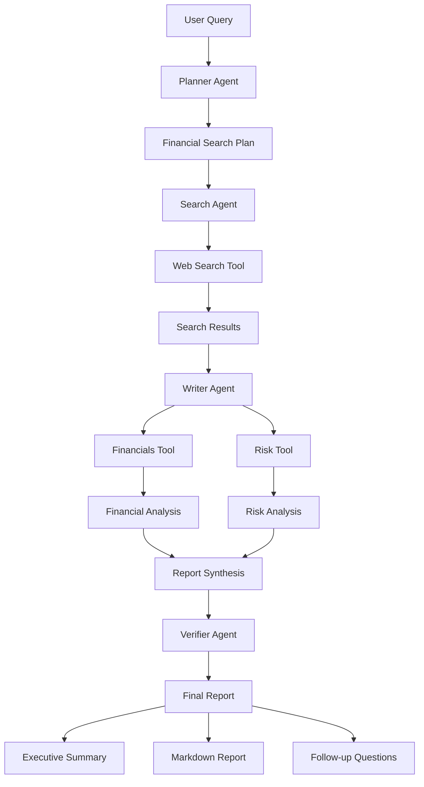
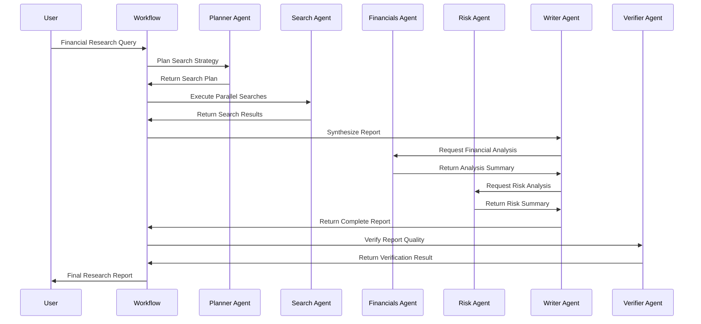

# Financial Research Agent

## 📑 Table of Contents
- [Introduction](#introduction)
- [Philosophy & Challenges](#philosophy--challenges)
- [System Constraints & Features](#system-constraints--features)
- [System Overview](#system-overview)
- [System Flow](#system-flow)
- [Core Architecture](#core-architecture)
- [Interaction Flow](#interaction-flow)
- [Development Guidelines](#development-guidelines)
- [Code Examples & Best Practices](#code-examples--best-practices)
- [Key Benefits of This Structure](#key-benefits-of-this-structure)
- [Important Implementation Notes](#important-implementation-notes)
- [Architecture Patterns](#architecture-patterns)
- [File Organization](#file-organization)
- [Common Development Patterns](#common-development-patterns)

## 🎯 Introduction
The Financial Research Agent system demonstrates how to build a sophisticated multi-agent financial research system using OpenAI Agents SDK with Temporal's durable execution. It orchestrates specialized agents for planning, searching, analysis, writing, and verification to produce comprehensive financial research reports with proper sourcing and quality assurance.

## 🧠 Philosophy & Challenges

### What We're Solving
- **Complex Research Workflows**: Breaking down financial analysis into specialized, manageable tasks
- **Multi-Agent Coordination**: Orchestrating diverse agents with different expertise areas
- **Quality Assurance**: Ensuring research reports are accurate, consistent, and well-sourced
- **Parallel Processing**: Optimizing research speed through concurrent web searches
- **Structured Output**: Producing standardized financial reports with executive summaries

### Our Approach
- **Agent Specialization**: Creating focused agents for specific research domains
- **Pipeline Architecture**: Sequential workflow with parallel execution where possible
- **Tool Integration**: Exposing specialist agents as tools for inline analysis
- **Verification Layer**: Final quality check to ensure report consistency and accuracy
- **Durable Execution**: Using Temporal workflows to handle long-running research tasks

## ⚡ System Constraints & Features

### Key Features
- **Multi-Agent Orchestration**: 6 specialized agents working in coordinated sequence
- **Parallel Web Searches**: Concurrent execution of multiple search queries
- **Specialist Analysis Tools**: Financial and risk analysis agents exposed as tools
- **Structured Output**: Pydantic models for consistent data structures
- **Quality Verification**: Final audit step for report consistency and sourcing
- **Temporal Integration**: Durable execution with proper workflow management

### System Constraints
- **Search Limit**: 5-15 search terms per research request
- **Summary Length**: Search results limited to 300 words maximum
- **Analysis Length**: Financial and risk analysis limited to 2 paragraphs
- **Model Requirements**: Specific model assignments for different agent types
- **Tool Choice**: Web search agent requires tool usage for all queries

## 🏗️ System Overview



## 🔄 System Flow



## 🏛️ Core Architecture

### Component Layers
1. **Orchestration Layer**: FinancialResearchManager coordinating all agents
2. **Planning Layer**: Planner agent creating search strategies
3. **Research Layer**: Search agent with web search capabilities
4. **Analysis Layer**: Specialist agents for financial and risk analysis
5. **Synthesis Layer**: Writer agent combining all research into reports
6. **Quality Layer**: Verifier agent ensuring report accuracy

### Key Components
- **[FinancialResearchManager](./financial_research_manager.py)**: Main orchestrator managing the entire research workflow
- **[Planner Agent](./agents/planner_agent.py)**: Creates strategic search plans with 5-15 search terms
- **[Search Agent](./agents/search_agent.py)**: Executes web searches with WebSearchTool integration
- **[Financials Agent](./agents/financials_agent.py)**: Analyzes company fundamentals and financial metrics
- **[Risk Agent](./agents/risk_agent.py)**: Identifies potential red flags and risk factors
- **[Writer Agent](./agents/writer_agent.py)**: Synthesizes research into comprehensive reports
- **[Verifier Agent](./agents/verifier_agent.py)**: Audits final reports for consistency and accuracy

## 🔗 Interaction Flow

### Internal Communication
- **Sequential Planning**: Planner → Search → Analysis → Writing → Verification
- **Parallel Execution**: Multiple web searches executed concurrently
- **Tool Integration**: Specialist agents exposed as tools for inline analysis
- **Data Flow**: Structured Pydantic models ensuring type safety throughout pipeline

### External Dependencies
- **Web Search API**: For retrieving financial information and news
- **OpenAI API**: For agent reasoning and content generation
- **Temporal Server**: For workflow orchestration and durable execution

## 💻 Development Guidelines

### Code Organization
- **Agent-Centric**: Each agent in separate file with focused responsibilities
- **Manager Pattern**: Central orchestrator coordinating all agent interactions
- **Tool Integration**: Specialist agents exposed as tools for complex workflows
- **Model-Driven**: Pydantic models for consistent data structures and validation

### Design Patterns
- **Pipeline Pattern**: Sequential workflow with parallel execution optimization
- **Tool Pattern**: Agents exposed as tools for inline analysis
- **Factory Pattern**: Agent creation through factory functions
- **Orchestrator Pattern**: Central manager coordinating complex workflows

### Error Handling
- **Graceful Degradation**: Failed searches don't stop entire workflow
- **Exception Handling**: Proper error handling in search operations
- **Validation**: Pydantic models ensure data integrity
- **Fallback Mechanisms**: Default queries and error recovery

## 📝 Code Examples & Best Practices

### Multi-Agent Orchestration Pattern
**File**: `openai_agents/financial_research_agent/financial_research_manager.py`

```python
class FinancialResearchManager:
    """Orchestrates the full flow: planning, searching, sub-analysis, writing, and verification."""

    def __init__(self) -> None:
        self.run_config = RunConfig()
        self.planner_agent = new_planner_agent()
        self.search_agent = new_search_agent()
        self.financials_agent = new_financials_agent()
        self.risk_agent = new_risk_agent()
        self.writer_agent = new_writer_agent()
        self.verifier_agent = new_verifier_agent()

    async def run(self, query: str) -> str:
        with trace("Financial research trace"):
            # Execute research pipeline sequentially
            search_plan = await self._plan_searches(query)
            search_results = await self._perform_searches(search_plan)
            report = await self._write_report(query, search_results)
            verification = await self._verify_report(report)

        # Return formatted output with all components
        result = f"""=====REPORT=====

{report.markdown_report}

=====FOLLOW UP QUESTIONS=====

{chr(10).join(report.follow_up_questions)}

=====VERIFICATION=====

Verified: {verification.verified}
Issues: {verification.issues}"""

        return result
```

**Key Benefits**:
- **Centralized Coordination**: Single manager orchestrates entire research workflow
- **Sequential Logic**: Clear pipeline from planning to verification
- **Comprehensive Output**: Structured report with all research components
- **Traceability**: Temporal tracing for monitoring and debugging

### Parallel Search Execution Pattern
**File**: `openai_agents/financial_research_agent/financial_research_manager.py`

```python
async def _perform_searches(
    self, search_plan: FinancialSearchPlan
) -> Sequence[str]:
    with custom_span("Search the web"):
        # Create concurrent search tasks for all search terms
        tasks = [
            asyncio.create_task(self._search(item)) for item in search_plan.searches
        ]
        results: list[str] = []
        
        # Process completed tasks as they finish
        for task in workflow.as_completed(tasks):
            result = await task
            if result is not None:
                results.append(result)
        return results

async def _search(self, item: FinancialSearchItem) -> str | None:
    input_data = f"Search term: {item.query}\nReason: {item.reason}"
    try:
        result = await Runner.run(
            self.search_agent,
            input_data,
            run_config=self.run_config,
        )
        return str(result.final_output)
    except Exception:
        return None
```

**Key Benefits**:
- **Parallel Execution**: Multiple searches run concurrently for speed
- **Fault Tolerance**: Failed searches don't block successful ones
- **Efficient Processing**: as_completed handles tasks as they finish
- **Error Isolation**: Individual search failures don't crash workflow

### Specialist Agent Tool Integration Pattern
**File**: `openai_agents/financial_research_agent/financial_research_manager.py`

```python
async def _write_report(
    self, query: str, search_results: Sequence[str]
) -> FinancialReportData:
    # Expose specialist analysts as tools for inline analysis
    fundamentals_tool = self.financials_agent.as_tool(
        tool_name="fundamentals_analysis",
        tool_description="Use to get a short write-up of key financial metrics",
        custom_output_extractor=_summary_extractor,
    )
    risk_tool = self.risk_agent.as_tool(
        tool_name="risk_analysis",
        tool_description="Use to get a short write-up of potential red flags",
        custom_output_extractor=_summary_extractor,
    )
    
    # Clone writer agent with integrated specialist tools
    writer_with_tools = self.writer_agent.clone(
        tools=[fundamentals_tool, risk_tool]
    )

    input_data = (
        f"Original query: {query}\nSummarized search results: {search_results}"
    )
    result = await Runner.run(
        writer_with_tools,
        input_data,
        run_config=self.run_config,
    )
    return result.final_output_as(FinancialReportData)
```

**Key Benefits**:
- **Tool Integration**: Specialist agents accessible as inline tools
- **Custom Extractors**: _summary_extractor provides clean output formatting
- **Agent Cloning**: Writer agent enhanced with specialist capabilities
- **Seamless Workflow**: Complex analysis integrated into writing process

### Structured Data Models Pattern
**File**: `openai_agents/financial_research_agent/agents/planner_agent.py`

```python
class FinancialSearchItem(BaseModel):
    reason: str
    """Your reasoning for why this search is relevant."""
    query: str
    """The search term to feed into a web (or file) search."""

class FinancialSearchPlan(BaseModel):
    searches: list[FinancialSearchItem]
    """A list of searches to perform."""

def new_planner_agent() -> Agent:
    return Agent(
        name="FinancialPlannerAgent",
        instructions=PROMPT,
        model="o3-mini",
        output_type=FinancialSearchPlan,
    )
```

**Key Benefits**:
- **Type Safety**: Pydantic models ensure data validation
- **Clear Structure**: Well-defined data models for search planning
- **Model Assignment**: Specific model (o3-mini) for cost-effective planning
- **Structured Output**: Guaranteed output format for downstream processing

### Web Search Integration Pattern
**File**: `openai_agents/financial_research_agent/agents/search_agent.py`

```python
def new_search_agent() -> Agent:
    return Agent(
        name="FinancialSearchAgent",
        instructions=INSTRUCTIONS,
        tools=[WebSearchTool()],
        model_settings=ModelSettings(tool_choice="required"),
    )
```

**Key Benefits**:
- **Web Search Integration**: Built-in WebSearchTool for real-time information
- **Forced Tool Usage**: tool_choice="required" ensures web search execution
- **Specialized Instructions**: Financial-focused search result processing
- **Concise Output**: 300-word limit for focused, relevant summaries

### Specialist Analysis Pattern
**File**: `openai_agents/financial_research_agent/agents/financials_agent.py`

```python
class AnalysisSummary(BaseModel):
    summary: str
    """Short text summary for this aspect of the analysis."""

def new_financials_agent() -> Agent:
    return Agent(
        name="FundamentalsAnalystAgent",
        instructions=FINANCIALS_PROMPT,
        output_type=AnalysisSummary,
    )
```

**Key Benefits**:
- **Focused Analysis**: Specialized in financial fundamentals and metrics
- **Structured Output**: AnalysisSummary model for consistent formatting
- **Concise Results**: 2-paragraph limit for focused insights
- **Tool Integration**: Can be exposed as tool for inline analysis

### Report Synthesis Pattern
**File**: `openai_agents/financial_research_agent/agents/writer_agent.py`

```python
class FinancialReportData(BaseModel):
    short_summary: str
    """A short 2-3 sentence executive summary."""
    markdown_report: str
    """The full markdown report."""
    follow_up_questions: list[str]
    """Suggested follow-up questions for further research."""

def new_writer_agent() -> Agent:
    return Agent(
        name="FinancialWriterAgent",
        instructions=WRITER_PROMPT,
        model="gpt-4.1-2025-04-14",
        output_type=FinancialReportData,
    )
```

**Key Benefits**:
- **Comprehensive Output**: Multiple report formats (summary, full, questions)
- **High-Quality Model**: GPT-4.1 for sophisticated report writing
- **Markdown Format**: Structured, readable report output
- **Follow-up Generation**: Automatic generation of research questions

### Quality Verification Pattern
**File**: `openai_agents/financial_research_agent/agents/verifier_agent.py`

```python
class VerificationResult(BaseModel):
    verified: bool
    """Whether the report seems coherent and plausible."""
    issues: str
    """If not verified, describe the main issues or concerns."""

def new_verifier_agent() -> Agent:
    return Agent(
        name="VerificationAgent",
        instructions=VERIFIER_PROMPT,
        model="gpt-4o",
        output_type=VerificationResult,
    )
```

**Key Benefits**:
- **Quality Assurance**: Final verification step for report accuracy
- **Issue Identification**: Clear reporting of problems or inconsistencies
- **High-Quality Model**: GPT-4o for thorough verification
- **Structured Results**: Boolean verification with detailed issue descriptions

### Temporal Workflow Integration Pattern
**File**: `openai_agents/financial_research_agent/workflows/financial_research_workflow.py`

```python
@workflow.defn
class FinancialResearchWorkflow:
    @workflow.run
    async def run(self, query: str) -> str:
        manager = FinancialResearchManager()
        return await manager.run(query)
```

**Key Benefits**:
- **Simple Integration**: Clean workflow interface to complex research system
- **Durable Execution**: Temporal handles long-running research tasks
- **State Management**: Workflow state preserved across system restarts
- **Scalable Processing**: Multiple research workflows can run concurrently

### Client Execution Pattern
**File**: `openai_agents/financial_research_agent/run_financial_research_workflow.py`

```python
async def main():
    # Get the query from user input
    query = input("Enter a financial research query: ")
    if not query.strip():
        query = "Write up an analysis of Apple Inc.'s most recent quarter."
        print(f"Using default query: {query}")

    client = await Client.connect(
        "localhost:7233",
        plugins=[OpenAIAgentsPlugin()],
    )

    print(f"Starting financial research for: {query}")
    print("This may take several minutes to complete...\n")

    result = await client.execute_workflow(
        FinancialResearchWorkflow.run,
        query,
        id=f"financial-research-{hash(query)}",
        task_queue="financial-research-task-queue",
    )

    print(result)
```

**Key Benefits**:
- **User Interaction**: Interactive query input with default fallback
- **Progress Feedback**: Clear indication of expected processing time
- **Unique Workflow IDs**: Hash-based IDs for workflow identification
- **Dedicated Task Queue**: Isolated processing for financial research workflows

### Worker Configuration Pattern
**File**: `openai_agents/financial_research_agent/run_worker.py`

```python
async def main():
    client = await Client.connect(
        "localhost:7233",
        plugins=[OpenAIAgentsPlugin()],
    )

    worker = Worker(
        client,
        task_queue="financial-research-task-queue",
        workflows=[FinancialResearchWorkflow],
    )

    print("Starting financial research worker...")
    await worker.run()
```

**Key Benefits**:
- **Dedicated Processing**: Isolated task queue for financial research
- **Plugin Integration**: OpenAI Agents plugin for seamless agent execution
- **Workflow Registration**: Clear workflow registration for worker
- **Scalable Architecture**: Multiple workers can handle concurrent research requests

## 🎯 **Key Benefits of This Structure:**

1. **Specialized Expertise**: Each agent focuses on specific research domains
2. **Parallel Processing**: Concurrent web searches optimize research speed
3. **Quality Assurance**: Verification step ensures report accuracy and consistency
4. **Tool Integration**: Specialist agents accessible as inline tools
5. **Structured Output**: Consistent data models throughout the pipeline
6. **Scalable Architecture**: Multiple workers can handle concurrent research requests
7. **Durable Execution**: Temporal workflows ensure research completion

## ⚠️ **Important Implementation Notes:**

- **Task Queue**: Uses `"financial-research-task-queue"` for all financial research workflows
- **Model Assignment**: Different agents use specific models (o3-mini, gpt-4.1, gpt-4o)
- **Parallel Execution**: Web searches use asyncio.create_task with workflow.as_completed
- **Tool Requirements**: Search agent requires tool usage with ModelSettings(tool_choice="required")
- **Output Extraction**: Custom _summary_extractor for clean specialist agent output
- **Error Handling**: Failed searches return None without stopping the workflow

## 🏗️ **Architecture Patterns:**

- **Pipeline Pattern**: Sequential workflow with parallel execution optimization
- **Tool Pattern**: Specialist agents exposed as tools for inline analysis
- **Factory Pattern**: Agent creation through factory functions
- **Orchestrator Pattern**: Central manager coordinating complex workflows
- **Parallel Processing Pattern**: Concurrent execution of independent tasks
- **Quality Gate Pattern**: Final verification step for output validation

## 📁 **File Organization:**

```
openai_agents/financial_research_agent/
├── README.md                           # Usage instructions and architecture overview
├── financial_research_manager.py       # Main orchestrator and workflow coordinator
├── run_financial_research_workflow.py  # Client for executing research workflows
├── run_worker.py                      # Temporal worker configuration
├── agents/                            # Specialized agent implementations
│   ├── planner_agent.py              # Search strategy planning agent
│   ├── search_agent.py               # Web search execution agent
│   ├── financials_agent.py           # Financial analysis specialist
│   ├── risk_agent.py                 # Risk assessment specialist
│   ├── writer_agent.py               # Report synthesis agent
│   └── verifier_agent.py             # Quality verification agent
└── workflows/                         # Temporal workflow definitions
    └── financial_research_workflow.py # Main research workflow
```

## 🔧 **Common Development Patterns:**

- **Agent Factory Functions**: Centralized agent creation with consistent configuration
- **Tool Integration**: Specialist agents exposed as tools for complex workflows
- **Parallel Task Execution**: asyncio.create_task with workflow.as_completed
- **Structured Data Models**: Pydantic models for type safety and validation
- **Custom Output Extractors**: Specialized formatting for tool integration
- **Error Isolation**: Individual component failures don't crash entire workflow
- **Quality Gates**: Verification steps ensure output quality and consistency

This structure ensures new developers can quickly understand how to build sophisticated multi-agent research systems with parallel processing, quality assurance, and seamless tool integration using Temporal workflows and OpenAI Agents SDK.
