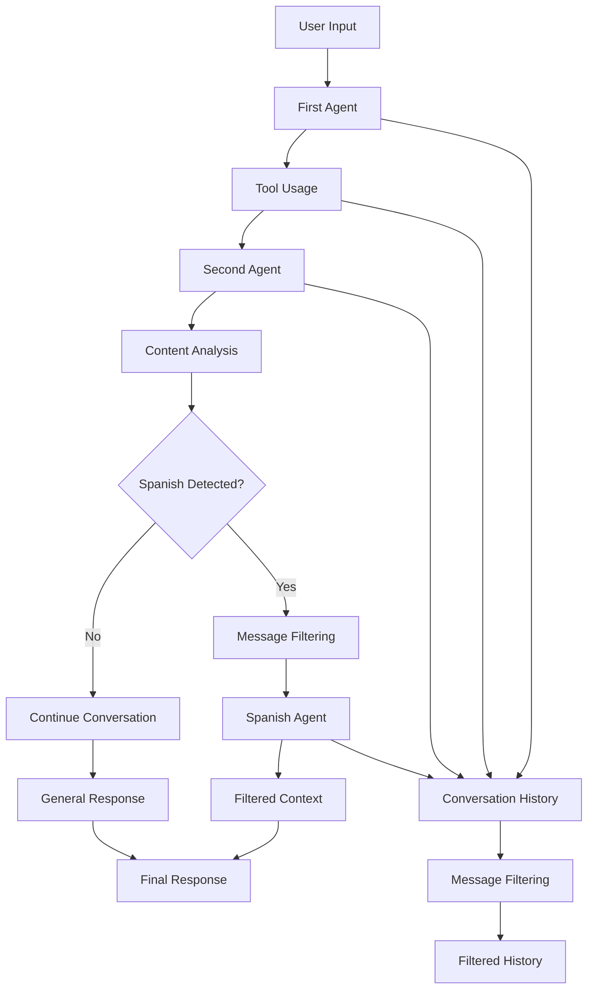
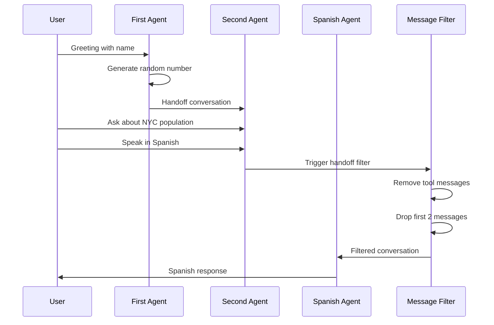

# Agent Handoffs

## 📑 Table of Contents

- [Introduction](#introduction)
- [Philosophy & Challenges](#philosophy--challenges)
- [System Constraints & Features](#system-constraints--features)
- [System Overview](#system-overview)
- [System Flow](#system-flow)
- [Core Architecture](#core-architecture)
- [Interaction Flow](#interaction-flow)
- [Development Guidelines](#development-guidelines)
- [Code Examples & Best Practices](#code-examples--best-practices)

## 🎯 Introduction

The Agent Handoffs service demonstrates sophisticated agent transition patterns with intelligent message filtering and context management. This service showcases how agents can seamlessly hand off conversations to specialized agents while maintaining conversation continuity and selectively filtering message history.

The system is designed for developers and engineering teams who want to:
- Learn how to implement intelligent agent handoffs in Temporal workflows
- Understand message filtering and context management during transitions
- Build multi-agent conversation systems with specialized capabilities
- Implement context-aware handoff triggers and message processing
- Maintain conversation flow across different agent specializations
- Control what information is preserved during agent transitions

## 🧠 Philosophy & Challenges

### What We're Solving
- **Agent Specialization**: Different agents have different expertise and capabilities
- **Conversation Continuity**: Maintaining context across agent transitions
- **Message Filtering**: Selective preservation of conversation history
- **Context Management**: Controlling what information each agent receives
- **Handoff Triggers**: Intelligent detection of when handoffs should occur
- **Tool Cleanup**: Removing tool-related messages during transitions
- **Selective Context**: Demonstrating different filtering strategies

### Our Approach
- **Intelligent Handoffs**: Trigger handoffs based on content analysis
- **Message Filtering**: Use specialized filters to clean conversation history
- **Context Preservation**: Maintain essential conversation context across transitions
- **Specialized Agents**: Create agents with focused capabilities and handoff descriptions
- **Tool Integration**: Demonstrate handoffs with function tools and message processing
- **Workflow Orchestration**: Use Temporal workflows to manage complex conversation flows

## ⚡ System Constraints & Features

### Key Features
- **Multi-Agent Conversations**: Seamless transitions between specialized agents
- **Message Filtering**: Intelligent cleanup of conversation history during handoffs
- **Context Preservation**: Maintain conversation flow across agent boundaries
- **Tool Integration**: Function tools that work across agent transitions
- **Language Detection**: Automatic handoff to language-specialized agents
- **Selective Context**: Demonstrate different filtering strategies
- **Complete Message History**: Return full conversation flow for inspection

### System Constraints
- **No Streaming**: Temporal workflows don't support streaming responses
- **Message History Limits**: OpenAI API has conversation length constraints
- **Tool Message Cleanup**: Tool-related messages must be filtered during handoffs
- **Context Window**: Each agent has limited context window for processing
- **Task Queue**: Uses `"openai-agents-handoffs-task-queue"` for all workflows
- **Extended Timeouts**: 60-second timeouts for complex conversation flows

## 🏗️ System Overview



## 🔄 System Flow



## 🏛️ Core Architecture

### Component Layers
1. **Workflow Layer**: Temporal workflow orchestrating the 4-step conversation
2. **Agent Layer**: Specialized agents with handoff capabilities and descriptions
3. **Filter Layer**: Message filtering functions for context cleanup
4. **Tool Layer**: Function tools that work across agent boundaries
5. **Execution Layer**: Runner scripts and worker processes for deployment

### Key Components
- **MessageFilterWorkflow**: Main workflow orchestrating the conversation flow
- **Specialized Agents**: First agent, second agent, and Spanish specialist
- **Message Filters**: Custom filtering functions for context management
- **Function Tools**: Random number generation tool
- **Handoff Management**: Intelligent handoff triggers and transitions
- **Context Preservation**: Maintaining conversation flow across transitions

## 🔗 Interaction Flow

### Internal Communication
- Workflows orchestrate agent transitions using `Runner.run()` with context
- Agents communicate through handoff descriptions and triggers
- Message filters process conversation history during transitions
- Context is preserved using `result.to_input_list()` for continuity
- Tool usage is tracked and can be filtered during handoffs

### External Dependencies
- **OpenAI API**: For agent responses and conversation management
- **Temporal Server**: For workflow orchestration and state management
- **Message Processing**: For filtering and context management
- **Tool Execution**: For function tool integration across agents

## 💻 Development Guidelines

### Code Organization
- **Workflow Files**: One file per handoff pattern in `workflows/` directory
- **Runner Scripts**: Individual execution scripts in root directory
- **Worker**: Central worker supporting all handoff workflows in `run_worker.py`
- **Message Filters**: Custom filtering functions embedded in workflow files

### Design Patterns
- **Handoff Pattern**: Seamless agent transitions with context preservation
- **Message Filtering Pattern**: Intelligent cleanup of conversation history
- **Context Continuity Pattern**: Maintaining conversation flow across agents
- **Specialized Agent Pattern**: Agents with focused capabilities and handoff descriptions
- **Tool Integration Pattern**: Function tools that work across agent boundaries

### Error Handling
- **Handoff Failures**: Handle cases where handoffs fail or are rejected
- **Message Filter Errors**: Gracefully handle filtering failures
- **Context Loss**: Prevent loss of essential conversation context
- **Tool Integration**: Handle tool-related message cleanup failures
- **Timeout Management**: Extended timeouts for complex conversation flows

## 📝 Code Examples & Best Practices

### Message Filter Workflow Pattern
**File**: `openai_agents/handoffs/workflows/message_filter_workflow.py`

This pattern demonstrates sophisticated agent handoffs with intelligent message filtering and context management.

```python
from __future__ import annotations

from dataclasses import dataclass
from typing import List

from agents import Agent, HandoffInputData, Runner, function_tool, handoff
from agents.extensions import handoff_filters
from agents.items import TResponseInputItem
from temporalio import workflow

# Structured output for handoff results
@dataclass
class MessageFilterResult:
    final_output: str                    # Final agent response
    final_messages: List[TResponseInputItem]  # Complete conversation history

# Function tool for random number generation
@function_tool
def random_number_tool(max: int) -> int:
    """Return a random integer between 0 and the given maximum."""
    return workflow.random().randint(0, max)

# Custom message filter for Spanish handoffs
def spanish_handoff_message_filter(
    handoff_message_data: HandoffInputData,
) -> HandoffInputData:
    # First, remove any tool-related messages from the message history
    handoff_message_data = handoff_filters.remove_all_tools(handoff_message_data)

    # Second, remove the first two items from the history for demonstration
    history = (
        tuple(handoff_message_data.input_history[2:])
        if isinstance(handoff_message_data.input_history, tuple)
        else handoff_message_data.input_history
    )

    # Return filtered handoff data with cleaned history
    return HandoffInputData(
        input_history=history,
        pre_handoff_items=tuple(handoff_message_data.pre_handoff_items),
        new_items=tuple(handoff_message_data.new_items),
    )

@workflow.defn
class MessageFilterWorkflow:
    @workflow.run
    async def run(self, user_name: str = "Sora") -> MessageFilterResult:
        # Agent 1: Concise assistant with tool capabilities
        first_agent = Agent(
            name="Assistant",
            instructions="Be extremely concise.",
            tools=[random_number_tool],
        )

        # Agent 3: Spanish specialist for language-specific queries
        spanish_agent = Agent(
            name="Spanish Assistant",
            instructions="You only speak Spanish and are extremely concise.",
            handoff_description="A Spanish-speaking assistant.",
        )

        # Agent 2: General assistant with handoff capabilities
        second_agent = Agent(
            name="Assistant",
            instructions=(
                "Be a helpful assistant. If the user speaks Spanish, handoff to the Spanish assistant."
            ),
            handoffs=[
                handoff(spanish_agent, input_filter=spanish_handoff_message_filter)
            ],
        )

        # Step 1: Initial greeting with the first agent
        result = await Runner.run(first_agent, input=f"Hi, my name is {user_name}.")

        # Step 2: Tool usage demonstration with random number generation
        result = await Runner.run(
            first_agent,
            input=result.to_input_list()  # Preserve conversation context
            + [
                {
                    "content": "Can you generate a random number between 0 and 100?",
                    "role": "user",
                }
            ],
        )

        # Step 3: Handoff to second agent for general questions
        result = await Runner.run(
            second_agent,
            input=result.to_input_list()  # Maintain conversation flow
            + [
                {
                    "content": "I live in New York City. What's the population of the city?",
                    "role": "user",
                }
            ],
        )

        # Step 4: Trigger Spanish handoff with message filtering
        result = await Runner.run(
            second_agent,
            input=result.to_input_list()  # Continue conversation context
            + [
                {
                    "content": "Por favor habla en español. ¿Cuál es mi nombre y dónde vivo?",
                    "role": "user",
                }
            ],
        )

        # Return both final response and complete message history for inspection
        return MessageFilterResult(
            final_output=result.final_output, 
            final_messages=result.to_input_list()
        )
```

**Key Benefits**:
- **Intelligent Handoffs**: Automatic detection of Spanish language triggers handoff
- **Message Filtering**: Custom filters remove tool messages and selective context
- **Context Preservation**: Maintains conversation flow across agent boundaries
- **Tool Integration**: Function tools work seamlessly across agent transitions
- **Complete History**: Returns full conversation flow for debugging and inspection

### Message Filtering Pattern
**File**: `openai_agents/handoffs/workflows/message_filter_workflow.py`

This pattern demonstrates how to create custom message filters for intelligent context management during handoffs.

```python
def spanish_handoff_message_filter(
    handoff_message_data: HandoffInputData,
) -> HandoffInputData:
    # Remove tool-related messages to clean up conversation history
    handoff_message_data = handoff_filters.remove_all_tools(handoff_message_data)

    # Demonstrate selective context removal by dropping first two messages
    history = (
        tuple(handoff_message_data.input_history[2:])
        if isinstance(handoff_message_data.input_history, tuple)
        else handoff_message_data.input_history
    )

    # Return filtered data with cleaned history and preserved structure
    return HandoffInputData(
        input_history=history,
        pre_handoff_items=tuple(handoff_message_data.pre_handoff_items),
        new_items=tuple(handoff_message_data.new_items),
    )
```

**Key Benefits**:
- **Tool Cleanup**: Removes tool-related messages that aren't relevant to next agent
- **Selective Context**: Demonstrates different filtering strategies for context management
- **Type Safety**: Handles both tuple and list history formats safely
- **Structure Preservation**: Maintains handoff data structure while filtering content
- **Customizable Filtering**: Easy to adapt for different handoff scenarios

### Specialized Agent Configuration
**File**: `openai_agents/handoffs/workflows/message_filter_workflow.py`

This pattern demonstrates how to configure agents with handoff capabilities and specialized instructions.

```python
# Agent with tool capabilities for initial interactions
first_agent = Agent(
    name="Assistant",
    instructions="Be extremely concise.",
    tools=[random_number_tool],
)

# Specialized agent for language-specific queries
spanish_agent = Agent(
    name="Spanish Assistant",
    instructions="You only speak Spanish and are extremely concise.",
    handoff_description="A Spanish-speaking assistant.",  # Description for handoff detection
)

# Agent with handoff capabilities and trigger logic
second_agent = Agent(
    name="Assistant",
    instructions=(
        "Be a helpful assistant. If the user speaks Spanish, handoff to the Spanish assistant."
    ),
    handoffs=[
        handoff(spanish_agent, input_filter=spanish_handoff_message_filter)
    ],
)
```

**Key Benefits**:
- **Specialized Instructions**: Each agent has focused capabilities and behavior
- **Handoff Descriptions**: Clear descriptions help with handoff detection
- **Trigger Logic**: Instructions include handoff detection criteria
- **Filter Integration**: Custom filters can be attached to handoffs
- **Tool Distribution**: Tools are distributed based on agent capabilities

### Context Continuity Pattern
**File**: `openai_agents/handoffs/workflows/message_filter_workflow.py`

This pattern demonstrates how to maintain conversation context across agent transitions.

```python
# Step 1: Initial interaction
result = await Runner.run(first_agent, input=f"Hi, my name is {user_name}.")

# Step 2: Continue conversation with context preservation
result = await Runner.run(
    first_agent,
    input=result.to_input_list()  # Preserve conversation context
    + [
        {
            "content": "Can you generate a random number between 0 and 100?",
            "role": "user",
        }
    ],
)

# Step 3: Handoff to second agent with full context
result = await Runner.run(
    second_agent,
    input=result.to_input_list()  # Maintain conversation flow
    + [
        {
            "content": "I live in New York City. What's the population of the city?",
            "role": "user",
        }
    ],
)
```

**Key Benefits**:
- **Context Preservation**: `result.to_input_list()` maintains conversation history
- **Seamless Transitions**: Agents can continue conversations naturally
- **State Management**: Temporal workflows maintain conversation state
- **History Accumulation**: Each interaction builds on previous context
- **Natural Flow**: Users experience continuous conversation across agents

### Worker Configuration
**File**: `openai_agents/handoffs/run_worker.py`

This is the central worker that supports the handoff workflow, providing extended timeouts for complex conversation flows.

```python
from __future__ import annotations

import asyncio
from datetime import timedelta

from temporalio.client import Client
from temporalio.contrib.openai_agents import ModelActivityParameters, OpenAIAgentsPlugin
from temporalio.worker import Worker

from openai_agents.handoffs.workflows.message_filter_workflow import (
    MessageFilterWorkflow,
)

async def main():
    # Create client connected to Temporal server
    client = await Client.connect(
        "localhost:7233",
        plugins=[
            OpenAIAgentsPlugin(
                model_params=ModelActivityParameters(
                    start_to_close_timeout=timedelta(seconds=60)  # Extended timeout for conversations
                )
            ),
        ],
    )

    # Create worker supporting the handoff workflow
    worker = Worker(
        client,
        task_queue="openai-agents-handoffs-task-queue",  # Dedicated task queue for handoffs
        workflows=[
            MessageFilterWorkflow,  # Register the handoff workflow
        ],
        activities=[
            # No custom activities needed for this workflow
        ],
    )
    await worker.run()

if __name__ == "__main__":
    asyncio.run(main())
```

**Key Benefits**:
- **Extended Timeouts**: 60-second timeouts for complex conversation flows
- **Dedicated Task Queue**: Separate queue for handoff-specific workflows
- **Workflow Registration**: Single workflow registration for the handoff pattern
- **Plugin Configuration**: OpenAI integration with appropriate timeout settings
- **Easy Deployment**: Single process to manage and monitor handoff workflows

### Runner Script Pattern
**File**: `openai_agents/handoffs/run_message_filter_workflow.py`

This pattern demonstrates how to execute the handoff workflow and inspect the complete conversation history.

```python
import asyncio
import json

from temporalio.client import Client
from temporalio.contrib.openai_agents import OpenAIAgentsPlugin

from openai_agents.handoffs.workflows.message_filter_workflow import (
    MessageFilterWorkflow,
)

async def main():
    # Create client connected to Temporal server
    client = await Client.connect(
        "localhost:7233",
        plugins=[OpenAIAgentsPlugin()],
    )

    # Execute the handoff workflow with user name
    result = await client.execute_workflow(
        MessageFilterWorkflow.run,
        "Sora",  # User name parameter
        id="message-filter-workflow",
        task_queue="openai-agents-handoffs-task-queue",
    )

    # Display final response
    print(f"Final output: {result.final_output}")
    print("\n===Final messages===\n")

    # Print complete message history to inspect filtering effects
    for message in result.final_messages:
        print(json.dumps(message, indent=2))

if __name__ == "__main__":
    asyncio.run(main())
```

**Key Benefits**:
- **Workflow Execution**: Simple execution of complex handoff workflows
- **Parameter Passing**: User name can be customized for different test scenarios
- **Result Inspection**: Access to both final response and complete message history
- **Debugging Support**: JSON formatting for easy message history analysis
- **Filtering Verification**: See exactly how message filters affected conversation

## 🎯 Key Benefits of This Structure

1. **Intelligent Handoffs**: Automatic detection and execution of agent transitions
2. **Message Filtering**: Intelligent cleanup of conversation history during handoffs
3. **Context Preservation**: Maintains conversation flow across agent boundaries
4. **Specialized Agents**: Agents with focused capabilities and clear handoff descriptions
5. **Tool Integration**: Function tools that work seamlessly across agent transitions
6. **Complete History**: Full conversation flow for debugging and inspection
7. **Customizable Filters**: Easy to adapt filtering strategies for different scenarios
8. **Workflow Orchestration**: Temporal workflows manage complex conversation flows

## ⚠️ Important Implementation Notes

### Task Queue Configuration
- **Worker**: Uses task queue `"openai-agents-handoffs-task-queue"`
- **Runner Scripts**: Use the same task queue for consistency
- **Note**: Dedicated task queue for handoff-specific workflows

### Handoff Dependencies and Setup
- **OpenAI API Key**: Required for agent conversations and handoffs
- **Message Filtering**: Custom filters for context cleanup during transitions
- **Context Management**: Careful handling of conversation history across agents
- **Tool Integration**: Function tools must be accessible to relevant agents

### Specific Examples Implemented
- **4-Step Conversation**: Greeting → Tool Usage → General Question → Spanish Handoff
- **Message Filtering**: Tool removal + selective context dropping
- **Context Preservation**: `result.to_input_list()` for conversation continuity
- **Language Detection**: Automatic handoff to Spanish specialist
- **Complete History**: Return full conversation flow for inspection

### Architecture Patterns
- **Handoff-First Design**: Handoffs are primary components, not afterthoughts
- **Message Filtering**: Intelligent cleanup of conversation history during transitions
- **Context Continuity**: Maintaining conversation flow across agent boundaries
- **Specialized Agents**: Agents with focused capabilities and clear handoff descriptions
- **Tool Integration**: Function tools that work across agent transitions

### File Organization
```
openai_agents/handoffs/
├── workflows/                           # Core handoff implementations
│   └── message_filter_workflow.py      # Message filtering with handoffs
├── run_worker.py                        # Central worker for handoff workflows
├── run_message_filter_workflow.py       # Individual workflow runner
└── README.md                           # Handoff overview and usage
```

### Common Development Patterns
- **Always use `result.to_input_list()`** to preserve conversation context
- **Implement custom message filters** for context cleanup during handoffs
- **Provide clear handoff descriptions** for better agent coordination
- **Test message filtering effects** by inspecting complete conversation history
- **Use extended timeouts** for complex conversation flows
- **Handle both tuple and list** history formats in message filters

This structure ensures developers can understand:
- **Handoff implementation patterns** with intelligent message filtering
- **Context management** across agent transitions
- **Message filtering strategies** for different handoff scenarios
- **Tool integration** across agent boundaries
- **Conversation continuity** maintenance
- **Complete conversation flow** inspection and debugging

The handoffs serve as building blocks for complex multi-agent conversation systems while maintaining the reliability, observability, and error handling that Temporal provides. Each pattern demonstrates specific handoff strategies that can be adapted for custom conversation flows and agent coordination.
