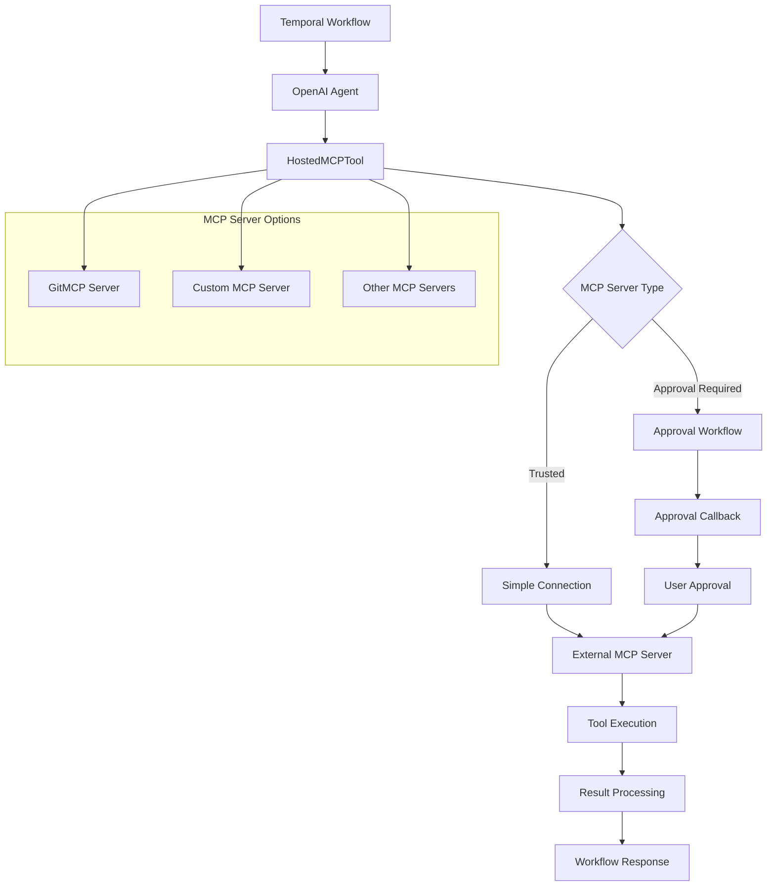
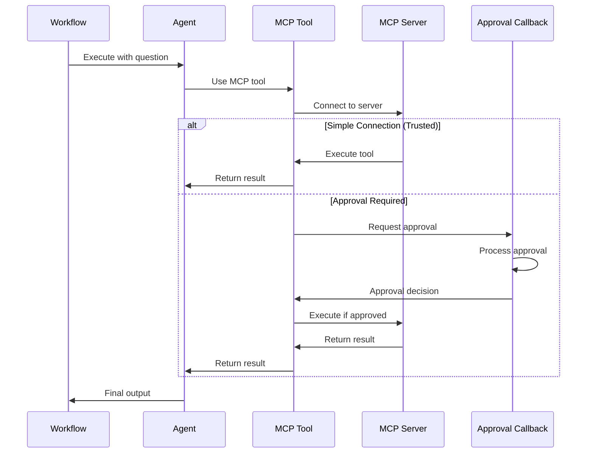

# Hosted MCP Integration

## 📑 Table of Contents

- [Introduction](#introduction)
- [Philosophy & Challenges](#philosophy--challenges)
- [System Constraints & Features](#system-constraints--features)
- [System Overview](#system-overview)
- [System Flow](#system-flow)
- [Core Architecture](#core-architecture)
- [Interaction Flow](#interaction-flow)
- [Development Guidelines](#development-guidelines)
- [Code Examples & Best Practices](#code-examples--best-practices)

## 🎯 Introduction

The Hosted MCP Integration service demonstrates how to integrate OpenAI agents with external Model Context Protocol (MCP) servers in Temporal workflows. This service showcases two key patterns: simple MCP connections for trusted servers and approval-based MCP connections with callback workflows for enhanced security and control.

The system is designed for developers and engineering teams who want to:
- Learn how to integrate external MCP servers with OpenAI agents in Temporal
- Understand approval workflows for MCP tool execution
- Build secure integrations with external data sources and APIs
- Implement callback-based approval systems within Temporal workflows
- Connect to hosted MCP servers for enhanced agent capabilities
- Manage tool execution permissions and approval workflows
- Extend agent capabilities through external MCP server integrations

## 🧠 Philosophy & Challenges

### What We're Solving
- **External Tool Integration**: Connecting agents to external MCP servers for enhanced capabilities
- **Security and Control**: Managing tool execution permissions through approval workflows
- **Server Trust Management**: Differentiating between trusted and approval-required MCP servers
- **Workflow Integration**: Seamlessly integrating MCP tools within Temporal workflows
- **Approval Callbacks**: Implementing approval workflows for sensitive tool operations
- **Server Configuration**: Flexible configuration for different MCP server endpoints
- **Tool Execution Control**: Granular control over when and how MCP tools are executed

### Our Approach
- **Dual Pattern Support**: Simple connections for trusted servers, approval workflows for others
- **Callback-Based Approvals**: Approval callbacks execute within Temporal workflows
- **Flexible Configuration**: Easy server URL configuration for different MCP endpoints
- **Workflow Integration**: MCP tools work seamlessly within Temporal workflow contexts
- **Approval Workflow Integration**: Use Temporal signals and updates for user approval
- **Server Labeling**: Clear identification of MCP servers for debugging and monitoring

## ⚡ System Constraints & Features

### Key Features
- **Hosted MCP Integration**: Connect to external MCP servers from Temporal workflows
- **Approval Workflows**: Callback-based approval system for tool execution
- **Flexible Server Configuration**: Easy switching between different MCP server endpoints
- **Trusted Server Support**: Simple connections for pre-approved MCP servers
- **Workflow Integration**: MCP tools work seamlessly within Temporal contexts
- **Approval Callbacks**: Approval functions execute within workflow context
- **Server Labeling**: Clear identification and labeling of MCP server connections

### System Constraints
- **MCP Server Availability**: External MCP servers must be accessible and operational
- **Approval Workflow Complexity**: Approval callbacks add complexity to tool execution
- **Network Dependencies**: External server connectivity affects workflow reliability
- **Approval Response Time**: User approval delays can impact workflow performance
- **Task Queue**: Uses `"openai-agents-hosted-mcp-task-queue"` for all workflows
- **Extended Timeouts**: 60-second timeouts for MCP server interactions
- **External API Limits**: MCP server rate limits and availability constraints

## 🏗️ System Overview



## 🔄 System Flow



## 🏛️ Core Architecture

### Component Layers
1. **Workflow Layer**: Temporal workflows orchestrating MCP tool usage
2. **Agent Layer**: OpenAI agents with MCP tool integration
3. **Tool Layer**: HostedMCPTool with approval workflow support
4. **Approval Layer**: Callback functions for tool execution approval
5. **Server Layer**: External MCP servers providing enhanced capabilities
6. **Execution Layer**: Runner scripts and worker processes for deployment

### Key Components
- **SimpleMCPWorkflow**: Workflow for trusted MCP server connections
- **ApprovalMCPWorkflow**: Workflow with approval callbacks for MCP tools
- **HostedMCPTool**: Tool wrapper for MCP server integration
- **Approval Callbacks**: Functions for managing tool execution permissions
- **MCP Server Integration**: Connection to external MCP servers
- **Workflow Orchestration**: Temporal workflow management of MCP interactions

## 🔗 Interaction Flow

### Internal Communication
- Workflows orchestrate MCP tool usage through OpenAI agents
- Agents communicate with MCP tools using standard tool interfaces
- Approval callbacks execute within Temporal workflow context
- MCP tools handle server communication and response processing
- Workflows manage the complete MCP tool execution lifecycle

### External Dependencies
- **MCP Servers**: External servers providing enhanced tool capabilities
- **OpenAI API**: For agent responses and tool integration
- **Temporal Server**: For workflow orchestration and state management
- **Network Infrastructure**: For MCP server connectivity and communication
- **Approval Systems**: For user approval workflows and decision making

## 💻 Development Guidelines

### Code Organization
- **Workflow Files**: One file per MCP pattern in `workflows/` directory
- **Runner Scripts**: Individual execution scripts in root directory
- **Worker**: Central worker supporting all MCP workflows in `run_worker.py`
- **Approval Callbacks**: Approval functions embedded in workflow files

### Design Patterns
- **Simple MCP Pattern**: Direct connections to trusted MCP servers
- **Approval MCP Pattern**: Callback-based approval workflows for tool execution
- **Server Configuration Pattern**: Flexible server URL configuration
- **Tool Integration Pattern**: Seamless MCP tool integration within agents
- **Workflow Orchestration Pattern**: Temporal workflows managing MCP interactions

### Error Handling
- **MCP Server Failures**: Handle cases where external servers are unavailable
- **Approval Rejections**: Manage cases where tool execution is denied
- **Network Timeouts**: Handle connectivity issues with external servers
- **Tool Execution Errors**: Gracefully handle MCP tool failures
- **Approval Callback Errors**: Handle approval workflow failures

## 📝 Code Examples & Best Practices

### Simple MCP Connection Pattern
**File**: `openai_agents/hosted_mcp/workflows/simple_mcp_workflow.py`

This pattern demonstrates direct connection to trusted MCP servers without approval requirements.

```python
from __future__ import annotations

from agents import Agent, HostedMCPTool, Runner
from temporalio import workflow

@workflow.defn
class SimpleMCPWorkflow:
    @workflow.run
    async def run(
        self, question: str, server_url: str = "https://gitmcp.io/openai/codex"
    ) -> str:
        # Create agent with MCP tool integration
        agent = Agent(
            name="Assistant",
            tools=[
                HostedMCPTool(
                    tool_config={
                        "type": "mcp",                    # Specify MCP tool type
                        "server_label": "gitmcp",         # Label for server identification
                        "server_url": server_url,         # MCP server endpoint
                        "require_approval": "never",      # No approval required for trusted servers
                    }
                )
            ],
        )

        # Execute agent with MCP tool capabilities
        result = await Runner.run(agent, question)
        return result.final_output
```

**Key Benefits**:
- **Simple Integration**: Direct connection to trusted MCP servers
- **No Approval Overhead**: Immediate tool execution without approval delays
- **Flexible Configuration**: Easy server URL customization for different endpoints
- **Server Labeling**: Clear identification for debugging and monitoring
- **Seamless Workflow Integration**: MCP tools work naturally within Temporal workflows

### MCP with Approval Workflow Pattern
**File**: `openai_agents/hosted_mcp/workflows/approval_mcp_workflow.py`

This pattern demonstrates approval-based MCP tool execution with callback workflows for enhanced security.

```python
from __future__ import annotations

from agents import (
    Agent,
    HostedMCPTool,
    MCPToolApprovalFunctionResult,
    MCPToolApprovalRequest,
    Runner,
)
from temporalio import workflow

def approval_callback(request: MCPToolApprovalRequest) -> MCPToolApprovalFunctionResult:
    """Simple approval callback that logs the request and approves by default.
    
    In a real application, user input would be provided through a UI or API.
    The approval callback executes within the Temporal workflow, so the application
    can use signals or updates to receive user input.
    """
    # Log the approval request for monitoring and debugging
    workflow.logger.info(f"MCP tool approval requested for: {request.data.name}")

    # Default approval result - in production, this would come from user input
    result: MCPToolApprovalFunctionResult = {"approve": True}
    return result

@workflow.defn
class ApprovalMCPWorkflow:
    @workflow.run
    async def run(
        self, question: str, server_url: str = "https://gitmcp.io/openai/codex"
    ) -> str:
        # Create agent with approval-required MCP tool
        agent = Agent(
            name="Assistant",
            tools=[
                HostedMCPTool(
                    tool_config={
                        "type": "mcp",                    # Specify MCP tool type
                        "server_label": "gitmcp",         # Label for server identification
                        "server_url": server_url,         # MCP server endpoint
                        "require_approval": "always",     # Always require approval for this server
                    },
                    on_approval_request=approval_callback,  # Approval callback function
                )
            ],
        )

        # Execute agent with approval workflow
        result = await Runner.run(agent, question)
        return result.final_output
```

**Key Benefits**:
- **Security Control**: Approval required for all MCP tool executions
- **Callback Integration**: Approval callbacks execute within Temporal workflow context
- **User Input Support**: Can integrate with UI/API for real user approval
- **Monitoring**: Logs all approval requests for audit and debugging
- **Flexible Approval Logic**: Easy to customize approval decision logic

### Approval Callback Pattern
**File**: `openai_agents/hosted_mcp/workflows/approval_mcp_workflow.py`

This pattern demonstrates how to implement approval callbacks for MCP tool execution within Temporal workflows.

```python
def approval_callback(request: MCPToolApprovalRequest) -> MCPToolApprovalFunctionResult:
    """Simple approval callback that logs the request and approves by default.
    
    In a real application, user input would be provided through a UI or API.
    The approval callback executes within the Temporal workflow, so the application
    can use signals or updates to receive user input.
    """
    # Log the approval request for monitoring and debugging
    workflow.logger.info(f"MCP tool approval requested for: {request.data.name}")

    # Default approval result - in production, this would come from user input
    result: MCPToolApprovalFunctionResult = {"approve": True}
    return result
```

**Key Benefits**:
- **Workflow Integration**: Approval callbacks execute within Temporal workflow context
- **User Input Support**: Can use Temporal signals and updates for user approval
- **Monitoring**: Logs all approval requests for audit and debugging
- **Flexible Logic**: Easy to customize approval decision logic
- **Production Ready**: Can integrate with real user approval systems

### HostedMCPTool Configuration Pattern
**File**: `openai_agents/hosted_mcp/workflows/approval_mcp_workflow.py`

This pattern demonstrates how to configure MCP tools with different approval requirements and server settings.

```python
# Simple MCP tool for trusted servers
HostedMCPTool(
    tool_config={
        "type": "mcp",                    # Specify MCP tool type
        "server_label": "gitmcp",         # Label for server identification
        "server_url": server_url,         # MCP server endpoint
        "require_approval": "never",      # No approval required for trusted servers
    }
)

# Approval-required MCP tool with callback
HostedMCPTool(
    tool_config={
        "type": "mcp",                    # Specify MCP tool type
        "server_label": "gitmcp",         # Label for server identification
        "server_url": server_url,         # MCP server endpoint
        "require_approval": "always",     # Always require approval for this server
    },
    on_approval_request=approval_callback,  # Approval callback function
)
```

**Key Benefits**:
- **Flexible Configuration**: Easy to switch between approval modes
- **Server Labeling**: Clear identification for debugging and monitoring
- **URL Customization**: Easy to connect to different MCP server endpoints
- **Approval Integration**: Seamless integration with approval workflows
- **Type Safety**: Strong typing for tool configuration and approval callbacks

### Worker Configuration
**File**: `openai_agents/hosted_mcp/run_worker.py`

This is the central worker that supports both MCP workflow patterns, providing extended timeouts for MCP server interactions.

```python
from __future__ import annotations

import asyncio
from datetime import timedelta

from temporalio.client import Client
from temporalio.contrib.openai_agents import ModelActivityParameters, OpenAIAgentsPlugin
from temporalio.worker import Worker

from openai_agents.hosted_mcp.workflows.approval_mcp_workflow import ApprovalMCPWorkflow
from openai_agents.hosted_mcp.workflows.simple_mcp_workflow import SimpleMCPWorkflow

async def main():
    # Create client connected to Temporal server
    client = await Client.connect(
        "localhost:7233",
        plugins=[
            OpenAIAgentsPlugin(
                model_params=ModelActivityParameters(
                    start_to_close_timeout=timedelta(seconds=60)  # Extended timeout for MCP interactions
                )
            ),
        ],
    )

    # Create worker supporting both MCP workflow patterns
    worker = Worker(
        client,
        task_queue="openai-agents-hosted-mcp-task-queue",  # Dedicated task queue for MCP workflows
        workflows=[
            SimpleMCPWorkflow,      # Simple MCP connections
            ApprovalMCPWorkflow,    # Approval-based MCP connections
        ],
        activities=[
            # No custom activities needed for these workflows
        ],
    )
    await worker.run()

if __name__ == "__main__":
    asyncio.run(main())
```

**Key Benefits**:
- **Dual Pattern Support**: Supports both simple and approval-based MCP workflows
- **Extended Timeouts**: 60-second timeouts for MCP server interactions
- **Dedicated Task Queue**: Separate queue for MCP-specific workflows
- **Workflow Registration**: Both MCP workflow patterns registered
- **Plugin Configuration**: OpenAI integration with appropriate timeout settings

### Simple MCP Runner Pattern
**File**: `openai_agents/hosted_mcp/run_simple_mcp_workflow.py`

This pattern demonstrates how to execute the simple MCP workflow for trusted server connections.

```python
import asyncio

from temporalio.client import Client
from temporalio.contrib.openai_agents import OpenAIAgentsPlugin

from openai_agents.hosted_mcp.workflows.simple_mcp_workflow import SimpleMCPWorkflow

async def main():
    # Create client connected to Temporal server
    client = await Client.connect(
        "localhost:7233",
        plugins=[OpenAIAgentsPlugin()],
    )

    # Execute the simple MCP workflow with repository analysis question
    result = await client.execute_workflow(
        SimpleMCPWorkflow.run,
        "Which language is this repo written in?",  # Question for MCP server
        id="simple-mcp-workflow",
        task_queue="openai-agents-hosted-mcp-task-queue",
    )

    print(f"Result: {result}")

if __name__ == "__main__":
    asyncio.run(main())
```

**Key Benefits**:
- **Simple Execution**: Easy execution of MCP tool workflows
- **Question Customization**: Repository analysis questions can be customized
- **Workflow Identification**: Clear workflow ID for monitoring and debugging
- **Result Display**: Simple output display for MCP tool results
- **Task Queue Consistency**: Uses the same task queue as the worker

### Approval MCP Runner Pattern
**File**: `openai_agents/hosted_mcp/run_approval_mcp_workflow.py`

This pattern demonstrates how to execute the approval-based MCP workflow with approval callbacks.

```python
import asyncio

from temporalio.client import Client
from temporalio.contrib.openai_agents import OpenAIAgentsPlugin

from openai_agents.hosted_mcp.workflows.approval_mcp_workflow import ApprovalMCPWorkflow

async def main():
    # Create client connected to Temporal server
    client = await Client.connect(
        "localhost:7233",
        plugins=[OpenAIAgentsPlugin()],
    )

    # Execute the approval MCP workflow with repository analysis question
    result = await client.execute_workflow(
        ApprovalMCPWorkflow.run,
        "Which language is this repo written in?",  # Question for MCP server
        id="approval-mcp-workflow",
        task_queue="openai-agents-hosted-mcp-task-queue",
    )

    print(f"Result: {result}")

if __name__ == "__main__":
    asyncio.run(main())
```

**Key Benefits**:
- **Approval Workflow**: Executes MCP tools with approval requirements
- **Callback Integration**: Approval callbacks execute within workflow context
- **Security Control**: All MCP tool executions require approval
- **Workflow Identification**: Clear workflow ID for monitoring and debugging
- **Result Display**: Simple output display for approved MCP tool results

## 🎯 Key Benefits of This Structure

1. **Dual Pattern Support**: Simple connections for trusted servers, approval workflows for others
2. **Security Control**: Approval-based tool execution for sensitive operations
3. **Flexible Configuration**: Easy switching between different MCP server endpoints
4. **Workflow Integration**: MCP tools work seamlessly within Temporal contexts
5. **Approval Callbacks**: Approval functions execute within workflow context
6. **Server Labeling**: Clear identification for debugging and monitoring
7. **External Integration**: Connect to hosted MCP servers for enhanced capabilities
8. **Production Ready**: Can integrate with real user approval systems

## ⚠️ Important Implementation Notes

### Task Queue Configuration
- **Worker**: Uses task queue `"openai-agents-hosted-mcp-task-queue"`
- **Runner Scripts**: Use the same task queue for consistency
- **Note**: Dedicated task queue for MCP-specific workflows

### MCP Server Dependencies and Setup
- **External MCP Servers**: Must be accessible and operational
- **Network Connectivity**: Stable connection required for MCP server interactions
- **Approval Workflows**: Callback functions for tool execution permissions
- **Server Configuration**: Flexible server URL configuration for different endpoints

### Specific Examples Implemented
- **Simple MCP Connection**: Direct connection to trusted GitMCP server
- **Approval MCP Workflow**: Callback-based approval for tool execution
- **Repository Analysis**: Questions about repository languages and structure
- **GitMCP Integration**: Default integration with `https://gitmcp.io/openai/codex`
- **Approval Callbacks**: Functions executing within Temporal workflow context

### Architecture Patterns
- **Dual Pattern Design**: Simple and approval-based MCP integration patterns
- **Callback Integration**: Approval callbacks execute within workflow context
- **Server Configuration**: Flexible server URL and approval requirement configuration
- **Tool Integration**: Seamless MCP tool integration within OpenAI agents
- **Workflow Orchestration**: Temporal workflows managing MCP interactions

### File Organization
```
openai_agents/hosted_mcp/
├── workflows/                           # Core MCP implementations
│   ├── simple_mcp_workflow.py          # Simple MCP connections
│   └── approval_mcp_workflow.py        # Approval-based MCP connections
├── run_worker.py                        # Central worker for MCP workflows
├── run_simple_mcp_workflow.py           # Simple MCP workflow runner
├── run_approval_mcp_workflow.py         # Approval MCP workflow runner
└── README.md                           # MCP integration overview and usage
```

### Common Development Patterns
- **Use `require_approval: "never"`** for trusted MCP servers
- **Use `require_approval: "always"`** for servers requiring approval
- **Implement approval callbacks** for enhanced security and control
- **Configure server URLs** for different MCP server endpoints
- **Use server labels** for clear identification and debugging
- **Handle approval rejections** gracefully in production systems
- **Integrate with user approval systems** using Temporal signals and updates

This structure ensures developers can understand:
- **MCP integration patterns** with OpenAI agents in Temporal workflows
- **Approval workflow implementation** for enhanced security and control
- **Server configuration** for different MCP server endpoints
- **Tool execution control** through approval workflows and callbacks
- **Workflow integration** of external MCP server capabilities
- **Production deployment** considerations for MCP integrations

The hosted MCP integration serves as a bridge between OpenAI agents and external data sources, APIs, and tools while maintaining the reliability, observability, and error handling that Temporal provides. Each pattern demonstrates specific MCP integration strategies that can be adapted for custom external tool integrations and approval workflows.
