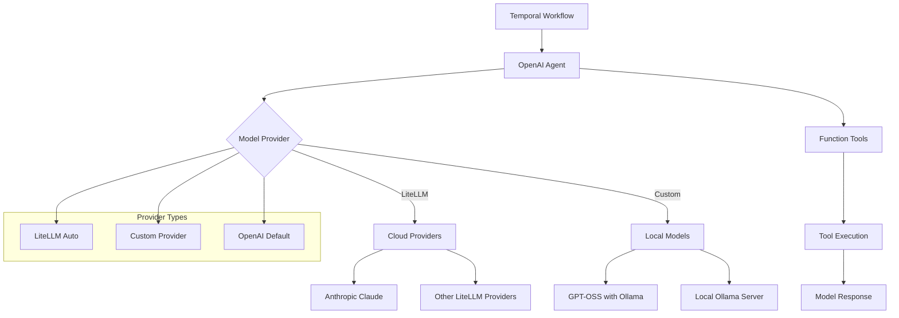
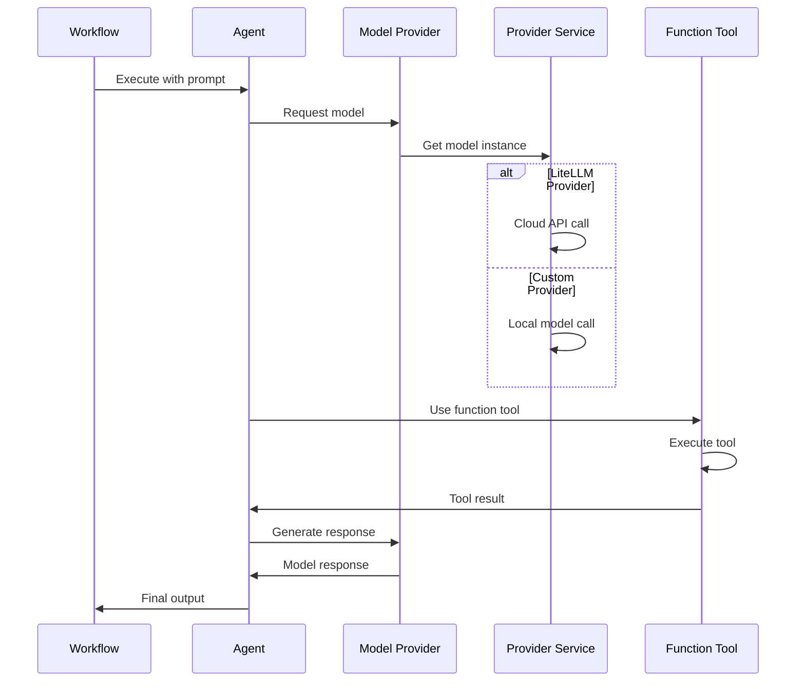

# Model Providers Integration

## 📑 Table of Contents

- [Introduction](#introduction)
- [Philosophy & Challenges](#philosophy--challenges)
- [System Constraints & Features](#system-constraints--features)
- [System Overview](#system-overview)
- [System Flow](#system-flow)
- [Core Architecture](#core-architecture)
- [Interaction Flow](#interaction-flow)
- [Development Guidelines](#development-guidelines)
- [Code Examples & Best Practices](#code-examples--best-practices)

## 🎯 Introduction

The Model Providers Integration service demonstrates how to integrate custom Large Language Model (LLM) providers with OpenAI agents in Temporal workflows. This service showcases two key patterns: LiteLLM integration for cloud-based providers and custom model providers for local/OSS models like GPT-OSS with Ollama.

The system is designed for developers and engineering teams who want to:
- Learn how to integrate custom LLM providers with OpenAI agents in Temporal
- Understand LiteLLM integration for various cloud-based model providers
- Build custom model providers for local or open-source models
- Implement tool calling with non-OpenAI models
- Connect to local Ollama servers for cost-effective model execution
- Extend agent capabilities through custom model provider integrations
- Manage different model configurations and API endpoints

## 🧠 Philosophy & Challenges

### What We're Solving
- **Model Provider Diversity**: Different LLM providers have different APIs and capabilities
- **Cost Optimization**: Local models can reduce costs compared to cloud APIs
- **Custom Integration**: Need to integrate with non-standard model providers
- **Tool Calling Support**: Ensure custom models support function calling capabilities
- **Provider Abstraction**: Unified interface for different model providers
- **Local Deployment**: Support for models running on local infrastructure
- **API Compatibility**: Handle different API formats and authentication methods

### Our Approach
- **Provider Abstraction**: Use ModelProvider interface for unified model access
- **LiteLLM Integration**: Leverage LiteLLM for cloud-based provider support
- **Custom Provider Implementation**: Build custom providers for specialized models
- **Tool Calling Support**: Ensure all models support function calling capabilities
- **Local Model Support**: Integrate with local Ollama servers for cost-effective execution
- **Workflow Integration**: Seamless integration within Temporal workflow contexts
- **Flexible Configuration**: Easy switching between different model providers

## ⚡ System Constraints & Features

### Key Features
- **LiteLLM Integration**: Built-in support for various cloud-based model providers
- **Custom Model Providers**: Custom provider implementation for specialized models
- **Local Model Support**: Integration with local Ollama servers
- **Tool Calling**: Function calling support across different model providers
- **Provider Abstraction**: Unified interface for different model types
- **Workflow Integration**: Custom models work seamlessly within Temporal contexts
- **Flexible Configuration**: Easy switching between different model providers

### System Constraints
- **Model Compatibility**: Models must support function calling capabilities
- **Local Infrastructure**: Local models require sufficient hardware resources
- **API Rate Limits**: Cloud providers have rate limits and availability constraints
- **Model Download**: Local models require initial download and setup
- **Task Queue**: Uses `"openai-agents-model-providers-task-queue"` for all workflows
- **Timeout Management**: 30-second timeouts for model interactions
- **Provider Dependencies**: External model providers must be accessible and operational

## 🏗️ System Overview



## 🔄 System Flow



## 🏛️ Core Architecture

### Component Layers
1. **Workflow Layer**: Temporal workflows orchestrating agent execution
2. **Agent Layer**: OpenAI agents with custom model provider integration
3. **Provider Layer**: Model provider abstraction for different model types
4. **Model Layer**: Specific model implementations and configurations
5. **Tool Layer**: Function tools for enhanced agent capabilities
6. **Execution Layer**: Runner scripts and worker processes for deployment

### Key Components
- **LitellmAutoWorkflow**: Workflow using LiteLLM for cloud-based providers
- **GptOssWorkflow**: Workflow using custom GPT-OSS provider with Ollama
- **LitellmProvider**: Built-in LiteLLM integration for cloud providers
- **CustomModelProvider**: Custom provider for local GPT-OSS models
- **Function Tools**: Weather tool demonstrating tool calling capabilities
- **Workflow Orchestration**: Temporal workflow management of model interactions

## 🔗 Interaction Flow

### Internal Communication
- Workflows orchestrate agent execution through custom model providers
- Agents communicate with models using the ModelProvider abstraction
- Model providers handle model instantiation and configuration
- Function tools execute within the workflow context
- Workflows manage the complete model interaction lifecycle

### External Dependencies
- **Cloud Model APIs**: Anthropic, OpenAI, and other cloud providers
- **Local Ollama Server**: For local model execution
- **OpenAI API**: For default model provider fallback
- **Temporal Server**: For workflow orchestration and state management
- **Network Infrastructure**: For cloud API connectivity and local server communication

## 💻 Development Guidelines

### Code Organization
- **Workflow Files**: One file per model provider pattern in `workflows/` directory
- **Runner Scripts**: Individual execution scripts in root directory
- **Worker Files**: Provider-specific worker configurations
- **Provider Implementation**: Custom model provider classes

### Design Patterns
- **Provider Abstraction Pattern**: Unified interface for different model types
- **LiteLLM Integration Pattern**: Built-in support for cloud-based providers
- **Custom Provider Pattern**: Custom implementation for specialized models
- **Tool Integration Pattern**: Function tools working with custom models
- **Workflow Orchestration Pattern**: Temporal workflows managing model interactions

### Error Handling
- **Model Provider Failures**: Handle cases where custom providers fail
- **API Rate Limits**: Manage cloud provider rate limiting
- **Local Model Failures**: Handle local Ollama server issues
- **Tool Execution Errors**: Gracefully handle function tool failures
- **Provider Configuration Errors**: Handle misconfigured model providers

## 📝 Code Examples & Best Practices

### LiteLLM Auto Integration Pattern
**File**: `openai_agents/model_providers/workflows/litellm_auto_workflow.py`

This pattern demonstrates LiteLLM integration for cloud-based model providers with function tool support.

```python
from __future__ import annotations

from agents import Agent, Runner, function_tool, set_tracing_disabled
from temporalio import workflow

@workflow.defn
class LitellmAutoWorkflow:
    @workflow.run
    async def run(self, prompt: str) -> str:
        # Disable tracing for this workflow to reduce overhead
        set_tracing_disabled(disabled=True)

        # Define a function tool for weather information
        @function_tool
        def get_weather(city: str):
            return f"The weather in {city} is sunny."

        # Create agent with LiteLLM model and function tools
        agent = Agent(
            name="Assistant",
            instructions="You only respond in haikus.",  # Creative constraint for responses
            model="anthropic/claude-3-5-sonnet-20240620",  # LiteLLM model identifier
            tools=[get_weather],  # Function tools for enhanced capabilities
        )

        # Execute agent with custom model provider
        result = await Runner.run(agent, prompt)
        return result.final_output
```

**Key Benefits**:
- **Cloud Provider Integration**: Easy integration with various cloud-based model providers
- **Function Tool Support**: Full tool calling capabilities with custom models
- **Creative Constraints**: Model instructions can enforce specific response formats
- **Tracing Control**: Ability to disable tracing for performance optimization
- **Seamless Integration**: Works naturally within Temporal workflow contexts

### GPT-OSS with Ollama Pattern
**File**: `openai_agents/model_providers/workflows/gpt_oss_workflow.py`

This pattern demonstrates custom model provider integration with local GPT-OSS models running on Ollama.

```python
from __future__ import annotations

from agents import Agent, Runner, function_tool, set_tracing_disabled
from temporalio import workflow

@workflow.defn
class GptOssWorkflow:
    @workflow.run
    async def run(self, prompt: str) -> str:
        # Disable tracing for this workflow to reduce overhead
        set_tracing_disabled(disabled=True)

        # Define a function tool for weather information with logging
        @function_tool
        def get_weather(city: str):
            workflow.logger.debug(f"Getting weather for {city}")  # Debug logging
            return f"The weather in {city} is sunny."

        # Create agent with local GPT-OSS model and function tools
        agent = Agent(
            name="Assistant",
            instructions="You only respond in haikus. When asked about the weather always use the tool to get the current weather.",
            model="gpt-oss:20b",  # Local Ollama model identifier
            tools=[get_weather],  # Function tools for enhanced capabilities
        )

        # Execute agent with local model provider
        result = await Runner.run(agent, prompt)
        return result.final_output
```

**Key Benefits**:
- **Local Model Execution**: Cost-effective model execution on local infrastructure
- **Function Tool Support**: Full tool calling capabilities with local models
- **Debug Logging**: Enhanced debugging capabilities within workflows
- **Creative Constraints**: Model instructions can enforce specific response formats
- **Tool Integration**: Seamless integration of function tools with local models

### Custom Model Provider Pattern
**File**: `openai_agents/model_providers/run_gpt_oss_worker.py`

This pattern demonstrates how to implement custom model providers for specialized models like GPT-OSS with Ollama.

```python
import asyncio
import logging
from datetime import timedelta
from typing import Optional

from agents import Model, ModelProvider, OpenAIChatCompletionsModel
from openai import AsyncOpenAI
from temporalio.client import Client
from temporalio.contrib.openai_agents import ModelActivityParameters, OpenAIAgentsPlugin
from temporalio.worker import Worker

from openai_agents.model_providers.workflows.gpt_oss_workflow import GptOssWorkflow

# Configure Ollama client for local model access
ollama_client = AsyncOpenAI(
    base_url="http://localhost:11434/v1",  # Local Ollama API endpoint
    api_key="ollama",  # Ignored by Ollama but required by OpenAI client
)

class CustomModelProvider(ModelProvider):
    """Custom model provider for GPT-OSS models running on local Ollama server."""
    
    def get_model(self, model_name: Optional[str]) -> Model:
        # Create OpenAI-compatible model wrapper for GPT-OSS
        model = OpenAIChatCompletionsModel(
            model=model_name if model_name else "gpt-oss:20b",  # Default model
            openai_client=ollama_client,  # Use local Ollama client
        )
        return model

async def main():
    # Configure logging to show workflow debug messages
    logging.basicConfig(level=logging.WARNING)
    logging.getLogger("temporalio.workflow").setLevel(logging.DEBUG)

    # Create client connected to Temporal server
    client = await Client.connect(
        "localhost:7233",
        plugins=[
            OpenAIAgentsPlugin(
                model_params=ModelActivityParameters(
                    start_to_close_timeout=timedelta(seconds=30)  # 30-second timeout
                ),
                model_provider=CustomModelProvider(),  # Use custom model provider
            ),
        ],
    )

    # Create worker supporting GPT-OSS workflow
    worker = Worker(
        client,
        task_queue="openai-agents-model-providers-task-queue",  # Dedicated task queue
        workflows=[
            GptOssWorkflow,  # Register GPT-OSS workflow
        ],
    )
    await worker.run()

if __name__ == "__main__":
    asyncio.run(main())
```

**Key Benefits**:
- **Custom Provider Implementation**: Full control over model instantiation and configuration
- **Local Model Support**: Integration with local Ollama servers for cost-effective execution
- **OpenAI Compatibility**: Uses OpenAI client interface for seamless integration
- **Debug Logging**: Enhanced debugging capabilities for workflow development
- **Flexible Configuration**: Easy customization of model settings and timeouts

### LiteLLM Provider Worker Pattern
**File**: `openai_agents/model_providers/run_litellm_provider_worker.py`

This pattern demonstrates how to configure workers with LiteLLM provider for cloud-based model access.

```python
import asyncio
from datetime import timedelta

from agents.extensions.models.litellm_provider import LitellmProvider
from temporalio.client import Client
from temporalio.contrib.openai_agents import ModelActivityParameters, OpenAIAgentsPlugin
from temporalio.worker import Worker

from openai_agents.model_providers.workflows.litellm_auto_workflow import (
    LitellmAutoWorkflow,
)

async def main():
    # Create client connected to Temporal server
    client = await Client.connect(
        "localhost:7233",
        plugins=[
            OpenAIAgentsPlugin(
                model_params=ModelActivityParameters(
                    start_to_close_timeout=timedelta(seconds=30)  # 30-second timeout
                ),
                model_provider=LitellmProvider(),  # Use built-in LiteLLM provider
            ),
        ],
    )

    # Create worker supporting LiteLLM workflows
    worker = Worker(
        client,
        task_queue="openai-agents-model-providers-task-queue",  # Dedicated task queue
        workflows=[
            LitellmAutoWorkflow,  # Register LiteLLM workflow
        ],
    )
    await worker.run()

if __name__ == "__main__":
    asyncio.run(main())
```

**Key Benefits**:
- **Built-in Integration**: Uses built-in LiteLLM provider for easy cloud model access
- **Provider Abstraction**: Seamless integration with various cloud-based model providers
- **Timeout Management**: Appropriate timeouts for cloud API interactions
- **Workflow Registration**: Easy registration of LiteLLM-based workflows
- **Minimal Configuration**: Simple setup for cloud-based model integration

### LiteLLM Auto Runner Pattern
**File**: `openai_agents/model_providers/run_litellm_auto_workflow.py`

This pattern demonstrates how to execute LiteLLM workflows with cloud-based model providers.

```python
import asyncio

from temporalio.client import Client
from temporalio.contrib.openai_agents import OpenAIAgentsPlugin

from openai_agents.model_providers.workflows.litellm_auto_workflow import (
    LitellmAutoWorkflow,
)

async def main():
    # Create client connected to Temporal server
    client = await Client.connect(
        "localhost:7233",
        plugins=[OpenAIAgentsPlugin()],
    )

    # Execute LiteLLM workflow with weather question
    result = await client.execute_workflow(
        LitellmAutoWorkflow.run,
        "What's the weather in Tokyo?",  # Question for weather tool
        id="litellm-auto-workflow-id",
        task_queue="openai-agents-model-providers-task-queue",
    )
    print(f"Result: {result}")

if __name__ == "__main__":
    asyncio.run(main())
```

**Key Benefits**:
- **Simple Execution**: Easy execution of LiteLLM-based workflows
- **Question Customization**: Weather questions can be customized for different cities
- **Workflow Identification**: Clear workflow ID for monitoring and debugging
- **Result Display**: Simple output display for model responses
- **Task Queue Consistency**: Uses the same task queue as the worker

### GPT-OSS Runner Pattern
**File**: `openai_agents/model_providers/run_gpt_oss_workflow.py`

This pattern demonstrates how to execute GPT-OSS workflows with local Ollama models.

```python
import asyncio

from temporalio.client import Client
from temporalio.contrib.openai_agents import OpenAIAgentsPlugin

from openai_agents.model_providers.workflows.gpt_oss_workflow import GptOssWorkflow

async def main():
    # Create client connected to Temporal server
    client = await Client.connect(
        "localhost:7233",
        plugins=[OpenAIAgentsPlugin()],
    )

    # Execute GPT-OSS workflow with weather question
    result = await client.execute_workflow(
        GptOssWorkflow.run,
        "What's the weather in Tokyo?",  # Question for weather tool
        id="litellm-gpt-oss-workflow-id",
        task_queue="openai-agents-model-providers-task-queue",
    )
    print(f"Result: {result}")

if __name__ == "__main__":
    asyncio.run(main())
```

**Key Benefits**:
- **Local Model Execution**: Executes workflows using local GPT-OSS models
- **Cost Effectiveness**: No cloud API costs for model execution
- **Question Customization**: Weather questions can be customized for different cities
- **Workflow Identification**: Clear workflow ID for monitoring and debugging
- **Result Display**: Simple output display for local model responses

## 🎯 Key Benefits of This Structure

1. **Provider Abstraction**: Unified interface for different model types and providers
2. **Cost Optimization**: Local models reduce costs compared to cloud APIs
3. **Flexible Integration**: Easy switching between different model providers
4. **Tool Calling Support**: Full function tool capabilities across different models
5. **Local Deployment**: Support for models running on local infrastructure
6. **Cloud Provider Support**: LiteLLM integration for various cloud-based providers
7. **Custom Provider Implementation**: Full control over model configuration and behavior
8. **Workflow Integration**: Custom models work seamlessly within Temporal contexts

## ⚠️ Important Implementation Notes

### Task Queue Configuration
- **Worker**: Uses task queue `"openai-agents-model-providers-task-queue"`
- **Runner Scripts**: Use the same task queue for consistency
- **Note**: Dedicated task queue for model provider-specific workflows

### Model Provider Dependencies and Setup
- **LiteLLM Integration**: Built-in support for cloud-based model providers
- **Ollama Server**: Local Ollama server required for GPT-OSS models
- **Model Downloads**: Local models require initial download and setup
- **API Keys**: Cloud providers require appropriate API keys and configuration

### Specific Examples Implemented
- **LiteLLM Auto Integration**: Cloud-based model providers with function tools
- **GPT-OSS with Ollama**: Local model execution with custom provider
- **Weather Tool Integration**: Function tools working with custom models
- **Haiku Response Format**: Creative constraints for model responses
- **Custom Model Providers**: Full control over model instantiation and configuration

### Architecture Patterns
- **Provider Abstraction Design**: Unified interface for different model types
- **LiteLLM Integration**: Built-in support for cloud-based providers
- **Custom Provider Implementation**: Full control over model configuration
- **Tool Integration**: Function tools working seamlessly with custom models
- **Workflow Orchestration**: Temporal workflows managing model interactions

### File Organization
```
openai_agents/model_providers/
├── workflows/                           # Core model provider implementations
│   ├── litellm_auto_workflow.py        # LiteLLM cloud provider integration
│   └── gpt_oss_workflow.py             # Custom GPT-OSS provider integration
├── run_litellm_provider_worker.py       # LiteLLM worker configuration
├── run_gpt_oss_worker.py                # GPT-OSS worker configuration
├── run_litellm_auto_workflow.py         # LiteLLM workflow runner
├── run_gpt_oss_workflow.py              # GPT-OSS workflow runner
└── README.md                           # Model provider overview and usage
```

### Common Development Patterns
- **Use `set_tracing_disabled(disabled=True)`** for performance optimization
- **Implement custom ModelProvider classes** for specialized model integration
- **Configure appropriate timeouts** for different model provider types
- **Use function tools** to enhance agent capabilities across different models
- **Handle provider failures** gracefully in production systems
- **Monitor model performance** and adjust timeouts accordingly
- **Test tool calling capabilities** with different model providers

This structure ensures developers can understand:
- **Model provider integration patterns** with OpenAI agents in Temporal workflows
- **Custom provider implementation** for specialized models and local deployment
- **LiteLLM integration** for cloud-based model providers
- **Tool calling support** across different model types
- **Local model deployment** with Ollama and custom providers
- **Production deployment** considerations for custom model integrations

The model providers integration serves as a bridge between OpenAI agents and various LLM providers, enabling cost optimization, local deployment, and enhanced flexibility while maintaining the reliability, observability, and error handling that Temporal provides. Each pattern demonstrates specific model provider integration strategies that can be adapted for custom model deployments and provider integrations.
