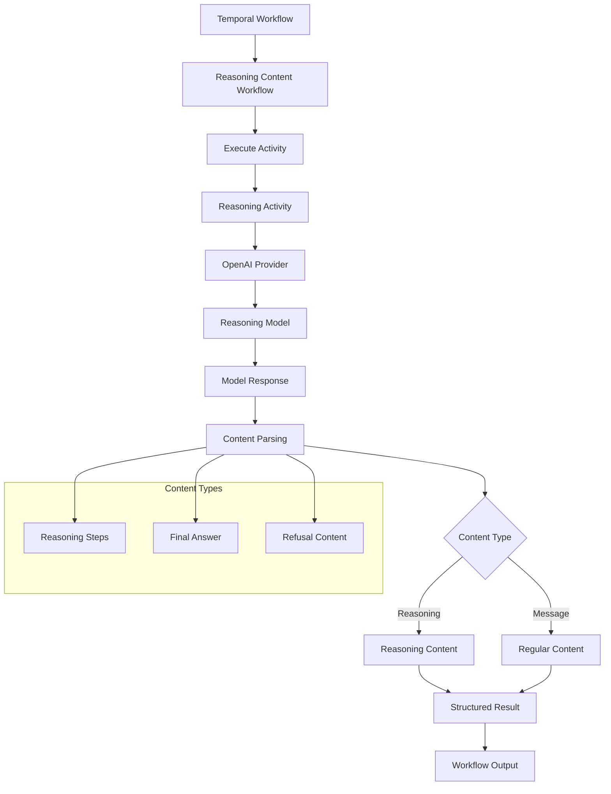
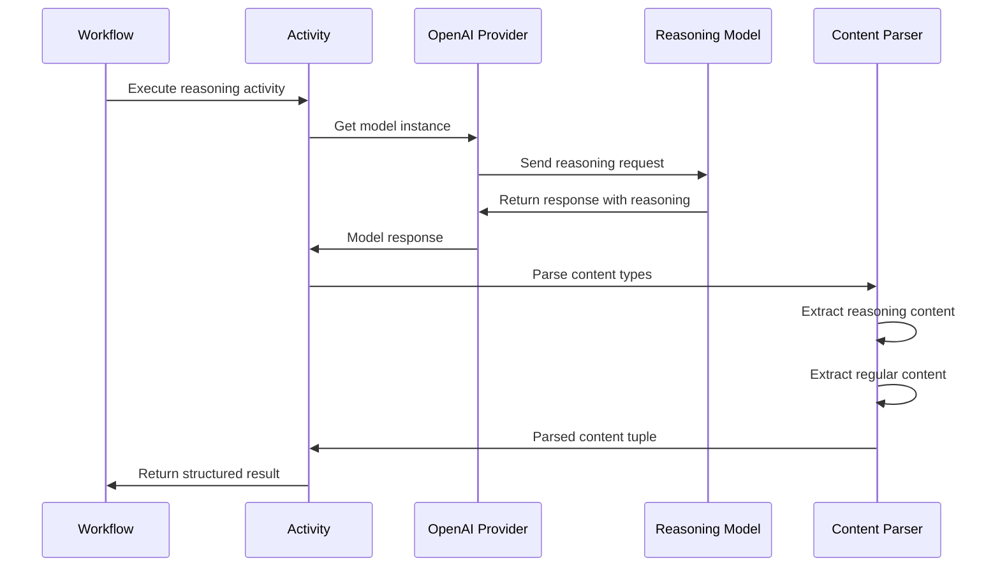

# Reasoning Content Extraction

## 📑 Table of Contents

- [Introduction](#introduction)
- [Philosophy & Challenges](#philosophy--challenges)
- [System Constraints & Features](#system-constraints--features)
- [System Overview](#system-overview)
- [System Flow](#system-flow)
- [Core Architecture](#core-architecture)
- [Interaction Flow](#interaction-flow)
- [Development Guidelines](#development-guidelines)
- [Code Examples & Best Practices](#code-examples--best-practices)

## 🎯 Introduction

The Reasoning Content Extraction service demonstrates how to access and utilize the reasoning content field from models that support it, such as deepseek-reasoner. This service showcases how to extract both the model's step-by-step thinking process and the final answer within Temporal workflows, providing transparency into AI decision-making processes.

The system is designed for developers and engineering teams who want to:
- Learn how to access reasoning content from reasoning-capable models
- Understand the model's step-by-step thinking process before final answers
- Build transparent AI systems with explainable reasoning
- Extract both reasoning and regular content from model responses
- Implement reasoning content extraction within Temporal workflows
- Use activities to handle I/O operations in workflows
- Work with models that provide detailed reasoning capabilities

## 🧠 Philosophy & Challenges

### What We're Solving
- **Reasoning Transparency**: Access to the model's internal thinking process
- **Explainable AI**: Understanding how models arrive at their conclusions
- **Content Separation**: Distinguishing between reasoning steps and final answers
- **I/O Handling**: Managing external API calls within Temporal workflows
- **Model Compatibility**: Working with models that support reasoning content
- **Content Extraction**: Parsing complex response structures for different content types
- **Workflow Integration**: Seamlessly integrating reasoning extraction into workflows

### Our Approach
- **Activity-Based I/O**: Use Temporal activities for external model API calls
- **Content Parsing**: Extract both reasoning and regular content from responses
- **Model Abstraction**: Use OpenAI provider for model interactions
- **Structured Output**: Return structured results with separated content types
- **Workflow Orchestration**: Temporal workflows manage the reasoning extraction process
- **Flexible Model Selection**: Support for different reasoning-capable models
- **Content Type Detection**: Automatic detection of reasoning vs. regular content

## ⚡ System Constraints & Features

### Key Features
- **Reasoning Content Extraction**: Access to model's step-by-step thinking process
- **Dual Content Support**: Both reasoning and regular content extraction
- **Activity-Based Architecture**: Temporal activities handle external I/O operations
- **Model Flexibility**: Support for different reasoning-capable models
- **Structured Results**: Clear separation of reasoning and regular content
- **Workflow Integration**: Seamless integration within Temporal workflows
- **Content Type Detection**: Automatic parsing of different response content types

### System Constraints
- **Model Compatibility**: Only works with models that support reasoning content
- **No Streaming**: Temporal workflows don't support streaming responses
- **I/O Operations**: External API calls must be handled in activities
- **Content Parsing**: Complex response structure parsing required
- **Task Queue**: Uses `"reasoning-content-task-queue"` for all workflows
- **Timeout Management**: 5-minute timeouts for reasoning model interactions
- **API Dependencies**: OpenAI API key and compatible model required

## 🏗️ System Overview



## 🔄 System Flow



## 🏛️ Core Architecture

### Component Layers
1. **Workflow Layer**: Temporal workflow orchestrating reasoning content extraction
2. **Activity Layer**: Temporal activities handling external I/O operations
3. **Provider Layer**: OpenAI provider for model interactions
4. **Model Layer**: Reasoning-capable models providing detailed responses
5. **Content Layer**: Content parsing and extraction logic
6. **Execution Layer**: Runner scripts and worker processes for deployment

### Key Components
- **ReasoningContentWorkflow**: Main workflow orchestrating reasoning extraction
- **get_reasoning_response**: Activity for handling model API calls
- **OpenAIProvider**: Provider for model interactions
- **Content Parser**: Logic for extracting different content types
- **Structured Results**: Dataclass for organizing extracted content
- **Workflow Orchestration**: Temporal workflow management of reasoning extraction

## 🔗 Interaction Flow

### Internal Communication
- Workflows orchestrate reasoning extraction through activities
- Activities handle external model API calls and content parsing
- Content parsing logic extracts different types of response content
- Structured results organize reasoning and regular content
- Workflows manage the complete reasoning extraction lifecycle

### External Dependencies
- **OpenAI API**: For model interactions and responses
- **Reasoning Models**: Models that support reasoning content (e.g., deepseek-reasoner)
- **Temporal Server**: For workflow orchestration and state management
- **Network Infrastructure**: For API connectivity and model communication
- **Environment Variables**: For API keys and model configuration

## 💻 Development Guidelines

### Code Organization
- **Workflow Files**: One file per reasoning pattern in `workflows/` directory
- **Activity Files**: I/O handling logic in `activities/` directory
- **Runner Scripts**: Individual execution scripts in root directory
- **Worker**: Central worker supporting reasoning workflows in `run_worker.py`

### Design Patterns
- **Activity-Based I/O Pattern**: Use activities for external API calls
- **Content Parsing Pattern**: Extract different content types from responses
- **Structured Output Pattern**: Return organized results with separated content
- **Model Provider Pattern**: Use OpenAI provider for model interactions
- **Workflow Orchestration Pattern**: Temporal workflows managing reasoning extraction

### Error Handling
- **Model API Failures**: Handle cases where reasoning models are unavailable
- **Content Parsing Errors**: Gracefully handle unexpected response structures
- **Activity Failures**: Handle activity execution failures
- **Model Compatibility**: Handle models that don't support reasoning content
- **Timeout Management**: Handle long-running reasoning model interactions

## 📝 Code Examples & Best Practices

### Reasoning Content Workflow Pattern
**File**: `openai_agents/reasoning_content/workflows/reasoning_content_workflow.py`

This pattern demonstrates how to orchestrate reasoning content extraction using Temporal workflows and activities.

```python
from dataclasses import dataclass

from temporalio import workflow

from openai_agents.reasoning_content.activities.reasoning_activities import (
    get_reasoning_response,
)

# Structured output for reasoning results
@dataclass
class ReasoningResult:
    reasoning_content: str | None      # Model's step-by-step thinking process
    regular_content: str | None        # Final answer or response
    prompt: str                        # Original input prompt

@workflow.defn
class ReasoningContentWorkflow:
    @workflow.run
    async def run(self, prompt: str, model_name: str | None = None) -> ReasoningResult:
        # Call the activity to get the reasoning response
        # Activities handle external I/O operations that workflows cannot perform directly
        reasoning_content, regular_content = await workflow.execute_activity(
            get_reasoning_response,
            args=[prompt, model_name],
            start_to_close_timeout=workflow.timedelta(minutes=5),  # Extended timeout for reasoning models
        )

        # Return structured result with separated content types
        return ReasoningResult(
            reasoning_content=reasoning_content,
            regular_content=regular_content,
            prompt=prompt,
        )
```

**Key Benefits**:
- **Activity-Based I/O**: External API calls handled in activities, not workflows
- **Structured Results**: Clear separation of reasoning and regular content
- **Extended Timeouts**: 5-minute timeouts for complex reasoning model interactions
- **Content Organization**: Dataclass provides clear structure for extracted content
- **Workflow Integration**: Seamless integration within Temporal workflow contexts

### Reasoning Content Activity Pattern
**File**: `openai_agents/reasoning_content/activities/reasoning_activities.py`

This pattern demonstrates how to implement activities for extracting reasoning content from model responses.

```python
import os
from typing import Any, cast

from agents import ModelSettings
from agents.models.interface import ModelTracing
from agents.models.openai_provider import OpenAIProvider
from openai.types.responses import ResponseOutputRefusal, ResponseOutputText
from temporalio import activity

@activity.defn
async def get_reasoning_response(
    prompt: str, model_name: str | None = None
) -> tuple[str | None, str | None]:
    """
    Activity to get response from a reasoning-capable model.
    Returns tuple of (reasoning_content, regular_content).
    """
    # Use provided model name, environment variable, or default to deepseek-reasoner
    model_name = model_name or os.getenv("EXAMPLE_MODEL_NAME") or "deepseek-reasoner"

    # Initialize OpenAI provider and get model instance
    provider = OpenAIProvider()
    model = provider.get_model(model_name)

    # Send request to reasoning-capable model
    response = await model.get_response(
        system_instructions="You are a helpful assistant that explains your reasoning step by step.",
        input=prompt,
        model_settings=ModelSettings(),
        tools=[],  # No tools needed for reasoning content extraction
        output_schema=None,
        handoffs=[],
        tracing=ModelTracing.DISABLED,  # Disable tracing for performance
        previous_response_id=None,
        prompt=None,
    )

    # Extract reasoning content and regular content from the response
    reasoning_content = None
    regular_content = None

    # Parse response output to identify different content types
    for item in response.output:
        if hasattr(item, "type") and item.type == "reasoning":
            # Extract reasoning content from reasoning-type items
            reasoning_content = item.summary[0].text
        elif hasattr(item, "type") and item.type == "message":
            # Extract regular content from message-type items
            if item.content and len(item.content) > 0:
                content_item = item.content[0]
                if isinstance(content_item, ResponseOutputText):
                    # Handle text content
                    regular_content = content_item.text
                elif isinstance(content_item, ResponseOutputRefusal):
                    # Handle refusal content
                    refusal_item = cast(Any, content_item)
                    regular_content = refusal_item.refusal

    # Return tuple of (reasoning_content, regular_content)
    return reasoning_content, regular_content
```

**Key Benefits**:
- **Content Type Detection**: Automatic identification of reasoning vs. regular content
- **Flexible Model Selection**: Support for different reasoning-capable models
- **Comprehensive Parsing**: Handles text, refusal, and reasoning content types
- **Type Safety**: Proper type casting and validation for different content types
- **Environment Configuration**: Easy model selection through environment variables

### Structured Result Pattern
**File**: `openai_agents/reasoning_content/workflows/reasoning_content_workflow.py`

This pattern demonstrates how to structure and organize extracted reasoning content for clear consumption.

```python
@dataclass
class ReasoningResult:
    reasoning_content: str | None      # Model's step-by-step thinking process
    regular_content: str | None        # Final answer or response
    prompt: str                        # Original input prompt
```

**Key Benefits**:
- **Clear Organization**: Separates different types of extracted content
- **Type Safety**: Optional fields handle cases where content might not be available
- **Prompt Preservation**: Maintains original input for context and debugging
- **Easy Consumption**: Simple structure for consuming applications
- **Extensible Design**: Easy to add additional content types in the future

### Content Parsing Pattern
**File**: `openai_agents/reasoning_content/activities/reasoning_activities.py`

This pattern demonstrates how to parse complex model responses to extract different content types.

```python
# Parse response output to identify different content types
for item in response.output:
    if hasattr(item, "type") and item.type == "reasoning":
        # Extract reasoning content from reasoning-type items
        reasoning_content = item.summary[0].text
    elif hasattr(item, "type") and item.type == "message":
        # Extract regular content from message-type items
        if item.content and len(item.content) > 0:
            content_item = item.content[0]
            if isinstance(content_item, ResponseOutputText):
                # Handle text content
                regular_content = content_item.text
            elif isinstance(content_item, ResponseOutputRefusal):
                # Handle refusal content
                refusal_item = cast(Any, content_item)
                regular_content = refusal_item.refusal
```

**Key Benefits**:
- **Type Detection**: Automatic identification of different content types
- **Comprehensive Coverage**: Handles reasoning, text, and refusal content
- **Safe Access**: Proper attribute checking before accessing content
- **Type Casting**: Safe type casting for different response structures
- **Error Resilience**: Graceful handling of unexpected response formats

### Worker Configuration
**File**: `openai_agents/reasoning_content/run_worker.py`

This is the central worker that supports the reasoning content workflow, registering both workflows and activities.

```python
#!/usr/bin/env python3

import asyncio

from temporalio.client import Client
from temporalio.contrib.openai_agents import OpenAIAgentsPlugin
from temporalio.worker import Worker

from openai_agents.reasoning_content.activities.reasoning_activities import (
    get_reasoning_response,
)
from openai_agents.reasoning_content.workflows.reasoning_content_workflow import (
    ReasoningContentWorkflow,
)

async def main():
    # Create client connected to Temporal server
    client = await Client.connect(
        "localhost:7233",
        plugins=[OpenAIAgentsPlugin()],
    )

    # Create worker supporting reasoning content workflows and activities
    worker = Worker(
        client,
        task_queue="reasoning-content-task-queue",  # Dedicated task queue for reasoning
        workflows=[ReasoningContentWorkflow],      # Register reasoning workflow
        activities=[get_reasoning_response],       # Register reasoning activity
    )

    print("Starting reasoning content worker...")
    await worker.run()

if __name__ == "__main__":
    asyncio.run(main())
```

**Key Benefits**:
- **Dual Registration**: Registers both workflows and activities
- **Dedicated Task Queue**: Separate queue for reasoning-specific operations
- **Activity Support**: Enables external I/O operations within workflows
- **Simple Setup**: Easy deployment of reasoning content capabilities
- **Clear Logging**: Informative startup messages for monitoring

### Runner Script Pattern
**File**: `openai_agents/reasoning_content/run_reasoning_content_workflow.py`

This pattern demonstrates how to execute reasoning content workflows with multiple demo prompts.

```python
#!/usr/bin/env python3

import asyncio
import os

from temporalio.client import Client
from temporalio.contrib.openai_agents import OpenAIAgentsPlugin

from openai_agents.reasoning_content.workflows.reasoning_content_workflow import (
    ReasoningContentWorkflow,
    ReasoningResult,
)

async def main():
    # Create client connected to Temporal server
    client = await Client.connect(
        "localhost:7233",
        plugins=[OpenAIAgentsPlugin()],
    )

    # Demo prompts that benefit from reasoning
    demo_prompts = [
        "What is the square root of 841? Please explain your reasoning.",
        "Explain the concept of recursion in programming",
        "Write a haiku about recursion in programming",
    ]

    # Get model name from environment or use default
    model_name = os.getenv("EXAMPLE_MODEL_NAME") or "deepseek-reasoner"
    print(f"Using model: {model_name}")
    print("Note: This example requires a model that supports reasoning content.")
    print("You may need to use a specific model like deepseek-reasoner or similar.\n")

    # Execute workflow for each demo prompt
    for i, prompt in enumerate(demo_prompts, 1):
        print(f"=== Example {i}: {prompt} ===")

        # Execute reasoning content workflow
        result: ReasoningResult = await client.execute_workflow(
            ReasoningContentWorkflow.run,
            args=[prompt, model_name],
            id=f"reasoning-content-{i}",
            task_queue="reasoning-content-task-queue",
        )

        # Display structured results
        print(f"\nPrompt: {result.prompt}")
        print("\nReasoning Content:")
        print(result.reasoning_content or "No reasoning content provided")
        print("\nRegular Content:")
        print(result.regular_content or "No regular content provided")
        print("-" * 50 + "\n")

if __name__ == "__main__":
    asyncio.run(main())
```

**Key Benefits**:
- **Multiple Examples**: Demonstrates reasoning content with different types of prompts
- **Environment Configuration**: Easy model selection through environment variables
- **Structured Display**: Clear presentation of extracted reasoning and regular content
- **Workflow Identification**: Unique IDs for each example execution
- **Comprehensive Testing**: Tests reasoning capabilities across different prompt types

## 🎯 Key Benefits of This Structure

1. **Reasoning Transparency**: Access to model's step-by-step thinking process
2. **Explainable AI**: Understanding how models arrive at conclusions
3. **Content Separation**: Clear distinction between reasoning and final answers
4. **Activity-Based I/O**: Proper handling of external API calls in workflows
5. **Structured Results**: Organized output for easy consumption
6. **Model Flexibility**: Support for different reasoning-capable models
7. **Content Type Detection**: Automatic parsing of different response structures
8. **Workflow Integration**: Seamless integration within Temporal contexts

## ⚠️ Important Implementation Notes

### Task Queue Configuration
- **Worker**: Uses task queue `"reasoning-content-task-queue"`
- **Runner Scripts**: Use the same task queue for consistency
- **Note**: Dedicated task queue for reasoning content-specific workflows

### Reasoning Content Dependencies and Setup
- **Model Compatibility**: Only works with models that support reasoning content
- **OpenAI API Key**: Required for model interactions
- **Reasoning Models**: Models like deepseek-reasoner provide reasoning content
- **Activity Registration**: Both workflows and activities must be registered

### Specific Examples Implemented
- **Mathematical Reasoning**: Square root calculation with step-by-step explanation
- **Concept Explanation**: Programming concepts like recursion
- **Creative Writing**: Haiku generation with reasoning process
- **Content Extraction**: Automatic parsing of reasoning vs. regular content
- **Structured Results**: Clear organization of extracted content types

### Architecture Patterns
- **Activity-Based I/O Design**: External API calls handled in activities
- **Content Parsing**: Automatic detection and extraction of different content types
- **Structured Output**: Organized results with clear content separation
- **Model Provider Integration**: OpenAI provider for reasoning model interactions
- **Workflow Orchestration**: Temporal workflows managing reasoning extraction

### File Organization
```
openai_agents/reasoning_content/
├── workflows/                           # Core reasoning workflow implementation
│   └── reasoning_content_workflow.py   # Reasoning content extraction workflow
├── activities/                          # I/O handling activities
│   └── reasoning_activities.py         # Reasoning content extraction activity
├── run_worker.py                        # Central worker for reasoning workflows
├── run_reasoning_content_workflow.py    # Reasoning workflow runner with demos
└── README.md                           # Reasoning content overview and usage
```

### Common Development Patterns
- **Use activities for external I/O** operations that workflows cannot perform
- **Implement content type detection** for automatic parsing of responses
- **Structure results clearly** with separated reasoning and regular content
- **Handle missing content gracefully** with optional fields and fallbacks
- **Use extended timeouts** for reasoning model interactions
- **Test with different prompt types** to validate reasoning capabilities
- **Monitor content extraction** for unexpected response formats

This structure ensures developers can understand:
- **Reasoning content extraction patterns** with OpenAI agents in Temporal workflows
- **Activity-based I/O handling** for external API calls
- **Content parsing strategies** for different response types
- **Structured output organization** for extracted content
- **Model compatibility requirements** for reasoning content support
- **Production deployment** considerations for reasoning extraction systems

The reasoning content extraction serves as a bridge between AI models and human understanding, providing transparency into AI decision-making processes while maintaining the reliability, observability, and error handling that Temporal provides. Each pattern demonstrates specific reasoning extraction strategies that can be adapted for custom explainable AI systems and reasoning content analysis.
