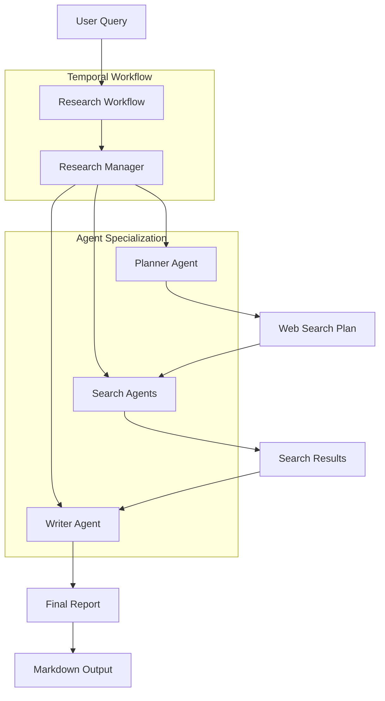
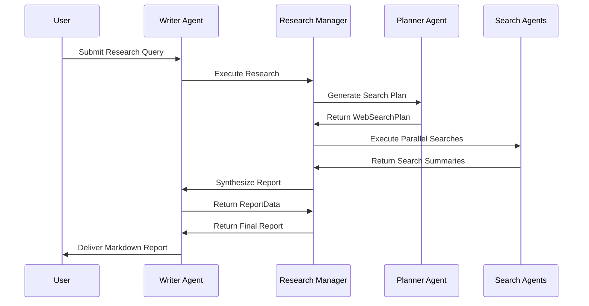

# Research Bot

## 📑 Table of Contents
- [Introduction](#introduction)
- [Philosophy & Challenges](#philosophy--challenges)
- [System Constraints & Features](#system-constraints--features)
- [System Overview](#system-overview)
- [System Flow](#system-flow)
- [Core Architecture](#core-architecture)
- [Interaction Flow](#interaction-flow)
- [Development Guidelines](#development-guidelines)
- [Code Examples & Best Practices](#code-examples--best-practices)
- [Key Benefits of This Structure](#key-benefits-of-this-structure)
- [Important Implementation Notes](#important-implementation-notes)
- [Architecture Patterns](#architecture-patterns)
- [File Organization](#file-organization)
- [Common Development Patterns](#common-development-patterns)

## 🎯 Introduction
The Research Bot is a multi-agent research system that orchestrates specialized AI agents to perform comprehensive web-based research tasks. It extends the OpenAI Agents SDK research bot with Temporal's durable execution, enabling reliable, scalable research workflows that can handle complex queries through parallel search execution and intelligent result synthesis.

## 🧠 Philosophy & Challenges

### What We're Solving
- **Research Complexity**: Breaking down complex research queries into manageable, focused web searches
- **Information Overload**: Synthesizing multiple search results into coherent, actionable reports
- **Scalability**: Executing multiple searches in parallel while maintaining workflow reliability
- **Quality Assurance**: Ensuring research coverage and report coherence through specialized agent roles

### Our Approach
- **Agent Specialization**: Each agent has a focused responsibility (planning, searching, writing)
- **Parallel Execution**: Leveraging Temporal's workflow capabilities for concurrent search operations
- **Structured Output**: Using Pydantic models to ensure data consistency and type safety
- **Progressive Refinement**: Planning → Searching → Synthesis workflow for systematic research

## ⚡ System Constraints & Features

### Key Features
- **Multi-Agent Orchestration**: Coordinated execution of specialized research agents
- **Parallel Web Search**: Concurrent execution of multiple search queries for efficiency
- **Intelligent Planning**: AI-driven search strategy generation based on research queries
- **Structured Reporting**: Consistent output format with summaries, detailed reports, and follow-up questions
- **Durable Execution**: Temporal workflow ensures research tasks survive interruptions

### System Constraints
- **Search Result Limits**: Summaries capped at 300 words for conciseness
- **Report Length**: Target 5-10 pages (1000+ words) for comprehensive coverage
- **Model Selection**: Different models for different tasks (GPT-4o for planning, o3-mini for writing)
- **Tool Requirements**: Search agent must use WebSearchTool (tool_choice="required")

## 🏗️ System Overview


## 🔄 System Flow


## 🏛️ Core Architecture

### Component Layers
1. **Workflow Layer**: Temporal workflow wrapper for the research process
2. **Orchestration Layer**: ResearchManager coordinates all agent interactions
3. **Agent Layer**: Specialized agents for planning, searching, and writing
4. **Tool Layer**: WebSearchTool integration for web research capabilities

### Key Components
- **[ResearchWorkflow]**: Temporal workflow entry point that wraps the ResearchManager
- **[ResearchManager]**: Central orchestrator that manages the entire research lifecycle
- **[PlannerAgent]**: Generates strategic search plans based on research queries
- **[SearchAgent]**: Executes web searches and produces concise summaries
- **[WriterAgent]**: Synthesizes search results into comprehensive reports

## 🔗 Interaction Flow

### Internal Communication
- **Sequential Planning**: Planner agent generates search strategy before execution
- **Parallel Search Execution**: Multiple search agents run concurrently using `workflow.as_completed`
- **Result Aggregation**: Search results are collected and passed to the writer agent
- **Final Synthesis**: Writer agent processes all results to create the final report

### External Dependencies
- **Web Search API**: WebSearchTool provides internet research capabilities
- **OpenAI Models**: Different models for different agent roles (GPT-4o, o3-mini)
- **Temporal Server**: Workflow orchestration and durable execution

## 💻 Development Guidelines

### Code Organization
- **Agent Separation**: Each agent is defined in its own file with clear responsibilities
- **Model Definitions**: Pydantic models for structured data exchange between agents
- **Workflow Isolation**: Simple workflow wrapper around the ResearchManager
- **Runner Scripts**: Separate execution scripts for workflow and worker

### Design Patterns
- **Agent Factory Pattern**: `new_*_agent()` functions for agent instantiation
- **Strategy Pattern**: Different agents handle different aspects of research
- **Pipeline Pattern**: Sequential processing through planning → searching → writing
- **Parallel Execution**: Concurrent search execution for improved performance

### Error Handling
- **Graceful Degradation**: Failed searches return None and are filtered out
- **Exception Isolation**: Individual search failures don't break the entire workflow
- **Result Validation**: Pydantic models ensure data consistency and type safety

## 📝 Code Examples & Best Practices

### Research Manager Orchestration
**File**: `openai_agents/research_bot/agents/research_manager.py`

```python
class ResearchManager:
    def __init__(self):
        self.run_config = RunConfig()
        self.search_agent = new_search_agent()
        self.planner_agent = new_planner_agent()
        self.writer_agent = new_writer_agent()

    async def run(self, query: str) -> str:
        with trace("Research trace"):
            search_plan = await self._plan_searches(query)
            search_results = await self._perform_searches(search_plan)
            report = await self._write_report(query, search_results)
        return report.markdown_report
```

**Key Benefits**:
- Centralized orchestration of all research phases
- Clear separation of concerns with dedicated methods
- Temporal tracing for observability and debugging
- Structured workflow from planning to final report

### Parallel Search Execution
**File**: `openai_agents/research_bot/agents/research_manager.py`

```python
async def _perform_searches(self, search_plan: WebSearchPlan) -> list[str]:
    with custom_span("Search the web"):
        num_completed = 0
        tasks = [
            asyncio.create_task(self._search(item)) 
            for item in search_plan.searches
        ]
        results = []
        for task in workflow.as_completed(tasks):
            result = await task
            if result is not None:
                results.append(result)
            num_completed += 1
        return results
```

**Key Benefits**:
- Concurrent execution of multiple searches for improved performance
- Proper Temporal workflow integration with `workflow.as_completed`
- Graceful handling of failed searches (None results are filtered)
- Progress tracking with completion counters

### Agent Configuration and Tools
**File**: `openai_agents/research_bot/agents/search_agent.py`

```python
def new_search_agent():
    return Agent(
        name="Search agent",
        instructions=INSTRUCTIONS,
        tools=[WebSearchTool()],
        model_settings=ModelSettings(tool_choice="required"),
    )
```

**Key Benefits**:
- Forced tool usage ensures WebSearchTool is always employed
- Clear agent naming for debugging and monitoring
- Structured instructions for consistent search behavior
- Tool integration for web research capabilities

### Structured Data Models
**File**: `openai_agents/research_bot/agents/planner_agent.py`

```python
class WebSearchItem(BaseModel):
    reason: str
    "Your reasoning for why this search is important to the query."
    query: str
    "The search term to use for the web search."

class WebSearchPlan(BaseModel):
    searches: list[WebSearchItem]
    """A list of web searches to perform to best answer the query."""
```

**Key Benefits**:
- Type-safe data exchange between agents
- Self-documenting fields with descriptive docstrings
- Validation ensures data consistency across the workflow
- Clear structure for search planning and execution

### Workflow Integration
**File**: `openai_agents/research_bot/workflows/research_bot_workflow.py`

```python
@workflow.defn
class ResearchWorkflow:
    @workflow.run
    async def run(self, query: str) -> str:
        return await ResearchManager().run(query)
```

**Key Benefits**:
- Simple workflow wrapper around the ResearchManager
- Clean separation between Temporal workflow and business logic
- Easy to extend with additional workflow features
- Minimal boilerplate for workflow definition

### Worker Configuration
**File**: `openai_agents/research_bot/run_worker.py`

```python
worker = Worker(
    client,
    task_queue="openai-agents-task-queue",
    workflows=[
        ResearchWorkflow,
    ],
)
```

**Key Benefits**:
- Consistent task queue naming across the system
- Extended timeouts for AI model operations (120 seconds)
- OpenAIAgentsPlugin integration for agent capabilities
- Simple worker setup focused on research workflows

## 🎯 **Key Benefits of This Structure:**

1. **Scalable Research**: Parallel search execution handles multiple queries efficiently
2. **Agent Specialization**: Each agent has a focused role for better performance
3. **Durable Execution**: Temporal ensures research tasks survive interruptions
4. **Structured Output**: Pydantic models guarantee data consistency
5. **Observability**: Tracing and custom spans provide debugging insights
6. **Modular Design**: Easy to extend with new agent types or research capabilities

## ⚠️ **Important Implementation Notes:**

- **Task Queue Consistency**: Uses `"openai-agents-task-queue"` for all operations
- **Model Selection Strategy**: Different models for different tasks (GPT-4o for planning, o3-mini for writing)
- **Search Result Filtering**: Failed searches return None and are automatically filtered out
- **Parallel Execution**: Uses `workflow.as_completed` for proper Temporal integration
- **Tool Requirements**: Search agent enforces tool usage with `tool_choice="required"`

## 🏗️ **Architecture Patterns:**

- **Multi-Agent System**: Coordinated execution of specialized AI agents
- **Pipeline Architecture**: Sequential processing through planning → searching → writing
- **Parallel Processing**: Concurrent search execution for improved performance
- **Workflow Orchestration**: Temporal manages the entire research lifecycle
- **Factory Pattern**: Agent instantiation through dedicated factory functions

## 📁 **File Organization:**

```
openai_agents/research_bot/
├── README.md                    # High-level overview and usage instructions
├── agents/
│   ├── research_manager.py      # Central orchestration and workflow management
│   ├── planner_agent.py         # Search strategy generation
│   ├── search_agent.py          # Web search execution and summarization
│   └── writer_agent.py          # Report synthesis and generation
├── workflows/
│   └── research_bot_workflow.py # Temporal workflow wrapper
├── run_research_workflow.py     # Client script for executing research
└── run_worker.py                # Worker configuration and execution
```

## 🔧 **Common Development Patterns:**

- **Agent Creation**: Use factory functions (`new_*_agent()`) for consistent agent setup
- **Data Flow**: Follow the planning → searching → writing pipeline for new research features
- **Error Handling**: Implement graceful degradation for individual component failures
- **Tracing**: Use `trace()` and `custom_span()` for observability and debugging
- **Model Selection**: Choose appropriate models based on task complexity and requirements
- **Tool Integration**: Ensure required tools are properly configured with `tool_choice="required"`
