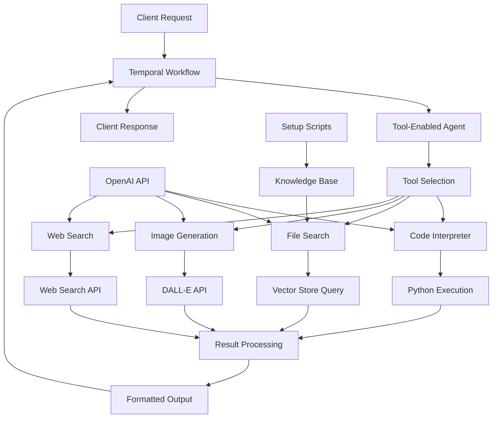
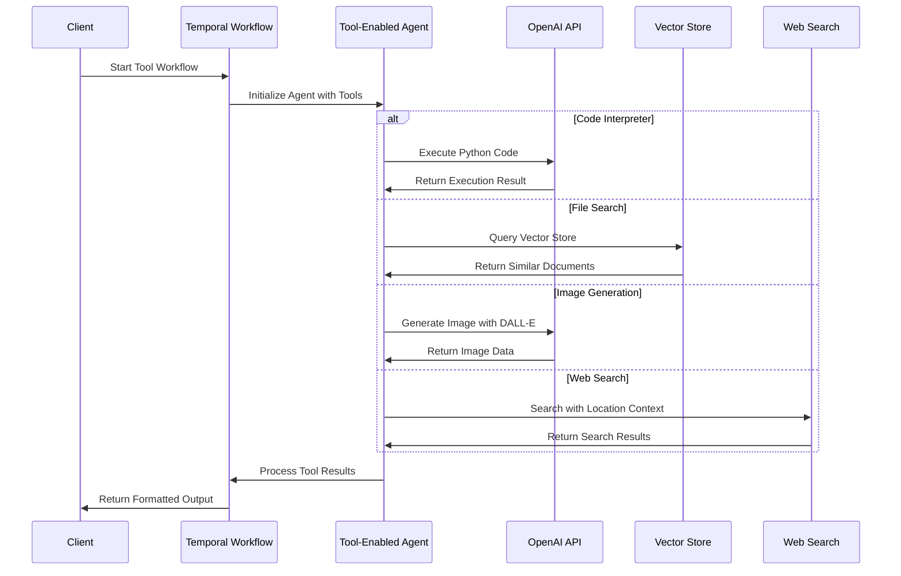

# Tools Integration

## 📑 Table of Contents

- [Introduction](#introduction)
- [Philosophy & Challenges](#philosophy--challenges)
- [System Constraints & Features](#system-constraints--features)
- [System Overview](#system-overview)
- [System Flow](#system-flow)
- [Core Architecture](#core-architecture)
- [Interaction Flow](#interaction-flow)
- [Development Guidelines](#development-guidelines)
- [Code Examples & Best Practices](#code-examples--best-practices)

## 🎯 Introduction

The Tools Integration service demonstrates how to extend OpenAI agents with powerful external capabilities through specialized tools. This service showcases integration with code interpretation, file search, image generation, and web search tools, all implemented within Temporal's reliable workflow framework.

The system is designed for developers and engineering teams who want to:
- Learn how to integrate external tools with OpenAI agents in Temporal workflows
- Implement code execution capabilities for mathematical and data analysis tasks
- Build document search systems using vector stores and similarity search
- Create image generation workflows with DALL-E integration
- Implement web search capabilities with location-aware context
- Understand tool configuration and resource management patterns

## 🧠 Philosophy & Challenges

### What We're Solving
- **Tool Integration Complexity**: Managing external tool dependencies and configurations
- **Resource Management**: Handling file uploads, vector stores, and API integrations
- **Tool Configuration**: Properly configuring tools with specific parameters and resources
- **Result Processing**: Extracting and processing different types of tool outputs
- **Knowledge Base Setup**: Creating and maintaining vector stores for document search
- **Cross-Platform Compatibility**: Handling tool outputs across different operating systems

### Our Approach
- **Tool-First Design**: Integrate tools as first-class citizens in agent workflows
- **Resource Abstraction**: Abstract complex tool configurations behind simple interfaces
- **Result Standardization**: Normalize different tool outputs into consistent formats
- **Setup Automation**: Provide automated setup scripts for complex tool dependencies
- **Temporal Integration**: Leverage workflow durability for reliable tool execution
- **Error Handling**: Implement robust error handling for external tool failures

## ⚡ System Constraints & Features

### Key Features
- **Code Interpreter Tool**: Execute Python code for calculations and data analysis
- **File Search Tool**: Vector-based document search using OpenAI's file search capabilities
- **Image Generation Tool**: Create images using DALL-E with configurable quality settings
- **Web Search Tool**: Search the web with location-aware context and user preferences
- **Knowledge Base Setup**: Automated creation of vector stores with sample content
- **Cross-Platform Support**: Handle tool outputs across macOS, Windows, and Linux

### System Constraints
- **OpenAI API Dependencies**: Requires valid OpenAI API key and proper tool access
- **File Upload Limits**: OpenAI API has specific file size and format requirements
- **Tool Resource Limits**: Vector stores and file search have usage quotas
- **Image Quality Trade-offs**: Lower quality settings for faster generation
- **Web Search Limitations**: Location-based results may vary by region
- **Task Queue**: Uses `"openai-agents-tools-task-queue"` for all workflows

## 🏗️ System Overview



## 🔄 System Flow



## 🏛️ Core Architecture

### Component Layers
1. **Workflow Layer**: Temporal workflows for tool orchestration with `@workflow.defn`
2. **Tool Layer**: Specialized tool implementations (CodeInterpreter, FileSearch, etc.)
3. **Agent Layer**: Tool-enabled agents with specific instructions and tool configurations
4. **Resource Layer**: Vector stores, file uploads, and external API integrations
5. **Setup Layer**: Automated knowledge base creation and tool configuration

### Key Components
- **Tool Workflows**: Implement specific tool capabilities with Temporal integration
- **Tool-Enabled Agents**: Agents configured with specific tools and resources
- **Resource Management**: Handle file uploads, vector stores, and API configurations
- **Result Processing**: Extract and format different types of tool outputs
- **Setup Automation**: Scripts for creating knowledge bases and configuring tools
- **Cross-Platform Handling**: Platform-specific file operations and tool outputs

## 🔗 Interaction Flow

### Internal Communication
- Workflows orchestrate tool execution using `Runner.run()` with tool-enabled agents
- Agents communicate with tools through OpenAI's tool integration system
- Results are processed through standardized output formats and error handling
- File operations and vector store queries are managed through OpenAI's APIs

### External Dependencies
- **OpenAI API**: For tool execution and resource management
- **Vector Stores**: For document search and similarity matching
- **DALL-E API**: For image generation capabilities
- **Web Search APIs**: For current information retrieval
- **File Systems**: For temporary file management and cross-platform operations

## 💻 Development Guidelines

### Code Organization
- **Tool Workflows**: One file per tool type in `workflows/` directory
- **Runner Scripts**: Individual execution scripts for each tool in root directory
- **Worker**: Central worker supporting all tools in `run_worker.py`
- **Setup Scripts**: Knowledge base creation and tool configuration in root directory

### Design Patterns
- **Tool Integration Pattern**: Agents configured with specific tools and resources
- **Resource Management Pattern**: Automated setup and configuration of external resources
- **Result Processing Pattern**: Standardized handling of different tool outputs
- **Cross-Platform Pattern**: Platform-specific handling of file operations and outputs

### Error Handling
- **Tool Failures**: Handle cases where external tools fail or timeout
- **Resource Limits**: Manage API quotas and file upload restrictions
- **Configuration Errors**: Handle missing or invalid tool configurations
- **Platform Differences**: Gracefully handle cross-platform compatibility issues
- **Setup Failures**: Provide clear error messages for knowledge base setup issues

## 📝 Code Examples & Best Practices

### Code Interpreter Tool Pattern
**File**: `openai_agents/tools/workflows/code_interpreter_workflow.py`

This pattern enables agents to execute Python code for mathematical calculations, data analysis, and computational tasks.

```python
from __future__ import annotations

from agents import Agent, CodeInterpreterTool, Runner
from temporalio import workflow

@workflow.defn
class CodeInterpreterWorkflow:
    @workflow.run
    async def run(self, question: str) -> str:
        # Create agent with code interpreter tool
        agent = Agent(
            name="Code interpreter",
            instructions="You love doing math.",  # Specialized instructions for mathematical tasks
            tools=[
                CodeInterpreterTool(
                    tool_config={
                        "type": "code_interpreter",      # Specify tool type
                        "container": {"type": "auto"},   # Use automatic container configuration
                    },
                )
            ],
        )

        # Execute the agent with the mathematical question
        result = await Runner.run(agent, question)
        return result.final_output
```

**Key Benefits**:
- **Mathematical Capabilities**: Execute complex calculations and data analysis
- **Code Execution**: Run Python code in isolated containers
- **Automatic Configuration**: Use OpenAI's optimized container settings
- **Result Integration**: Seamlessly integrate code execution results into agent responses

### File Search Tool Pattern
**File**: `openai_agents/tools/workflows/file_search_workflow.py`

This pattern enables agents to search through uploaded documents using vector similarity and semantic understanding.

```python
from __future__ import annotations

from agents import Agent, FileSearchTool, Runner
from temporalio import workflow

@workflow.defn
class FileSearchWorkflow:
    @workflow.run
    async def run(self, question: str, vector_store_id: str) -> str:
        # Create agent with file search tool
        agent = Agent(
            name="File searcher",
            instructions="You are a helpful agent.",
            tools=[
                FileSearchTool(
                    max_num_results=3,                    # Limit results for focused responses
                    vector_store_ids=[vector_store_id],   # Specify which knowledge base to search
                    include_search_results=True,          # Include raw search results in context
                )
            ],
        )

        # Execute search with the user's question
        result = await Runner.run(agent, question)
        return result.final_output
```

**Key Benefits**:
- **Semantic Search**: Find relevant documents using vector similarity
- **Knowledge Base Integration**: Search through custom document collections
- **Result Limiting**: Control the number of search results for focused responses
- **Context Preservation**: Include search results in agent context for better responses

### Image Generation Tool Pattern
**File**: `openai_agents/tools/workflows/image_generator_workflow.py`

This pattern enables agents to generate images using DALL-E with configurable quality settings and result processing.

```python
from __future__ import annotations

from dataclasses import dataclass
from typing import Optional

from agents import Agent, ImageGenerationTool, Runner
from temporalio import workflow

# Structured output for image generation results
@dataclass
class ImageGenerationResult:
    final_output: str                    # Agent's text response
    image_data: Optional[str] = None     # Base64-encoded image data if generated

@workflow.defn
class ImageGeneratorWorkflow:
    @workflow.run
    async def run(self, prompt: str) -> ImageGenerationResult:
        # Create agent with image generation tool
        agent = Agent(
            name="Image generator",
            instructions="You are a helpful agent.",
            tools=[
                ImageGenerationTool(
                    tool_config={
                        "type": "image_generation",  # Specify tool type
                        "quality": "low",             # Use lower quality for faster generation
                    },
                )
            ],
        )

        # Generate image based on the prompt
        result = await Runner.run(agent, prompt)

        # Extract image data from tool results
        image_data = None
        for item in result.new_items:
            if (
                item.type == "tool_call_item"
                and item.raw_item.type == "image_generation_call"
                and (img_result := item.raw_item.result)
            ):
                image_data = img_result
                break

        # Return structured result with both text and image data
        return ImageGenerationResult(
            final_output=result.final_output, 
            image_data=image_data
        )
```

**Key Benefits**:
- **Image Generation**: Create custom images using DALL-E integration
- **Quality Control**: Configure image quality vs. generation speed trade-offs
- **Result Extraction**: Access both text responses and generated image data
- **Structured Output**: Use Pydantic models for type-safe result handling

### Web Search Tool Pattern
**File**: `openai_agents/tools/workflows/web_search_workflow.py`

This pattern enables agents to search the web for current information with location-aware context.

```python
from __future__ import annotations

from agents import Agent, Runner, WebSearchTool
from temporalio import workflow

@workflow.defn
class WebSearchWorkflow:
    @workflow.run
    async def run(self, question: str, user_city: str = "New York") -> str:
        # Create agent with web search tool
        agent = Agent(
            name="Web searcher",
            instructions="You are a helpful agent.",
            tools=[
                WebSearchTool(
                    user_location={
                        "type": "approximate",    # Use approximate location for privacy
                        "city": user_city         # Specify user's city for localized results
                    }
                )
            ],
        )

        # Execute web search with location context
        result = await Runner.run(agent, question)
        return result.final_output
```

**Key Benefits**:
- **Current Information**: Access up-to-date information from the web
- **Location Context**: Provide location-aware search results
- **Privacy Protection**: Use approximate location instead of exact coordinates
- **Real-time Data**: Get current news, weather, and local information

### Worker Configuration
**File**: `openai_agents/tools/run_worker.py`

This is the central worker that supports all tool workflows, providing a single execution environment for the entire system.

```python
from __future__ import annotations

import asyncio
from datetime import timedelta

from temporalio.client import Client
from temporalio.contrib.openai_agents import ModelActivityParameters, OpenAIAgentsPlugin
from temporalio.worker import Worker

# Import all tool workflow classes for registration
from openai_agents.tools.workflows.code_interpreter_workflow import CodeInterpreterWorkflow
from openai_agents.tools.workflows.file_search_workflow import FileSearchWorkflow
from openai_agents.tools.workflows.image_generator_workflow import ImageGeneratorWorkflow
from openai_agents.tools.workflows.web_search_workflow import WebSearchWorkflow

async def main():
    # Create client connected to Temporal server
    client = await Client.connect(
        "localhost:7233",
        plugins=[
            OpenAIAgentsPlugin(
                model_params=ModelActivityParameters(
                    start_to_close_timeout=timedelta(seconds=60)  # Extended timeout for tool operations
                )
            ),
        ],
    )

    # Create worker that supports all tool workflows
    worker = Worker(
        client,
        task_queue="openai-agents-tools-task-queue",  # Dedicated task queue for tools
        workflows=[
            # Register all tool workflow classes for execution
            CodeInterpreterWorkflow,
            FileSearchWorkflow,
            ImageGeneratorWorkflow,
            WebSearchWorkflow,
        ],
        activities=[
            # No custom activities needed for these workflows
        ],
    )
    await worker.run()

if __name__ == "__main__":
    asyncio.run(main())
```

**Key Benefits**:
- **Centralized Execution**: Single worker for all tool workflows
- **Extended Timeouts**: Longer timeouts for complex tool operations
- **Dedicated Task Queue**: Separate queue for tool-specific workflows
- **Easy Deployment**: Single process to manage and monitor all tools

### Runner Script Pattern
**File**: `openai_agents/tools/run_code_interpreter_workflow.py` (example)

Runner scripts provide individual execution of specific tools for testing and demonstration purposes.

```python
import asyncio

from temporalio.client import Client
from temporalio.contrib.openai_agents import OpenAIAgentsPlugin

from openai_agents.tools.workflows.code_interpreter_workflow import CodeInterpreterWorkflow

async def main():
    # Create client connected to Temporal server
    client = await Client.connect(
        "localhost:7233",
        plugins=[OpenAIAgentsPlugin()],
    )

    # Execute specific tool workflow with test input
    result = await client.execute_workflow(
        CodeInterpreterWorkflow.run,                    # Workflow to execute
        "What is the square root of 273 * 312821 plus 1782?",  # Mathematical question
        id="code-interpreter-workflow",                 # Unique workflow ID
        task_queue="openai-agents-tools-task-queue",    # Task queue for execution
    )
    print(f"Result: {result}")

if __name__ == "__main__":
    asyncio.run(main())
```

**Key Benefits**:
- **Individual Testing**: Test specific tools in isolation
- **Easy Demonstration**: Simple execution for demos and presentations
- **Development Workflow**: Quick iteration during development
- **Clear Examples**: Shows exactly how to execute each tool

### Knowledge Base Setup Pattern
**File**: `openai_agents/tools/setup_knowledge_base.py`

This script demonstrates how to create and configure vector stores for file search capabilities.

```python
#!/usr/bin/env python3
"""
Setup script to create vector store with sample documents for testing FileSearchWorkflow.
Creates documents about Arrakis/Dune and uploads them to OpenAI for file search testing.
"""

import asyncio
import os
import tempfile
from contextlib import asynccontextmanager
from pathlib import Path
from typing import Dict, List

from openai import AsyncOpenAI

# Sample knowledge base content for testing
KNOWLEDGE_BASE = {
    "arrakis_overview": """
    Arrakis: The Desert Planet
    
    Arrakis, also known as Dune, is the third planet of the Canopus system. 
    This harsh desert world is the sole source of the spice melange, the most 
    valuable substance in the known universe.
    """,
    # ... additional content sections
}

@asynccontextmanager
async def temporary_files(content_dict: Dict[str, str]):
    """Create temporary files from content dictionary."""
    temp_files = []
    try:
        for name, content in content_dict.items():
            with tempfile.NamedTemporaryFile(
                mode="w", suffix=".txt", delete=False, prefix=f"arrakis_{name}_"
            ) as tmp:
                tmp.write(content)
                temp_files.append(tmp.name)
        yield temp_files
    finally:
        # Clean up temporary files
        for file_path in temp_files:
            try:
                os.unlink(file_path)
            except Exception:
                pass

async def upload_files_to_openai(file_paths: List[str]) -> List[str]:
    """Upload files to OpenAI and return file IDs."""
    client = AsyncOpenAI()
    file_ids = []
    
    for file_path in file_paths:
        try:
            with open(file_path, "rb") as file:
                response = await client.files.create(
                    file=file,
                    purpose="assistants"  # Specify purpose for vector store usage
                )
                file_ids.append(response.id)
                print(f"Uploaded {file_path}: {response.id}")
        except Exception as e:
            print(f"Error uploading {file_path}: {e}")
    
    return file_ids

async def create_vector_store_with_assistant(file_ids: List[str]) -> str:
    """Create vector store via OpenAI assistant creation."""
    client = AsyncOpenAI()
    
    try:
        # Create assistant with file search capabilities
        assistant = await client.beta.assistants.create(
            name="Arrakis Knowledge Assistant",
            instructions="You are an expert on the Arrakis/Dune universe.",
            model="gpt-4o",
            tools=[{"type": "file_search"}],
            tool_resources={
                "file_search": {
                    "vector_stores": [
                        {
                            "file_ids": file_ids,
                            "metadata": {"name": "Arrakis Knowledge Base"},
                        }
                    ]
                }
            },
        )

        # Extract vector store ID from assistant
        if assistant.tool_resources and assistant.tool_resources.file_search:
            vector_store_ids = assistant.tool_resources.file_search.vector_store_ids
            if vector_store_ids:
                return vector_store_ids[0]

        raise Exception("No vector store ID found in assistant response")

    except Exception as e:
        print(f"Error creating assistant: {e}")
        raise

def update_workflow_files(vector_store_id: str):
    """Update workflow files with the new vector store ID."""
    import re

    files_to_update = ["run_file_search_workflow.py"]

    # Pattern to match any vector store ID with the specific comment
    pattern = r'(vs_[a-f0-9]+)",\s*#\s*Vector store with Arrakis knowledge'
    replacement = f'{vector_store_id}",  # Vector store with Arrakis knowledge'

    for filename in files_to_update:
        file_path = Path(__file__).parent / filename
        if file_path.exists():
            try:
                content = file_path.read_text()
                if re.search(pattern, content):
                    updated_content = re.sub(pattern, replacement, content)
                    file_path.write_text(updated_content)
                    print(f"Updated {filename} with vector store ID")
                else:
                    print(f"No matching pattern found in {filename}")
            except Exception as e:
                print(f"Error updating {filename}: {e}")

async def main():
    """Main function to set up the knowledge base."""
    # Check for API key
    if not os.getenv("OPENAI_API_KEY"):
        print("Error: OPENAI_API_KEY environment variable not set")
        print("Please set your OpenAI API key:")
        print("export OPENAI_API_KEY='your-api-key-here'")
        return

    print("Setting up Arrakis knowledge base...")

    try:
        # Create temporary files and upload them
        async with temporary_files(KNOWLEDGE_BASE) as temp_files:
            print(f"Created {len(temp_files)} temporary files")

            file_ids = await upload_files_to_openai(temp_files)

            if not file_ids:
                print("Error: No files were successfully uploaded")
                return

            print(f"Successfully uploaded {len(file_ids)} files")

            # Create vector store via assistant
            vector_store_id = await create_vector_store_with_assistant(file_ids)

            print(f"Created vector store: {vector_store_id}")

            # Update workflow files automatically
            update_workflow_files(vector_store_id)

            print()
            print("=" * 60)
            print("KNOWLEDGE BASE SETUP COMPLETE")
            print("=" * 60)
            print(f"Vector Store ID: {vector_store_id}")
            print(f"Files indexed: {len(file_ids)}")
            print("Content: Arrakis/Dune universe knowledge")
            print("=" * 60)

    except Exception as e:
        print(f"Setup failed: {e}")

if __name__ == "__main__":
    asyncio.run(main())
```

**Key Benefits**:
- **Automated Setup**: Create knowledge bases with minimal manual intervention
- **Content Management**: Organize and structure knowledge base content
- **File Upload**: Handle OpenAI file uploads with proper cleanup
- **Vector Store Creation**: Automatically create and configure vector stores
- **Workflow Integration**: Update workflow files with new vector store IDs

### Cross-Platform File Handling Pattern
**File**: `openai_agents/tools/run_image_generator_workflow.py` (example)

This pattern demonstrates how to handle platform-specific file operations and tool outputs.

```python
import asyncio
import base64
import os
import subprocess
import sys
import tempfile

from temporalio.client import Client
from temporalio.contrib.openai_agents import OpenAIAgentsPlugin

from openai_agents.tools.workflows.image_generator_workflow import ImageGeneratorWorkflow

def open_file(path: str) -> None:
    """Open file using platform-specific commands."""
    if sys.platform.startswith("darwin"):
        subprocess.run(["open", path], check=False)  # macOS
    elif os.name == "nt":  # Windows
        os.startfile(path)  # type: ignore
    elif os.name == "posix":
        subprocess.run(["xdg-open", path], check=False)  # Linux/Unix
    else:
        print(f"Don't know how to open files on this platform: {sys.platform}")

async def main():
    # Create client connected to Temporal server
    client = await Client.connect(
        "localhost:7233",
        plugins=[OpenAIAgentsPlugin()],
    )

    # Execute image generation workflow
    result = await client.execute_workflow(
        ImageGeneratorWorkflow.run,
        "Create an image of a frog eating a pizza, comic book style.",
        id="image-generator-workflow",
        task_queue="openai-agents-tools-task-queue",
    )

    print(f"Text result: {result.final_output}")

    if result.image_data:
        # Save and open the generated image
        with tempfile.NamedTemporaryFile(suffix=".png", delete=False) as tmp:
            tmp.write(base64.b64decode(result.image_data))
            temp_path = tmp.name

        print(f"Image saved to: {temp_path}")
        # Open the image using platform-specific commands
        open_file(temp_path)
    else:
        print("No image data found in result")

if __name__ == "__main__":
    asyncio.run(main())
```

**Key Benefits**:
- **Cross-Platform Support**: Handle file operations across different operating systems
- **Automatic File Opening**: Use platform-appropriate commands to open generated files
- **Temporary File Management**: Properly handle temporary file creation and cleanup
- **Base64 Decoding**: Convert tool outputs to usable file formats

## 🎯 Key Benefits of This Structure

1. **Tool Integration**: Demonstrates comprehensive external tool integration with OpenAI agents
2. **Resource Management**: Shows how to manage complex tool dependencies and configurations
3. **Result Processing**: Implements standardized handling of different tool output types
4. **Setup Automation**: Provides automated setup scripts for complex tool configurations
5. **Cross-Platform Support**: Handles tool outputs across different operating systems
6. **Knowledge Base Management**: Demonstrates vector store creation and document indexing
7. **Quality Control**: Configurable tool parameters for performance and quality trade-offs
8. **Error Handling**: Robust error handling for external tool failures and resource limits

## ⚠️ Important Implementation Notes

### Task Queue Configuration
- **Worker**: Uses task queue `"openai-agents-tools-task-queue"`
- **All Runner Scripts**: Use the same task queue for consistency
- **Note**: Dedicated task queue for tool-specific workflows

### Tool Dependencies and Setup
- **OpenAI API Key**: Required for all tool operations
- **Knowledge Base Setup**: Run `setup_knowledge_base.py` before testing file search
- **File Upload Limits**: OpenAI API has specific file size and format requirements
- **Tool Access**: Ensure your OpenAI account has access to the required tools

### Specific Examples Implemented
- **Code Interpreter**: Mathematical calculations and Python code execution
- **File Search**: Vector-based document search with Arrakis knowledge base
- **Image Generation**: DALL-E integration with configurable quality settings
- **Web Search**: Location-aware web search with user context
- **Knowledge Base**: Automated setup with sample Dune/Arrakis content

### Architecture Patterns
- **Tool-First Design**: Tools are primary components, not afterthoughts
- **Resource Management**: Automated setup and configuration of external resources
- **Result Standardization**: Consistent handling of different tool output types
- **Cross-Platform Support**: Platform-specific handling of file operations
- **Setup Automation**: Scripts for creating and configuring complex tool dependencies

### File Organization
```
openai_agents/tools/
├── workflows/                           # Core tool implementations
│   ├── code_interpreter_workflow.py    # Python code execution
│   ├── file_search_workflow.py         # Vector-based document search
│   ├── image_generator_workflow.py     # DALL-E image generation
│   └── web_search_workflow.py          # Web search with location context
├── run_worker.py                        # Central worker for all tools
├── run_*.py                            # Individual tool runners
├── setup_knowledge_base.py             # Knowledge base creation script
└── README.md                           # Tool overview and usage
```

### Common Development Patterns
- **Always check API keys** before running tool workflows
- **Use setup scripts** for complex tool configurations
- **Handle tool outputs** with proper error checking
- **Implement cross-platform** file operations for tool results
- **Configure tool parameters** for performance vs. quality trade-offs
- **Manage external resources** with proper cleanup and error handling

This structure ensures developers can understand:
- **Tool integration patterns** with OpenAI agents in Temporal workflows
- **Resource management** for complex external dependencies
- **Result processing** for different types of tool outputs
- **Setup automation** for knowledge bases and tool configurations
- **Cross-platform compatibility** for tool outputs and file operations
- **Quality and performance** trade-offs in tool configuration

The tools serve as building blocks for extending agent capabilities while maintaining the reliability, observability, and error handling that Temporal provides. Each tool demonstrates specific integration patterns that can be adapted for custom tool development and integration.
