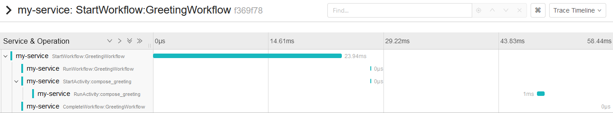

# OpenTelemetry Sample

This sample shows how to configure OpenTelemetry to capture workflow traces and SDK metrics.

For this sample, the optional `open_telemetry` dependency group must be included. To include, run:

    poetry install --with open_telemetry

To run, first see [README.md](../README.md) for prerequisites. Then run the following to start a Jaeger container to
view the trace results:

    docker run -d --name jaeger \
      -p 16686:16686 \
      -p 6831:6831/udp \
      jaegertracing/all-in-one:latest

Since that is running in the background (`-d`), you can also run the metrics collector in the foreground:

    docker run -p 4317:4317 \
      -v /path/to/samples-python/open_telemetry/otel-metrics-collector-config.yaml:/etc/otel-collector-config.yaml \
      otel/opentelemetry-collector:latest \
      --config=/etc/otel-collector-config.yaml

Replace `/path/to/samples-python` with the absolute path to the cloned samples repo.

Now, from this directory, start the worker in its own terminal:

    poetry run python worker.py

This will start the worker. Then, in another terminal, run the following to execute the workflow:

    poetry run python starter.py

The workflow should complete with the hello result. The workflow trace can now be viewed in Jaeger at
http://localhost:16686/. Under service, select `my-service` and "Find Traces". The workflow should appear and when
clicked, may look something like:

Note, in-workflow spans do not have a time associated with them. This is by intention since due to replay. In
OpenTelemetry, only the process that started the span may end it. But in Temporal a span may cross workers/processes.
Therefore we intentionally start-then-end in-workflow spans immediately. So while the start time and hierarchy is
accurate, the duration is not.

The metrics should have been dumped out in the terminal where the OpenTelemetry collector container is running.

## OTLP gRPC

Currently for tracing this example uses the `opentelemetry-exporter-jaeger-thrift` exporter because the common OTLP gRPC
exporter `opentelemetry-exporter-otlp-proto-grpc` uses an older, incompatible `protobuf` library. See
[this issue](https://github.com/open-telemetry/opentelemetry-python/issues/2880) for more information.

Once OTel supports latest protobuf, the exporter can be changed and Jaeger could be run with:

    docker run -d --name jaeger \
      -e COLLECTOR_OTLP_ENABLED=true \
      -p 16686:16686 \
      -p 4317:4317 \
      -p 4318:4318 \
      jaegertracing/all-in-one:latest