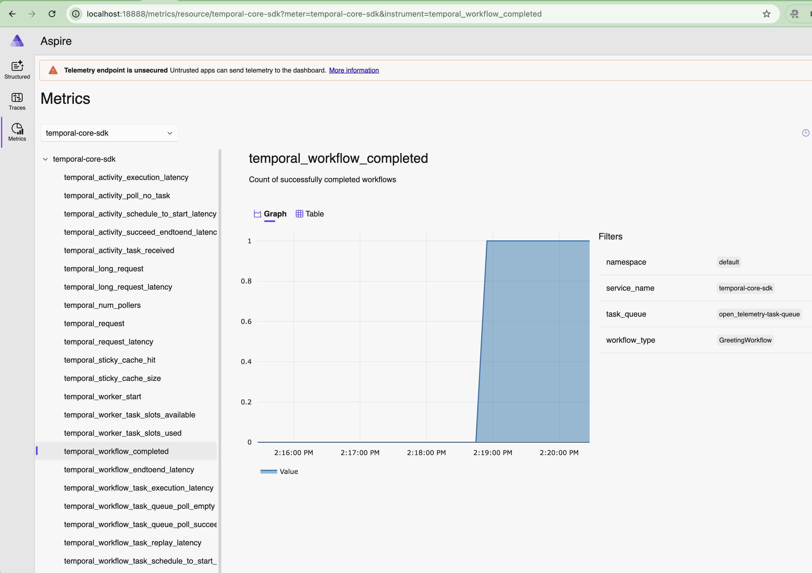
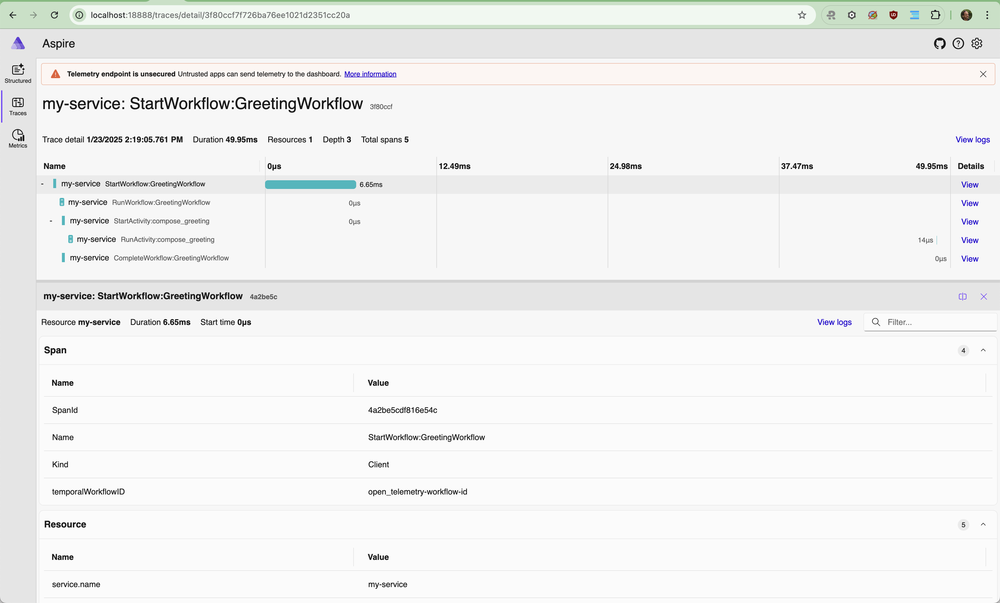

# OpenTelemetry Sample

This sample shows how to configure OpenTelemetry to capture workflow traces and SDK metrics.

For this sample, the optional `open_telemetry` dependency group must be included. To include, run:

    uv sync --group open-telemetry

To run, first see [README.md](../README.md) for prerequisites. Then run the following to start an [Aspire](https://hub.docker.com/r/microsoft/dotnet-aspire-dashboard/) OTEL collector

    docker compose up

Now, from this directory, start the worker in its own terminal:

    uv run worker.py

Then, in another terminal, run the following to execute the workflow:

    uv run starter.py

The workflow should complete with the hello result.

Now view the Aspire UI at http://localhost:18888/.

To view metrics sent describing the worker and the workflow that was executed, select `Metrics` on the left and under "Select a resource" select "temporal-core-sdk". It may look like this:

To view workflow spans, select `Traces` on the left and under "Select a resource" select "temporal-core-sdk". It may look like this:

Note, in-workflow spans do not have a time associated with them. This is by intention since due to replay. In
OpenTelemetry, only the process that started the span may end it. But in Temporal a span may cross workers/processes.
Therefore we intentionally start-then-end in-workflow spans immediately. So while the start time and hierarchy is
accurate, the duration is not.