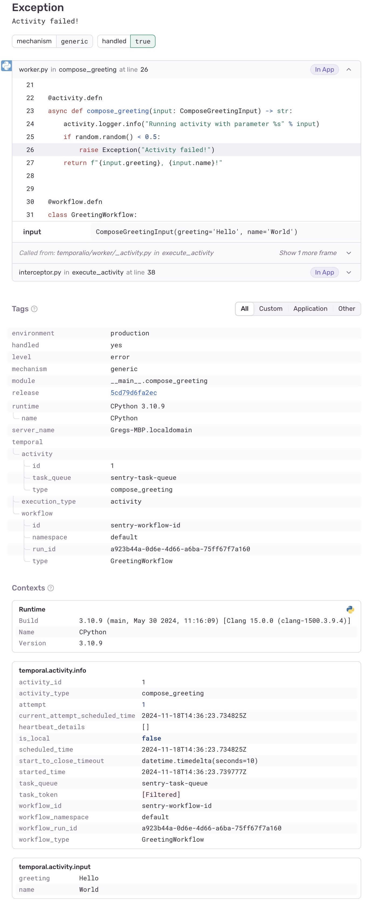

# Sentry Sample

This sample shows how to configure [Sentry](https://sentry.io) SDK (version 2) to intercept and capture errors from the Temporal SDK
for workflows and activities. The integration adds some useful context to the errors, such as the activity type, task queue, etc.

## Further details

This is a small modification of the original example Sentry integration in this repo based on SDK v1. The integration
didn't work properly with Sentry SDK v2 due to some internal changes in the Sentry SDK that broke the worker sandbox.
Additionally, the v1 SDK has been deprecated and is only receiving security patches and will reach EOL some time in the future.
If you still need to use Sentry SDK v1, check the original example at this [commit](https://github.com/temporalio/samples-python/blob/090b96d750bafc10d4aad5ad506bb2439c413d5e/sentry).

## Running the Sample

For this sample, the optional `sentry` dependency group must be included. To include, run:

    uv sync --no-default-groups --dev --group sentry

> Note: this integration breaks when `gevent` is installed (e.g. by the gevent sample) so make sure to only install
> the `sentry` group and run the scripts below as described.

To run, first see [README.md](../README.md) for prerequisites. Set `SENTRY_DSN` environment variable to the Sentry DSN.
Then, run the following from this directory to start the worker:

    export SENTRY_DSN=  # You'll need a Sentry account to test against
    export ENVIRONMENT=dev
    uv run --no-default-groups --dev --group sentry worker.py

This will start the worker. Then, in another terminal, run the following to execute the workflow:

    uv run --no-default-groups --dev --group sentry starter.py

You should see the activity fail causing an error to be reported to Sentry.

## Screenshot

The screenshot below shows the extra tags and context included in the
Sentry error from the exception thrown in the activity.

