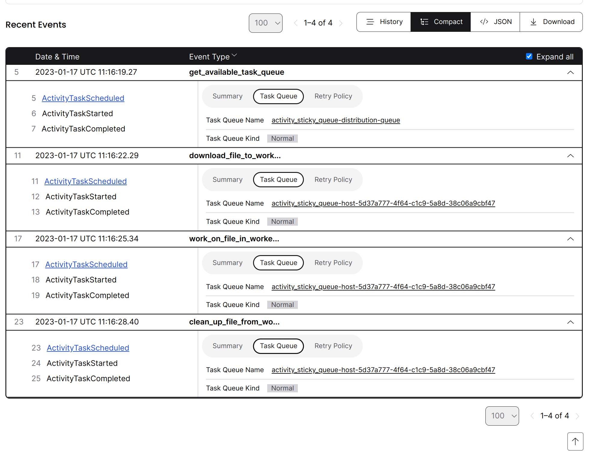

# Worker-Specific Task Queues

Use a unique Task Queue for each Worker in order to have certain Activities run on a specific Worker. In the Go SDK, this is explicitly supported via the Session option, but in other SDKs a different approach is required.

Typical use cases include tasks where interaction with a filesystem is required, such as data processing or interacting with legacy access structures. This example will write text files to folders corresponding to each worker, located in the `demo_fs` folder. In production, these folders would typically be independent machines in a worker cluster.

This strategy is:

- Each Worker process runs two `Worker`s:
  - One `Worker` listens on the `worker_specific_task_queue-distribution-queue` Task Queue.
  - Another `Worker` listens on a uniquely generated Task Queue.
- The Workflow and the first Activity are run on `worker_specific_task_queue-distribution-queue`.
- The first Activity returns one of the uniquely generated Task Queues (that only one Worker is listening on—i.e. the **Worker-specific Task Queue**).
- The rest of the Activities do the file processing and are run on the Worker-specific Task Queue.

Check the Temporal Web UI to confirm tasks were staying with their respective worker.

It doesn't matter where the `get_available_task_queue` activity is run, so it can be executed on the shared Task Queue. In this demo, `unique_worker_task_queue` is simply a `uuid` initialized in the Worker, but you can inject smart logic here to uniquely identify the Worker, [as Netflix did](https://community.temporal.io/t/using-dynamic-task-queues-for-traffic-routing/3045).

Activities have been artificially slowed with `time.sleep(3)` to simulate doing more work.

### Running This Sample

To run, first see [README.md](../README.md) for prerequisites. Then, run the following from this directory to start the
worker:

    uv run worker.py

This will start the worker. Then, in another terminal, run the following to execute the workflow:

    uv run starter.py

#### Example output:

```bash
(temporalio-samples-py3.10) user@machine:~/samples-python/activities_sticky_queues$ uv run starter.py
Output checksums:
49d7419e6cba3575b3158f62d053f922aa08b23c64f05411cda3213b56c84ba4
49d7419e6cba3575b3158f62d053f922aa08b23c64f05411cda3213b56c84ba4
49d7419e6cba3575b3158f62d053f922aa08b23c64f05411cda3213b56c84ba4
49d7419e6cba3575b3158f62d053f922aa08b23c64f05411cda3213b56c84ba4
49d7419e6cba3575b3158f62d053f922aa08b23c64f05411cda3213b56c84ba4
49d7419e6cba3575b3158f62d053f922aa08b23c64f05411cda3213b56c84ba4
49d7419e6cba3575b3158f62d053f922aa08b23c64f05411cda3213b56c84ba4
49d7419e6cba3575b3158f62d053f922aa08b23c64f05411cda3213b56c84ba4
49d7419e6cba3575b3158f62d053f922aa08b23c64f05411cda3213b56c84ba4
49d7419e6cba3575b3158f62d053f922aa08b23c64f05411cda3213b56c84ba4
```

<details>
<summary>Checking the history to see where activities are run</summary>
All activities for the one workflow are running against the same task queue, which corresponds to unique workers:



</details>
